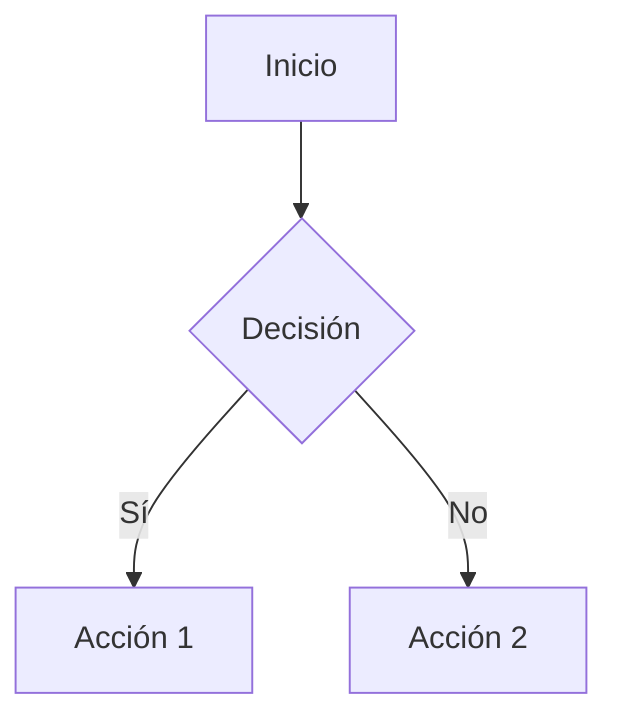

# Contributing Guide

Gracias por tu interés en contribuir a este portfolio. Este documento describe las pautas para mantener la calidad y consistencia de la documentación.

---

## Cómo Contribuir

### Reportar Issues

- Usa GitHub Issues para reportar errores o solicitar features
- Describe claramente el problema con pasos para reproducirlo
- Incluye screenshots si aplica

### Proponer Cambios

1. **Fork** el repositorio
2. Crea una **branch** descriptiva: `git checkout -b feature/nueva-seccion`
3. Realiza tus cambios siguiendo las guías de estilo
4. **Test** localmente: `mkdocs serve`
5. **Commit** con mensajes descriptivos
6. **Push** a tu fork: `git push origin feature/nueva-seccion`
7. Abre un **Pull Request**

---

## Guías de Estilo

### Markdown

- Usa headers jerárquicos (`#` → `##` → `###`)
- Longitud de línea máxima: 100 caracteres
- Usa backticks para código inline
- Bloques de código con language tag

### Estructura de Páginas

Toda página de proyecto debe seguir esta estructura:

```markdown
# Título del Proyecto

## Overview
Descripción breve del proyecto y su propósito.

## Arquitectura
Diagramas y explicación de componentes.

## Tecnologías
Lista de tecnologías utilizadas.

## Implementación
Pasos clave y decisiones técnicas.

## Resultados
Métricas y logros alcanzados.

## Referencias
Links a repositorios o documentación externa.
```

### Frontmatter

Usa frontmatter para metadatos:

```markdown
---
title: Título de Página
description: Breve descripción SEO
---
```

### Admonitions

Usa admonitions para información destacada:

```markdown
!!! note "Nota importante"
    Información relevante.

!!! tip "Pro Tip"
    Mejores prácticas.

!!! warning "Advertencia"
    Consideraciones importantes.
```

### Diagramas

Usa Mermaid para diagramas:

```markdown

```

---

## Convenciones de Nomenclatura

### Archivos

- Minúsculas con guiones: `nombre-archivo.md`
- Nombres descriptivos en inglés o español
- Evita espacios y caracteres especiales

### Directorios

```
docs/
├── projects/          # Proyectos técnicos
│   ├── index.md      # Listado de proyectos
│   ├── proyecto-1.md
│   └── proyecto-2.md
├── blog/             # Artículos del blog
│   ├── index.md
│   └── YYYY-MM-DD-titulo.md
├── assets/           # Imágenes y recursos
│   ├── images/
│   └── diagrams/
├── stylesheets/      # CSS custom
└── javascripts/      # JS custom
```

---

## Proceso de Review

Todo PR será revisado considerando:

- [ ] **Contenido**: Información precisa y actualizada
- [ ] **Formato**: Cumple guías de estilo
- [ ] **Links**: Todos los enlaces funcionan
- [ ] **Imágenes**: Optimizadas y con alt text
- [ ] **Build**: `mkdocs build --strict` pasa sin errores

---

## Desarrollo Local

### Requisitos

- Python 3.8+
- pip o uv

### Setup

```bash
# Instalar dependencias
pip install -r requirements.txt

# Servir localmente con hot-reload
mkdocs serve

# Construir para producción
mkdocs build --strict
```

### Testing

```bash
# Verificar links
mkdocs build --strict

# Lint Markdown (opcional)
npx markdownlint-cli docs/**/*.md
```

---

## Commit Messages

Usa formato descriptivo:

```
tipo: descripción corta (50 chars máximo)

Descripción más detallada si es necesario. Explica el "por qué"
no solo el "qué". Líneas de máximo 72 caracteres.

Fixes #123
```

**Tipos:**
- `feat`: Nueva funcionalidad
- `fix`: Bug fix
- `docs`: Cambios en documentación
- `style`: Formato, sin cambios de código
- `refactor`: Refactorización
- `perf`: Mejoras de performance
- `test`: Tests
- `chore`: Tareas de mantenimiento

---

## Code of Conduct

- Sé respetuoso y constructivo
- Acepta feedback gracefully
- Enfócate en lo mejor para la comunidad
- Comportamiento inapropiado no será tolerado

---

## Preguntas?

- Abre un issue en GitHub
- Contacta: peter@arkenops.cc

¡Gracias por contribuir!
