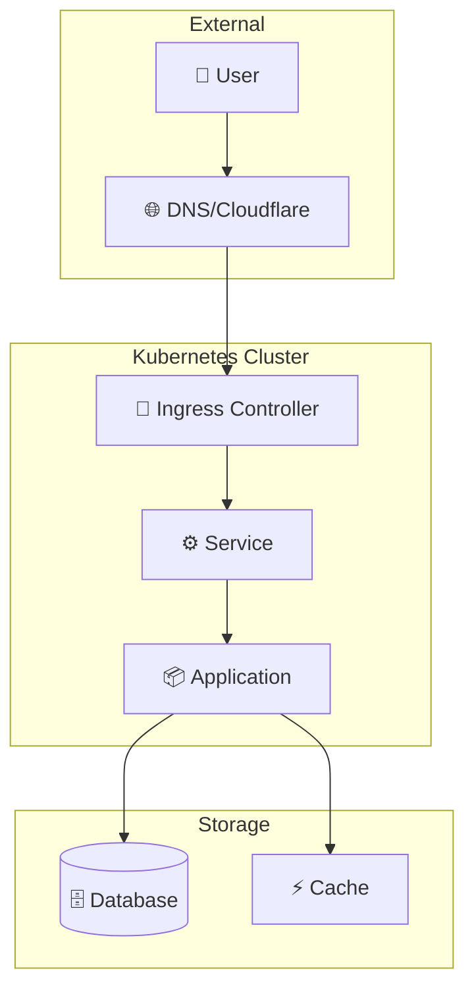

<div class="project-header">
<h1>NOMBRE_DEL_PROYECTO</h1>
<p>Subtítulo descriptivo breve que explique el propósito y valor del proyecto en una línea.</p>

<div class="project-meta-grid">
<div class="meta-item">
<span class="meta-label">Status</span>
<span class="meta-value">ESTADO_ACTUAL</span>
</div>
<div class="meta-item">
<span class="meta-label">Environment</span>
<span class="meta-value">ENTORNO</span>
</div>
<div class="meta-item">
<span class="meta-label">Category</span>
<span class="meta-value">CATEGORIA</span>
</div>
<div class="meta-item">
<span class="meta-label">Uptime</span>
<span class="meta-value">XX.X%</span>
</div>
</div>
</div>

## Visión General

Descripción concisa del proyecto, su propósito y el problema que resuelve.
Explica el contexto y por qué es importante en tu infraestructura.

!!! impact "Key Metrics & Impact"
    **Métrica clave** destacada • **Impacto medible** • **Beneficio principal** logrado

---

## Arquitectura



!!! info "Componentes Clave"
    - **Componente 1**: Descripción breve de su función y valor.
    - **Componente 2**: Descripción breve de su función y valor.
    - **Componente 3**: Descripción breve de su función y valor.

---

## Stack Tecnológico

=== "Infraestructura"

    | Componente | Tecnología | Descripción |
    |:-----------|:-----------|:------------|
    | **Capa 1** | Tech 1 | Propósito específico |
    | **Capa 2** | Tech 2 | Propósito específico |
    | **Capa 3** | Tech 3 | Propósito específico |

=== "Plataforma"

    | Componente | Tecnología | Descripción |
    |:-----------|:-----------|:------------|
    | **Componente A** | Tech A | Función en el stack |
    | **Componente B** | Tech B | Función en el stack |

=== "Observabilidad"

    | Componente | Tecnología | Descripción |
    |:-----------|:-----------|:------------|
    | **Métricas** | Prometheus | Time-series monitoring |
    | **Logs** | Loki | Log aggregation |
    | **Alertas** | Alertmanager | Notificaciones |

---

## Implementación

### Fase 1: Preparación

!!! example "Paso 1 - Configuración Inicial"
    ```bash
    # Comandos para configuración inicial
    kubectl apply -f namespace.yaml
    kubectl apply -f prerequisites.yaml
    ```

### Fase 2: Despliegue

!!! example "Paso 2 - Instalación"
    ```yaml
    # Ejemplo de configuración
    apiVersion: v1
    kind: ConfigMap
    metadata:
      name: app-config
    data:
      key: value
    ```

### Fase 3: Verificación

!!! example "Paso 3 - Testing"
    ```bash
    # Comandos de verificación
    kubectl get pods -n namespace
    curl https://endpoint/health
    ```

---

## Configuración

### Variables de Entorno

| Variable | Descripción | Default | Requerido |
|:---------|:------------|:--------|:----------|
| `VAR_1` | Descripción de la variable | `default` | Sí |
| `VAR_2` | Descripción de la variable | `false` | No |

### Secrets

!!! warning "Gestión de Secrets"
    Usa Sealed Secrets o External Secrets Operator.
    Nunca commitees secrets en texto plano.

---

## Operaciones

### Comandos Útiles

```bash
# Verificar estado
curl -s https://status.endpoint/health | jq .

# Logs
gkubectl logs -f deployment/<app> -n <namespace>

# Shell al pod
kubectl exec -it <pod> -n <namespace> -- /bin/sh
```

### Troubleshooting

!!! tip "Issue Común 1"
    **Síntoma**: Descripción del problema
    
    **Solución**: Pasos para resolver

!!! tip "Issue Común 2"
    **Síntoma**: Descripción del problema
    
    **Solución**: Pasos para resolver

---

## Monitoreo

### Métricas Clave

| Métrica | Umbral | Alerta |
|:--------|:-------|:-------|
| CPU Usage | > 80% | Warning |
| Memory | > 85% | Critical |
| Latency | > 500ms | Warning |
| Error Rate | > 1% | Critical |

### Dashboards

- [Grafana Dashboard](https://grafana.local/d/dashboard)
- [ArgoCD Apps](https://argocd.local)

### Alertas

Las alertas se envían a Telegram via Alertmanager.

---

## Resultados

### Métricas de Éxito

| Métrica | Antes | Después | Mejora |
|:--------|:------|:--------|:-------|
| Métrica 1 | Valor | Valor | +X% |
| Métrica 2 | Valor | Valor | -Y% |

### Lecciones Aprendidas

!!! info "Key Takeaway"
    Principal aprendizaje o insight del proyecto.

---

## Roadmap

- [x] Fase 1: Implementación inicial
- [x] Fase 2: Optimización
- [ ] Fase 3: Escalabilidad
- [ ] Fase 4: Feature X

---

## Referencias

- [Repositorio GitHub](https://github.com/palbina/HOMELAB-INFRA)
- [Documentación Oficial](https://docs.example.com)
- [Artículo Relacionado](./blog/articulo-relacionado.md)

---

!!! quote "Filosofía"
    "Breve quote o filosofía aplicada en este proyecto."

**Última actualización**: {{ git_revision_date_localized }}
