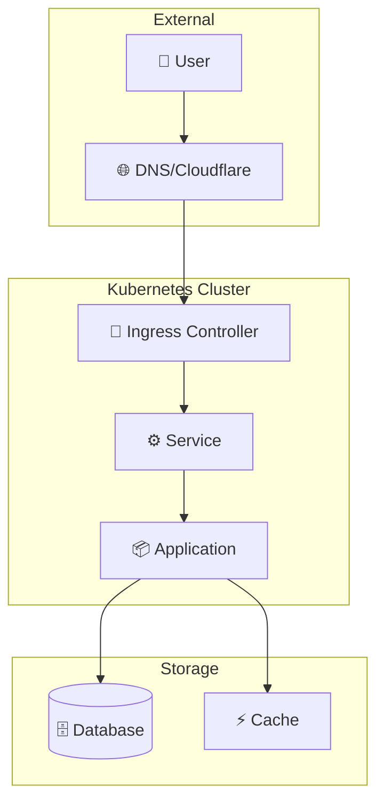

# Nombre del Proyecto

<div class="project-header">
<span class="project-badge">CATEGORÍA</span>
<span class="project-status">ESTADO: En Producción</span>
</div>

!!! summary "Overview"
    Descripción breve y concisa del proyecto.
    
    **Impacto**: Métrica clave o resultado principal.

---

## Arquitectura

### Diagrama de Componentes



### Componentes Principales

| Componente | Tecnología | Propósito |
|:-----------|:-----------|:----------|
| **Componente 1** | Tech 1 | Descripción |
| **Componente 2** | Tech 2 | Descripción |
| **Componente 3** | Tech 3 | Descripción |

---

## Tecnologías

### Stack Principal

<div class="tech-stack">

- **Infrastructure**: Talos Linux, Kubernetes, Cilium
- **Platform**: ArgoCD, Istio, Traefik
- **Observability**: Prometheus, Grafana, Loki
- **Security**: CrowdSec, Authentik, mTLS

</div>

### Versiones

| Software | Versión | Notas |
|:---------|:--------|:------|
| Software 1 | v1.0.0 | Requerido |
| Software 2 | v2.0.0 | Opcional |

---

## Implementación

### Fase 1: Preparación

!!! example "Paso 1 - Configuración Inicial"
    ```bash
    # Comandos para configuración
    kubectl apply -f namespace.yaml
    ```

### Fase 2: Despliegue

!!! example "Paso 2 - Instalación"
    ```yaml
    # Ejemplo de configuración
    apiVersion: v1
    kind: ConfigMap
    metadata:
      name: app-config
    data:
      key: value
    ```

### Fase 3: Verificación

!!! example "Paso 3 - Testing"
    ```bash
    # Comandos de verificación
    kubectl get pods -n namespace
    curl https://endpoint/health
    ```

---

## Configuración

### Variables de Entorno

| Variable | Descripción | Default | Requerido |
|:---------|:------------|:--------|:----------|
| `VAR_1` | Descripción 1 | `default` | Sí |
| `VAR_2` | Descripción 2 | `false` | No |

### Secrets

!!! warning "Gestión de Secrets"
    Usa Sealed Secrets o External Secrets Operator.
    Nunca commitees secrets en texto plano.

---

## Operaciones

### Comandos Útiles

```bash
# Verificar estado
kubectl get all -n <namespace>

# Logs
gkubectl logs -f deployment/<app> -n <namespace>

# Shell al pod
kubectl exec -it <pod> -n <namespace> -- /bin/sh
```

### Troubleshooting

!!! tip "Issue Común 1"
    **Síntoma**: Descripción del problema
    
    **Solución**: Pasos para resolver

!!! tip "Issue Común 2"
    **Síntoma**: Descripción del problema
    
    **Solución**: Pasos para resolver

---

## Monitoreo

### Métricas Clave

| Métrica | Umbral | Alerta |
|:--------|:-------|:-------|
| CPU Usage | > 80% | Warning |
| Memory | > 85% | Critical |
| Latency | > 500ms | Warning |
| Error Rate | > 1% | Critical |

### Dashboards

- [Grafana Dashboard](https://grafana.local/d/dashboard)
- [ArgoCD Apps](https://argocd.local)

### Alertas

Las alertas se envían a Telegram via Alertmanager.

---

## Resultados

### Métricas de Éxito

<div class="metrics-grid">

| Métrica | Antes | Después | Mejora |
|:--------|:------|:--------|:-------|
| Métrica 1 | Valor | Valor | +X% |
| Métrica 2 | Valor | Valor | -Y% |

</div>

### Lecciones Aprendidas

!!! info "Key Takeaway"
    Principal aprendizaje o insight del proyecto.

---

## Roadmap

- [x] Fase 1: Implementación inicial
- [x] Fase 2: Optimización
- [ ] Fase 3: Escalabilidad
- [ ] Fase 4: Feature X

---

## Referencias

- [Repositorio GitHub](https://github.com/palbina/HOMELAB-INFRA)
- [Documentación Oficial](https://docs.example.com)
- [Artículo Relacionado](./blog/articulo-relacionado.md)

---

!!! quote "Arquitectura"
    "Breve quote o filosofía aplicada en este proyecto."

**Última actualización**: {{ git_revision_date_localized }}
