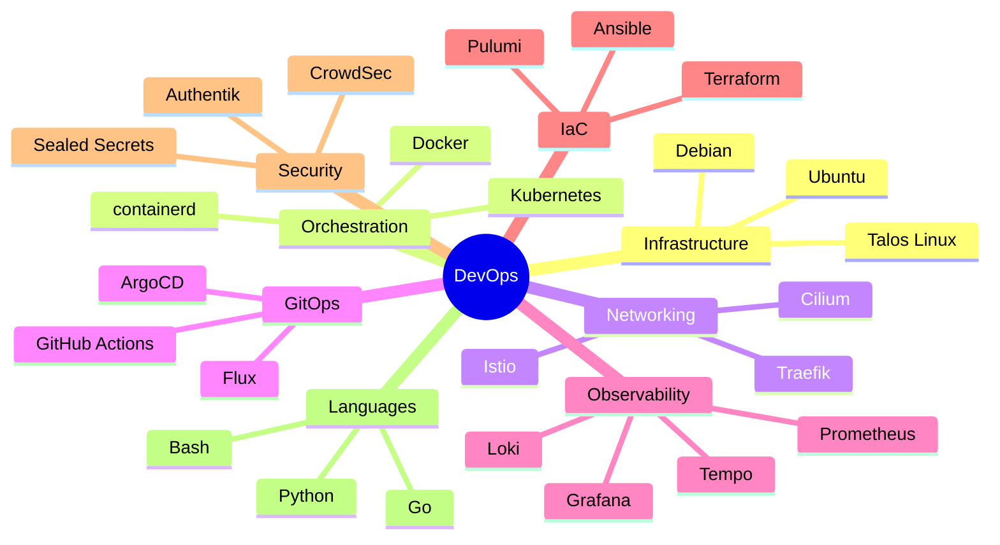

# Sobre Mí

## Peter Albina

**Senior DevOps/SRE Engineer** especializado en infraestructura cloud-native, automatización y observabilidad.

---

## Experiencia

Mi enfoque técnico se centra en:

- **Kubernetes & Container Orchestration**: Diseño y operación de clusters de producción
- **GitOps & CI/CD**: Implementación de flujos de trabajo declarativos con ArgoCD
- **Observability**: Stack completo de métricas, logs y traces correlacionados
- **Infrastructure as Code**: Terraform, Ansible, configuración declarativa
- **Security**: Zero Trust, mTLS, WAF, Identity Management

---

## Certificaciones

| Certificación | Estado |
|:--------------|:-------|
| CKA - Certified Kubernetes Administrator | ✅ |
| CKAD - Certified Kubernetes Application Developer | ✅ |
| AWS Solutions Architect | ✅ |
| Terraform Associate | ✅ |

---

## Stack Tecnológico

---

## Contacto

- :fontawesome-brands-github: [github.com/palbina](https://github.com/palbina)
- :fontawesome-brands-linkedin: [linkedin.com/in/peteralbina](https://linkedin.com/in/peteralbina)
- :material-email: <peter@arkenops.cc>

---

!!! tip "Portfolio Interactivo"
    También puedes explorar mi [portfolio con AI Chat](https://arkenops.cc)
    donde puedes hacerme preguntas sobre mi experiencia usando RAG + LLM.
