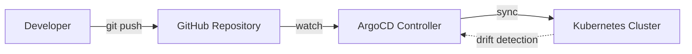
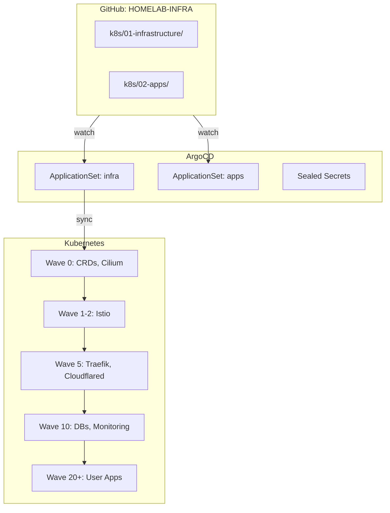

# GitOps Real: De `kubectl apply` al Self-Healing con ArgoCD

**¿Cuántas veces has aplicado un manifest en producción y luego te has olvidado de documentar el cambio?**

Ese era mi día a día antes de adoptar GitOps. Hoy, todo mi cluster — 30+ aplicaciones, configuraciones de red, storage, monitoreo — se sincroniza automáticamente desde Git. Si alguien toca algo manualmente, ArgoCD lo revierte en minutos. Si el cluster se destruye, lo recreo desde Git en menos de una hora.

<!-- more -->

## 1. El Problema: Configuración Fantasma

En el modelo tradicional de `kubectl apply`, cada cambio es una operación puntual sin registro:

```bash
# ¿Quién cambió esto? ¿Cuándo? ¿Por qué?
kubectl edit deployment api-gateway -n production
# ... 3 meses después ...
# ¿Por qué este deployment tiene 5 réplicas en vez de 3?
```

El resultado: **drift de configuración** acumulativo. Dos entornos que deberían ser idénticos terminan siendo diferentes porque alguien aplicó un hotfix en producción y se olvidó de staging.

## 2. La Solución: Git como Fuente Única de Verdad

GitOps invierte el flujo. En lugar de empujar cambios al cluster, **el cluster observa Git y se sincroniza automáticamente**:



### ¿Por qué ArgoCD?

| Alternativa | Por qué no |
|:------------|:-----------|
| Flux CD | Buena herramienta, pero ArgoCD tiene mejor UI y ApplicationSets más flexibles |
| `kubectl apply` manual | Sin audit trail, sin self-healing |
| Helm manual | Los charts se desactualizan; sin visibilidad de drift |

ArgoCD fue la elección natural: UI web intuitiva, CLI potente, y ApplicationSets para gestionar docenas de aplicaciones sin duplicar código.

## 3. Arquitectura de mi Implementación



## 4. Implementación Paso a Paso

### Paso 1: ApplicationSets en vez de Applications Manuales

En lugar de crear una `Application` de ArgoCD por cada app, uso un `ApplicationSet` que escanea directorios en Git:

```yaml
apiVersion: argoproj.io/v1alpha1
kind: ApplicationSet
metadata:
  name: apps
  namespace: argocd
spec:
  generators:
    - git:
        repoURL: https://github.com/palbina/HOMELAB-INFRA
        revision: main
        directories:
          - path: k8s/02-apps/*
  template:
    metadata:
      name: '{{ "{{" }}path.basename{{ "}}" }}'
    spec:
      source:
        repoURL: https://github.com/palbina/HOMELAB-INFRA
        targetRevision: main
        path: '{{ "{{" }}path{{ "}}" }}'
      destination:
        server: https://kubernetes.default.svc
        namespace: '{{ "{{" }}path.basename{{ "}}" }}'
      syncPolicy:
        automated:
          prune: true
          selfHeal: true
```

Añadir una nueva aplicación ahora es crear un directorio en Git. ArgoCD lo detecta automáticamente.

### Paso 2: Sync Waves para Orden de Despliegue

No todo puede desplegarse al mismo tiempo. Los CRDs deben existir antes que los recursos que los usan. Las NetworkPolicies antes que los pods. Las sync waves controlan el orden:

```yaml
# Wave 0: CRDs, Cilium CNI
metadata:
  annotations:
    argocd.argoproj.io/sync-wave: "0"

# Wave 5: Traefik ingress
metadata:
  annotations:
    argocd.argoproj.io/sync-wave: "5"
```

ArgoCD despliega en orden ascendente: primero toda la wave 0, luego la 1, y así sucesivamente.

### Paso 3: Secrets Encriptados en Git

Los secrets no pueden estar en texto plano en Git. Sealed Secrets los encripta con una clave asimétrica:

```bash
# Encriptar un secret
kubectl create secret generic db-password --from-literal=password=supersecreto \
  --dry-run=client -o yaml | kubeseal -o yaml > db-password-sealed.yaml

# El archivo encriptado es seguro para commit
git add db-password-sealed.yaml && git commit -m "feat: add database credentials"
```

Solo el controller de Sealed Secrets en el cluster puede desencriptarlos.

## 5. Mi Experiencia en Producción

### Métricas Reales (30 días)

| Métrica | Objetivo | Actual | Estado |
|:--------|:---------|:-------|:-------|
| **Deployment Frequency** | Daily | Multiple/day | ✅ Excedido |
| **Lead Time (commit→prod)** | < 1h | ~15 min | ✅ Excedido |
| **Change Failure Rate** | < 10% | ~2% | ✅ Excedido |
| **MTTR (Mean Time to Recover)** | < 1h | ~5 min | ✅ Excedido |
| **Drift Incidents** | 0 | 2 (ambos auto-corregidos) | ✅ |
| **Apps Gestionadas** | - | 30+ | ✅ |

### Lo que más valoro

- **Self-healing real:** Un día, por error, borré un deployment con `kubectl delete`. En menos de 3 minutos, ArgoCD lo había recreado. Ni siquiera tuve que intervenir.
- **PRs como audit trail:** Cada cambio en el cluster tiene un PR asociado. Si algo falla, `git log` te dice exactamente quién, qué y cuándo.
- **Recreación desde cero probada:** Hice un restore test borrando un namespace completo. ArgoCD lo recreó idéntico desde Git en ~2 minutos.

## 6. Desafíos Encontrados

!!! warning "ApplicationSet no detecta nuevos directorios inmediatamente"
    **Síntoma**: Creé un directorio nuevo en Git pero no aparecía en ArgoCD.
    
    **Solución**: El ApplicationSet por defecto re-evalúa cada 3 minutos. Para forzar la detección inmediata: `argocd app list -l app.kubernetes.io/instance=apps --hard-refresh`.

!!! warning "Sealed Secrets + Renovate no se llevan bien"
    **Síntoma**: Renovate intentaba actualizar archivos `-sealed.yaml` como si fueran texto plano.
    
    **Solución**: Añadí `"matchFileNames": ["!**/*-sealed.yaml"]` en la configuración de Renovate para excluir secrets encriptados.

## 7. Cuándo Usar (y Cuándo No)

=== "Ideal Para"

    - Clusters con 10+ aplicaciones que cambian frecuentemente
    - Equipos donde múltiples personas hacen cambios de infraestructura
    - Entornos que requieren audit trail (compliance, SOC2, ISO 27001)
    - Infraestructura que debe ser reproducible desde cero (DR, staging clones)

=== "No Recomendado Para"

    - Clusters con 1-3 aplicaciones estáticas (la sobrecarga de ArgoCD no se justifica)
    - Entornos de desarrollo local (mejor usar Tilt, Skaffold o `kubectl apply` directo)
    - Equipos que no usan Git como flujo de trabajo principal (si no hay PRs, GitOps pierde su valor)

## 8. Conclusión

GitOps con ArgoCD transformó mi relación con la infraestructura. De "rezar para que funcione después de un cambio" a "confío en que si está en Git, está bien." La combinación de ApplicationSets + sync waves + Sealed Secrets elimina prácticamente toda la fricción operacional de gestionar un cluster.

Si hoy tuviera que recrear mi cluster desde cero, tardaría lo que tarda ArgoCD en sincronizar 30 aplicaciones: ~5 minutos. Sin GitOps, sería una tarde entera de `kubectl apply` manual y debugging.

---

### Recursos Adicionales

- [Proyecto GitOps con ArgoCD](../../projects/gitops.md)
- [Filosofía GitOps](../../explanation/gitops-philosophy.md)
- [Tutorial: GitOps con ArgoCD](../../tutorials/gitops-argocd.md)
- [Documentación Oficial de ArgoCD](https://argo-cd.readthedocs.io/)
