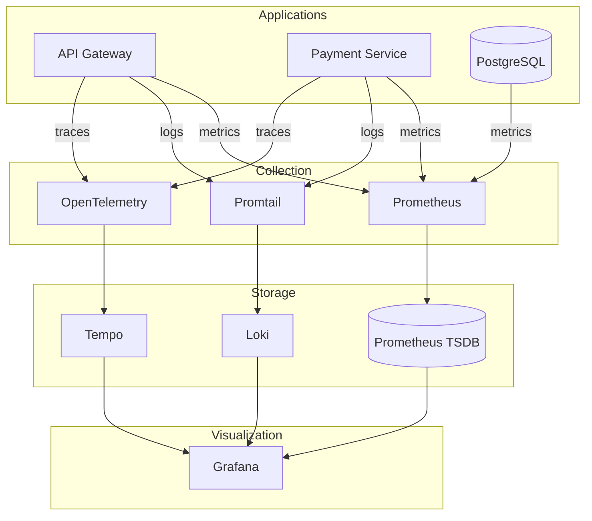

# Observability Real: Correlacionando Métricas, Logs y Traces con LGTM

**¿Alguna vez has recibido una alerta de "latencia alta" y has pasado 30 minutos saltando entre dashboards intentando encontrar la causa?**

El stack LGTM (Loki, Grafana, Tempo, Prometheus) cambió eso para mí. En este artículo te muestro cómo la correlación de señales reduce drásticamente el tiempo de debugging, con un incidente real como ejemplo.

<!-- more -->

## 1. El Problema: Señales Aisladas

El monitoreo tradicional te dice **qué** está pasando: CPU al 90%, latencia alta, pods reiniciándose. Pero rara vez te dice **por qué**. Para eso necesitas logs. Y si el problema está en una cadena de microservicios, necesitas traces para saber **dónde** exactamente.

El problema clásico:

1. **Alerta de Prometheus**: "Latencia p99 > 500ms en payment-service"
2. **Dashboards de Grafana**: CPU normal, memoria normal, tráfico normal. ¿Entonces?
3. **Saltas a los logs en Loki**: Encuentras `connection timeout` a la base de datos... ¿pero qué query causó el timeout?
4. **Buscas el trace en Tempo**: Ahí está — una query sin índice que hace full scan de 2M de filas.

Sin correlación entre estas herramientas, cada paso requiere copiar timestamps, pegar IDs de trace, y cambiar de contexto mental. **El MTTR promedio sin correlación: 30 minutos.**

## 2. La Solución: LGTM con Correlación Nativa

El stack LGTM integra los tres pilares con correlación automática:

| Señal | Herramienta | Pregunta que responde | Query Language |
|:------|:------------|:----------------------|:---------------|
| **Métricas** | Prometheus | ¿QUÉ pasó? | PromQL |
| **Logs** | Loki | ¿POR QUÉ pasó? | LogQL |
| **Traces** | Tempo | ¿DÓNDE pasó? | TraceQL |

La magia está en Grafana, que une las tres señales automáticamente:

- **Loki → Tempo**: Los logs incluyen `traceID`. Un clic en el ID del trace te lleva directamente al trace completo en Tempo.
- **Tempo → Loki**: Los spans tienen etiquetas de servicio y timestamp. Puedes saltar a los logs de ese servicio exacto en ese momento exacto.
- **Métricas → Logs**: Desde cualquier panel de Prometheus, "Explore" te lleva a los logs del mismo timeframe.

## 3. Arquitectura



## 4. Implementación Paso a Paso

### Paso 1: Prometheus + Grafana Base

```bash
helm repo add prometheus-community https://prometheus-community.github.io/helm-charts
helm repo update

helm install prometheus prometheus-community/kube-prometheus-stack \
  --namespace monitoring --create-namespace \
  --set grafana.enabled=true \
  --set prometheus.prometheusSpec.retention=15d
```

### Paso 2: Loki para Logs

```bash
helm repo add grafana https://grafana.github.io/helm-charts
helm repo update

helm install loki grafana/loki-stack \
  --namespace monitoring \
  --set promtail.enabled=true \
  --set grafana.enabled=false \
  --set loki.persistence.size=20Gi
```

Configura Loki como data source en Grafana: URL `http://loki.monitoring:3100`.

### Paso 3: Tempo para Traces

```yaml
# tempo-values.yaml
tempo:
  receivers:
    otlp:
      protocols:
        grpc:
          endpoint: 0.0.0.0:4317
        http:
          endpoint: 0.0.0.0:4318
```

```bash
helm install tempo grafana/tempo --namespace monitoring --values tempo-values.yaml
```

## 5. Mi Experiencia en Producción

### Incidente Real: Latencia en Payment Service

**Alerta**: 02:14 AM — Alertmanager notifica "Latencia p99 de payment-service: 523ms (umbral: 200ms)".

**Debugging con correlación (3 minutos total)**:

| Minuto | Acción | Herramienta |
|:-------|:-------|:------------|
| 00:00 | Alerta recibida. Abro el panel de latencia en Grafana. | Prometheus → Grafana |
| 00:30 | Veo un spike de `cnpg_pg_stat_activity_count` — 195 conexiones activas (normal: 20). | Prometheus |
| 01:00 | Clic derecho en el spike → "Explore → Loki". Veo `ERROR: remaining connection slots are reserved for superuser`. | Loki |
| 01:30 | En los logs, encuentro un `traceID: abc123def456`. Clic → Tempo. | Tempo |
| 02:00 | El trace muestra que `SELECT * FROM orders WHERE status='pending'` toma 450ms. La tabla `orders` no tiene índice en `status`. | Tempo |
| 02:30 | Creo el índice: `CREATE INDEX idx_orders_status ON orders(status)`. | PostgreSQL |
| 03:00 | Latencia p99 vuelve a 50ms. Incidente cerrado. | Grafana |

**Sin correlación, este mismo incidente habría tomado ~30 minutos** saltando manualmente entre dashboards de CPU, memoria, base de datos, y grepeando logs a ciegas.

### Métricas de Observabilidad

| Métrica | Antes (solo Prometheus) | Ahora (LGTM completo) |
|:--------|:------------------------|:----------------------|
| **MTTD** (Mean Time to Detect) | ~10 min | ~2 min |
| **MTTR** (Mean Time to Resolve) | ~30 min | ~3 min |
| **Incidentes sin causa raíz** | ~15% | 0% |
| **Alertas configuradas** | 12 | 35+ |
| **Data Completeness** | ~85% | 99.5% |

## 6. Desafíos Encontrados

!!! warning "Cardinalidad de labels en Loki"
    **Síntoma**: Loki consumía más memoria de la esperada (~8GB para 30 días de logs).
    
    **Solución**: Reduje la cardinalidad eliminando labels de alta variabilidad (`request_id`, `user_id`) del stream de Loki. Estos valores se guardan en el log message, no como labels indexados. Memoria bajó a ~3GB.

!!! warning "Sampling de traces en entornos de alto tráfico"
    **Síntoma**: Tempo almacenaba demasiados traces (7 días de retención llenaban el disco en 3 días).
    
    **Solución**: Configuré sampling probabilístico en OpenTelemetry: `sampler: parentbased_traceidratio` con `ratio: 0.1` (samplear 10% de traces). Para servicios críticos como payment, fuerza 100% sampling.

## 7. Cuándo Usar (y Cuándo No)

=== "Ideal Para"

    - Sistemas con 5+ microservicios donde el debugging end-to-end es complejo
    - Entornos de producción con SLAs estrictos (MTTR < 5 min)
    - Equipos que necesitan correlación entre métricas, logs y traces
    - Infraestructura donde el "qué falló" ya no es suficiente — necesitas el "por qué"

=== "No Recomendado Para"

    - Aplicaciones monolíticas simples (Prometheus + Loki es suficiente; Tempo añade complejidad sin valor)
    - Entornos de desarrollo local (usa `kubectl logs` y `kubectl top` para debugging cotidiano)
    - Equipos sin experiencia en instrumentación (OpenTelemetry requiere añadir código a las aplicaciones)

## 8. Conclusión

La diferencia entre monitoreo y observabilidad no es semántica — es práctica. Con monitoreo, sabes que algo falló. Con observabilidad, sabes **qué**, **por qué** y **dónde** en menos de 3 minutos.

El stack LGTM no es trivial de configurar (3 Helm charts, instrumentación de aplicaciones, sampling tuning), pero la inversión se recupera en el primer incidente grave que resuelves en minutos en vez de horas.

---

### Recursos Adicionales

- [Proyecto Observabilidad LGTM](../../projects/observability.md)
- [Patrones de Observabilidad](../../explanation/observability-patterns.md)
- [Tutorial: Observabilidad con LGTM](../../tutorials/observability-lgtm.md)
- [Guía How-To: Monitoreo y Alertas](../../how-to/setup-monitoring.md)
- [Documentación Oficial de Grafana](https://grafana.com/docs/)
