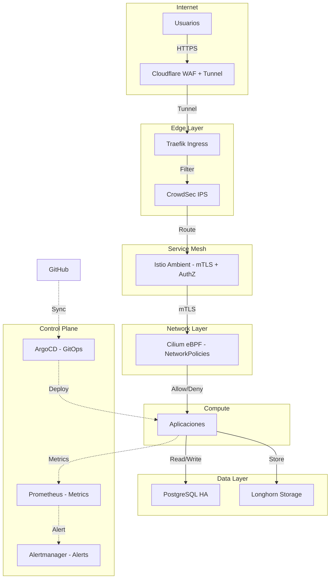

# Arquitectura Cloud Native

Por qué este stack representa una implementación real de los principios cloud-native y las decisiones arquitectónicas detrás de cada componente.

---

## El Problema: Infraestructura como Mascota vs Ganado

La infraestructura tradicional trata los servidores como mascotas: cada uno tiene nombre, personalidad,
y cuando se enferma, lo curamos manualmente con SSH. El enfoque cloud-native los trata como ganado:
son intercambiables, se aprovisionan automáticamente, y cuando uno falla se reemplaza sin drama.

Este HomeLab implementa el modelo "ganado" en bare-metal real, no en la nube. Cada decisión
arquitectónica busca eliminar el estado manual y hacer el sistema reproducible desde cero.

---

## ¿Por Qué Talos Linux?

Talos Linux es un sistema operativo diseñado exclusivamente para Kubernetes. A diferencia de
distribuciones generales como Ubuntu o Debian:

- **No tiene SSH, shell ni gestor de paquetes.** Toda administración es vía API (gRPC).
- **Es inmutable.** El sistema de archivos raíz se monta como read-only desde una imagen SquashFS.
- **Todo se configura vía YAML.** La configuración del nodo se aplica con `talosctl apply-config`.
- **Las actualizaciones son atómicas.** Se descarga una nueva imagen, se verifica, y se aplica con
  un solo reboot. Si falla, hay rollback automático.

!!! info "Inmutabilidad = Reproducibilidad"
    La inmutabilidad elimina el "drift de configuración" — ese fenómeno donde dos servidores que
    deberían ser idénticos terminan siendo diferentes porque alguien instaló algo por SSH hace 6 meses.
    Con Talos, cada nodo es exactamente lo que dice el archivo YAML. Nada más, nada menos.

---

## ¿Por Qué Cilium con eBPF?

El networking en Kubernetes tradicionalmente usa kube-proxy, que manipula reglas de iptables.
Esto funciona, pero:

1. **iptables no escala bien.** Cada Service de Kubernetes genera múltiples reglas. Con cientos
   de servicios, la tabla de iptables se vuelve inmanejable y lenta.
2. **iptables es un "dump pipe".** Cada paquete atraviesa todas las reglas secuencialmente.
   No hay forma eficiente de hacer matching.

Cilium usa eBPF (extended Berkeley Packet Filter), que permite ejecutar programas en el kernel
de Linux sin modificar el código fuente del kernel:

- **Los programas eBPF se ejecutan en el kernel** con near-native performance.
- **El matching de servicios es O(1)** usando hash tables, no O(n) como iptables.
- **Hubble** proporciona observabilidad de red completa: cada flujo, cada paquete, cada
  política aplicada, visible en tiempo real.
- **L7 filtering** permite políticas de red basadas en HTTP, gRPC, Kafka — no solo IPs y puertos.

!!! quote "eBPF en una frase"
    eBPF te permite reprogramar cómo se comporta el kernel de Linux sin tocar el kernel mismo.
    Es como un "JavaScript para el kernel", pero seguro y verificado.

---

## ¿Por Qué Istio Ambient?

El modelo tradicional de service mesh (sidecar) inyecta un contenedor proxy al lado de cada pod.
Aunque potente, tiene desventajas:

1. **Cada pod paga el costo del sidecar** en memoria y CPU, incluso si no necesita todas las
   funcionalidades L7.
2. **Acoplamiento de ciclo de vida.** El sidecar debe iniciarse antes que la aplicación y
   detenerse después. Esto complica los jobs y las actualizaciones.
3. **Sobrecarga operacional.** Actualizar la mesh requiere reiniciar todos los pods.

Istio Ambient resuelve esto separando las responsabilidades en dos capas:

- **ztunnel (L4):** Un proxy por nodo que maneja mTLS, identidad y telemetría básica.
  Escrito en Rust, extremadamente ligero. No requiere inyección de sidecars.
- **Waypoint proxy (L7):** Solo se despliega para namespaces que necesitan funcionalidades
  L7 (routing HTTP, autorización). Los namespaces que solo necesitan L4 no pagan este costo.

La clave: **separar el plano de datos del ciclo de vida de las aplicaciones.** Los pods no
necesitan sidecars. El mesh es parte de la infraestructura, no de la aplicación.

---

## ¿Por Qué GitOps?

La gestión declarativa de infraestructura tiene tres principios fundamentales:

1. **Git es la fuente única de verdad.** Todo lo que existe en el cluster está declarado en Git.
2. **El estado declarado es el estado deseado.** Un controller continuamente compara Git con
   el cluster y corrige cualquier diferencia (self-healing).
3. **Los cambios se hacen vía PR, no vía kubectl.** Toda modificación deja un rastro auditable
   en Git: quién, qué, cuándo y por qué.

En este HomeLab, **nunca se ejecuta `kubectl apply` manualmente.** Todos los cambios fluyen
de Git al cluster a través de ArgoCD. Si alguien modifica algo manualmente en el cluster,
ArgoCD lo detecta como "drift" y lo revierte en minutos.

---

## ¿Por Qué Cloudflare Tunnel?

Exponer servicios al internet tradicionalmente requiere:

1. Abrir puertos en el firewall del router
2. Configurar port forwarding
3. Gestionar certificados TLS
4. Preocuparse por ataques DDoS directos a tu IP pública

Cloudflare Tunnel invierte el modelo: en lugar de aceptar conexiones entrantes, el túnel
establece una conexión saliente hacia Cloudflare. El tráfico legítimo se enruta por esa
conexión. No hay puertos abiertos en tu firewall. Tu IP real nunca se expone.

---

## El Diagrama Completo

---

## Arquitectura Soberana: Sin Dependencia de la Nube

A diferencia de arquitecturas cloud-native tradicionales que dependen de ECR, GCR, o GitHub,
TalosLab implementa un **sovereign stack** 100% autosuficiente:

| Componente | Cloud-Dependent | Sovereign (TalosLab) |
|:---|:---|:---|
| Git Source | GitHub/GitLab.com | GitLab self-hosted + agentk |
| Container Registry | Docker Hub/GHCR | Zot registry local |
| CI/CD | GitHub Actions | Forgejo Actions (`network=host`) |
| Backups | AWS S3 | SeaweedFS S3 (VPS dedicada) |
| GitOps Engine | ArgoCD | ArgoCD v3.4.3 + Renovate v43 + Image Updater |

**Principio**: La infraestructura debe sobrevivir sin conexión a internet. El registry local
Zot + GitLab self-hosted + Forgejo CI/CD forman un ciclo cerrado que permite desarrollar,
buildear, y desplegar completamente offline si es necesario.

---

## Ver también

- [Tutorial: HomeLab Kubernetes desde Cero](../tutorials/kubernetes-homelab.md)
- [Filosofía GitOps](gitops-philosophy.md)
- [Modelo Zero Trust](zero-trust-model.md)
- [Patrones de Observabilidad](observability-patterns.md)
- [Stack tecnológico completo](../reference/tech-stacks.md)
