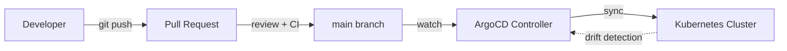

# Filosofía GitOps

Por qué Git como fuente única de verdad transforma la gestión de infraestructura. Los principios, patrones y beneficios del enfoque declarativo que elimina la configuración manual.

---

## El Principio Fundamental

!!! quote "Si no está en Git, no existe"
    Todo el estado deseado del cluster está declarado en Git. Cualquier recurso que exista
    en el cluster pero no en Git es "drift" y será eliminado automáticamente.

GitOps invierte el modelo tradicional de operaciones. En lugar de ejecutar comandos
imperativos (`kubectl apply`, `helm install`), declaras el estado deseado en archivos
YAML en Git, y un controller (ArgoCD) se encarga de hacer que el cluster coincida.

---

## ¿Por Qué Git?

Git no es solo un sistema de control de versiones. En GitOps, Git cumple cinco funciones:

1. **Fuente única de verdad.** No hay ambigüedad sobre cuál es el estado correcto: lo que
   está en la rama `main` de Git.

2. **Audit trail completo.** Cada cambio tiene autor, timestamp, mensaje de commit y diff.
   Sabes exactamente quién cambió qué y por qué.

3. **Pull requests como gate de cambio.** Nadie hace push directo a `main`. Los cambios
   pasan por review, CI y aprobación antes de aplicarse.

4. **Rollback trivial.** ¿Algo salió mal? `git revert` y el controller sincroniza al
   estado anterior. No hay procedimiento manual de rollback.

5. **Disaster recovery instantáneo.** Si el cluster se destruye completamente, aplicar
   los mismos manifests de Git produce un clúster idéntico.

---

## Lecciones del Mundo Real: Multi-Source y Sovereign Stack

La teoría GitOps es elegante. La práctica en TalosLab reveló complejidades:

### Apps Multi-Source: ApplicationSet NO Funciona

Cuando una app usa Helm chart externo + valores locales, el ApplicationSet genérico
falla. ArgoCD procesa incorrectamente los charts porque la referencia `$values` no
resuelve correctamente en modo multi-source. **Lección**: Apps complejas requieren
su propio manifiesto `Application` manual, excluido explícitamente del ApplicationSet:

```yaml
# En el ApplicationSet genérico
spec:
  generators:
- git:
        directories:
          - path: k8s/02-apps/*
            exclude: true
              - path: k8s/02-apps/molty-odoo    # ← Excluido: multi-source
              - path: k8s/02-apps/gitlab         # ← Excluido: multi-source
```

### Sovereign Stack: GitLab como Source Primario

Migrar de GitHub a GitLab self-hosted eliminó la dependencia externa. Pero introdujo
complejidad: Workhorse en `:8181` para git interno, SSH via `gitlab-shell:22` para
Renovate, y `hostAliases` para resolver el registry Zot (`10.99.141.31`).



El flujo es **siempre** de Git al cluster, nunca al revés. Esto es fundamental porque:

- Rompe el ciclo de "cambios manuales que nadie documenta"
- Elimina el "funcionó en mi máquina" — si está en Git, está versionado
- Hace que cualquier persona del equipo pueda reproducir el estado exacto del cluster

---

## Patrones Clave Implementados

### App-of-Apps

En lugar de crear una Application de ArgoCD por cada aplicación (lo que requeriría aplicar
manifests de ArgoCD para añadir nuevas apps), usamos el patrón App-of-Apps:

Una Application "root" contiene el manifest de las demás Applications. Añadir una nueva
aplicación es tan simple como añadir un archivo YAML en el directorio correcto de Git.

### ApplicationSets

Los ApplicationSets automatizan la creación de Applications basándose en la estructura de
directorios del repositorio. Cada subdirectorio en `k8s/02-apps/` se convierte
automáticamente en una Application de ArgoCD:

```
k8s/02-apps/
├── monitoring/
│   └── (manifests del stack LGTM)
├── security/
│   └── (manifests de CrowdSec, Cilium policies)
├── database/
│   └── (manifests de CNPG)
└── apps/
    └── (manifests de aplicaciones de usuario)
```

### Sync Waves

No todo puede desplegarse simultáneamente. Los CRDs deben existir antes que los recursos
que los usan. Las NetworkPolicies deben estar antes que los pods. Las sync waves controlan
este orden:

```
Wave 0:  CRDs, Cilium CNI          ← Lo más fundamental
Wave 1:  Istio Base                ← Depende de CRDs
Wave 3:  Sealed Secrets            ← Depende de Istio mTLS
Wave 5:  Ingress (Traefik)         ← Depende de networking
Wave 10: Bases de datos            ← Depende de storage
Wave 20: Aplicaciones de usuario   ← Depende de todo lo anterior
```

ArgoCD despliega en orden ascendente de wave: primero la wave 0 completa, luego la 1, etc.

### Self-Healing

```yaml
syncPolicy:
  automated:
    prune: true      # Elimina recursos que ya no están en Git
    selfHeal: true   # Revierte cambios manuales automáticamente
```

Con `selfHeal: true`, ArgoCD compara el estado real del cluster con Git cada 3 minutos
(por defecto). Si detecta cualquier diferencia, la corrige automáticamente. Esto significa
que ejecutar `kubectl edit deployment` es inútil: tus cambios se revertirán en minutos.

---

## Beneficios Concretos

| Sin GitOps | Con GitOps |
|:-----------|:-----------|
| `kubectl apply` manual | `git push` + PR review |
| Configuración dispersa en laptops | Toda la configuración en Git |
| Sin registro de quién cambió qué | Audit trail completo vía git log |
| Rollback manual complejo | `git revert` + sync automático |
| Drift de configuración acumulativo | Self-healing corrige drift en minutos |
| Disaster recovery impredecible | Cluster reproducible desde Git |

---

## Ver también

- [Tutorial: GitOps con ArgoCD](../tutorials/gitops-argocd.md)
- [Guía: Configurar ArgoCD](../how-to/configure-argocd.md)
- [Arquitectura Cloud Native](cloud-native-architecture.md)
- [Referencia de sync waves](../reference/configuration-reference.md)
