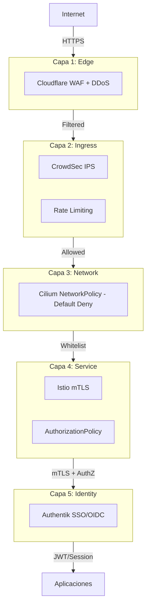

# Modelo Zero Trust

Por qué la seguridad basada en perímetro ya no funciona y cómo implementar defensa en profundidad con verificación continua de identidad en cada capa.

---

## El Fin del Perímetro

La seguridad tradicional asume que hay un "adentro" seguro y un "afuera" peligroso. Construyes
un firewall, y todo lo que está dentro es de confianza. Este modelo falla por tres razones:

1. **El perímetro ya no existe.** Con cloud, trabajo remoto, APIs, y microservicios, no hay
   un borde claro de la red.
2. **El 80% de las brechas de seguridad involucran credenciales comprometidas.** Si un
   atacante obtiene credenciales válidas, el firewall lo deja pasar porque está "adentro".
3. **El movimiento lateral es el verdadero peligro.** Una vez dentro, sin controles internos,
   un atacante puede saltar de un sistema a otro libremente.

Zero Trust invierte el modelo: **nunca confiar, siempre verificar.** Cada request, venga de
donde venga, debe ser autenticado y autorizado. No hay "adentro" seguro.

---

## El Bug del `- {}`: Cuando Tu Default-Deny No Niega Nada

En TalosLab, durante una auditoría de seguridad en 2026, descubrimos un bug sutil pero
crítico en nuestras CiliumNetworkPolicies. Las políticas documentadas como "default-deny"
estaban usando la sintaxis `- {}` que en YAML representa una lista con un elemento vacío:

```yaml
# ❌ Esto parece default-deny pero NO lo es
spec:
  ingress:
- {}        # Objeto vacío = allow ALL traffic
```

El objeto vacío `{}` actúa como un selector que matchea **todos** los endpoints. Kubernetes
lo interpreta como "permitir tráfico desde cualquier fuente". La sintaxis correcta es:

```yaml
# ✅ Esto SÍ es default-deny verdadero
spec:
  ingress: []   # Lista vacía = deny ALL traffic
```

La diferencia entre `- {}` y `[]` es de un solo carácter en YAML pero representa la
diferencia entre un cluster protegido y uno completamente abierto al movimiento lateral.
La corrección (v2.1) se aplicó a las 45+ NetworkPolicies del cluster.

En lugar de un solo perímetro, implementamos 5 capas independientes. Cada capa puede detener
un ataque por sí sola. Si una capa falla, las demás continúan protegiendo.



### Capa 1: Cloudflare WAF (Edge)

Primera línea de defensa. Bloquea tráfico malicioso antes de que llegue a tu infraestructura.

- **DDoS Protection:** Automático en todos los planes. Mitiga ataques volumétricos.
- **Bot Fight Mode:** Detecta y bloquea bots maliciosos basándose en firmas de comportamiento.
- **WAF Rules:** Rate limiting (100 req/min por IP), bloqueo de user-agents maliciosos,
  protección OWASP Top 10.

### Capa 2: CrowdSec IPS (Ingress)

Detección y bloqueo colaborativo de amenazas. CrowdSec analiza logs en tiempo real y bloquea
IPs que muestran comportamiento malicioso.

- **Inteligencia colectiva:** Comparte señales de ataque anónimas con una red global.
  Si alguien ataca a otro usuario de CrowdSec, tu instancia lo bloquea proactivamente.
- **Bouncer para Traefik:** El plugin se integra con Traefik para bloquear IPs a nivel
  de ingress, antes de que el tráfico llegue a los pods.
- **Escenarios activos:** HTTP probing, SSH brute force, crawlers no estáticos,
  bad user agents.

### Capa 3: Cilium NetworkPolicy (Network)

Default-deny a nivel de red. Ningún pod puede comunicarse con otro a menos que una
NetworkPolicy lo permita explícitamente.

- **Default deny:** Todo el tráfico entre pods está bloqueado por defecto.
- **Whitelist explícita:** Solo se permite el tráfico necesario (ej. todos los pods
  pueden hablar con el DNS en kube-system, pero no entre sí sin política).
- **L7 filtering:** Cilium puede filtrar tráfico HTTP/gRPC, no solo IPs y puertos.
  Permite decir "este pod puede hacer GET /api/health a este servicio, pero no POST /admin".

### Capa 4: Istio mTLS (Service)

Mutual TLS entre todos los servicios. Cada servicio presenta un certificado que prueba
su identidad. La comunicación está encriptada en tránsito.

- **STRICT mode:** Todo el tráfico entre servicios debe usar mTLS. Si un servicio no
  presenta un certificado válido, la conexión se rechaza.
- **AuthorizationPolicy:** Control granular de quién puede llamar a qué endpoint.
  "El servicio de frontend puede hacer GET /api/products, pero no DELETE".
- **Zero-touch:** Con Istio Ambient, no necesitas sidecars. El ztunnel por nodo maneja
  el mTLS automáticamente.

### Capa 5: Authentik SSO (Identity)

Autenticación única (Single Sign-On) para todas las aplicaciones. Un solo punto de
login que emite tokens JWT verificables.

- **OIDC/SAML:** Protocolos estándar para autenticación federada.
- **MFA:** Autenticación de múltiples factores obligatoria.
- **Integración con Traefik:** El middleware de Authentik bloquea requests no
  autenticados a nivel de ingress.

---

## ¿Por Qué Múltiples Capas?

Imagina que un atacante logra evadir Cloudflare (quizás encuentra la IP real del servidor).
Ahora enfrenta:

1. **CrowdSec** analizando sus patrones de acceso
2. **Cilium NetworkPolicy** bloqueando todo tráfico no whitelisteado
3. **Istio mTLS** requiriendo certificados que no tiene
4. **Authentik** pidiendo credenciales que no posee

Cada capa es independiente. Comprometer una no compromete las demás. Esto es defensa en profundidad.

---

## Resultados Concretos

| Métrica | Valor |
|:--------|:------|
| IPs bloqueadas/día por CrowdSec | ~150 |
| Escenarios de detección activos | 12 |
| mTLS coverage | 100% STRICT |
| NetworkPolicies aplicadas | 45+ |
| False positive rate | < 0.2% |

---

## Ver también

- [Tutorial: Zero Trust Security](../tutorials/zero-trust-security.md)
- [Arquitectura Cloud Native](cloud-native-architecture.md)
- [Referencia de stacks de seguridad](../reference/tech-stacks.md)
