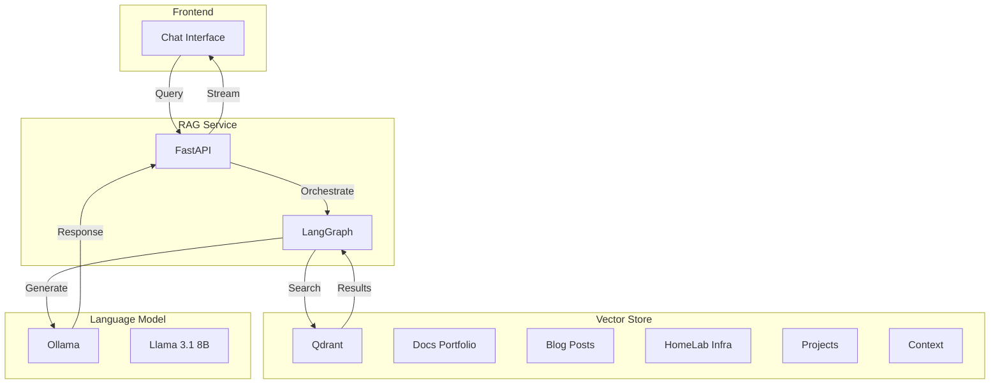
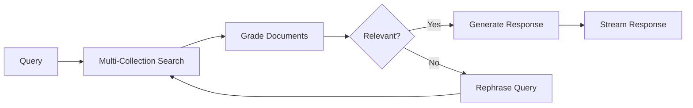

<div class="project-header">
<h1>AI Chat con RAG</h1>
<p>Asistente inteligente con recuperación aumentada para consulta de documentación técnica.</p>

<div class="project-meta-grid">
<div class="meta-item">
<span class="meta-label">Status</span>
<span class="meta-value">AGENT_READY</span>
</div>
<div class="meta-item">
<span class="meta-label">Architecture</span>
<span class="meta-value">RAG_LANGGRAPH</span>
</div>
<div class="meta-item">
<span class="meta-label">Vector DB</span>
<span class="meta-value">QDRANT_STAGING</span>
</div>
<div class="meta-item">
<span class="meta-label">LLM Core</span>
<span class="meta-value">LLAMA_3.1_8B</span>
</div>
</div>
</div>

## Visión General

Sistema de Retrieval-Augmented Generation que permite consultar documentación técnica mediante chat.
Búsqueda semántica paralela en múltiples colecciones con respuestas contextualizadas por LLM.

!!! success "Impacto"
    **12K+ documentos** indexados • **5 colecciones** de conocimiento • **Respuestas contextuales** en < 3 segundos

---

## Arquitectura



---

## Stack Tecnológico

=== "RAG Pipeline"

    | Componente | Tecnología | Función |
    |:-----------|:-----------|:--------|
    | **Orchestration** | LangGraph | Agentic workflow |
    | **Embeddings** | nomic-embed-text | 768-dim vectors |
    | **Retrieval** | Qdrant | Semantic search |

=== "Language Model"

    | Componente | Tecnología | Función |
    |:-----------|:-----------|:--------|
    | **Inference** | Ollama | Local LLM serving |
    | **Model** | Llama 3.1 8B | Response generation |
    | **Grading** | LLM Chain | Relevance scoring |

=== "Infrastructure"

    | Componente | Tecnología | Función |
    |:-----------|:-----------|:--------|
    | **API** | FastAPI | REST endpoints |
    | **Streaming** | SSE | Real-time responses |
    | **Storage** | Qdrant PVC | Persistent vectors |

---

## LangGraph Workflow



### Nodos del Grafo

```python
workflow = StateGraph(GraphState)

# Definir nodos
workflow.add_node("retrieve", retrieve_parallel)
workflow.add_node("grade_documents", grade_documents)
workflow.add_node("generate", generate_response)
workflow.add_node("transform_query", transform_query)

# Edges condicionales
workflow.add_conditional_edges(
    "grade_documents",
    decide_to_generate,
    {
        "generate": "generate",
        "transform_query": "transform_query"
    }
)
```

---

## Features Destacadas

### Búsqueda Multi-Colección

```python
async def retrieve_parallel(state: GraphState):
    """Búsqueda paralela en todas las colecciones"""
    collections = [
        "docs_portfolio",
        "blog_posts", 
        "homelab_infra",
        "projects",
        "context_docs"
    ]
    
    tasks = [
        search_collection(query, collection)
        for collection in collections
    ]
    
    results = await asyncio.gather(*tasks)
    return merge_and_rank(results)
```

!!! tip "Parallel Search"
    Las 5 colecciones se consultan en paralelo, reduciendo latencia de 5x a ~300ms total.

### Document Grading

El grader LLM evalúa relevancia antes de generar:

```
Score 1: Documento contiene información sobre la pregunta
Score 0: Documento no es relevante para la pregunta
```

### Streaming Response

- ✅ Server-Sent Events para respuesta progresiva
- ✅ Primera palabra en < 500ms
- ✅ Markdown formatting en tiempo real

---

## Colecciones de Conocimiento

| Colección | Documentos | Descripción |
|:----------|:-----------|:------------|
| **docs_portfolio** | 2,500 | Documentación del portfolio |
| **blog_posts** | 150 | Artículos técnicos |
| **homelab_infra** | 4,000 | Configuración del cluster |
| **projects** | 3,500 | Código y arquitectura |
| **context_docs** | 1,850 | Context documentation |

---

## API Endpoints

```python
# Chat endpoint con streaming
POST /api/chat
{
    "query": "¿Cómo funciona el canary deployment?",
    "session_id": "uuid"
}

# Sugerencias de preguntas
GET /api/suggestions

# Health check
GET /api/health
```

---

## Repositorio

[:fontawesome-brands-github: devops-portfolio](https://github.com/palbina/devops-portfolio){ .md-button }

!!! quote "AI-Powered Documentation"
    *"Ask questions, get contextual answers"* - Tu documentación técnica, accesible mediante conversación natural.
