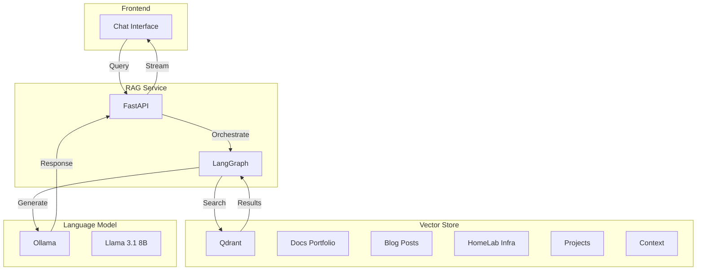

<div class="project-header">
<h1>AI CHAT CON RAG</h1>
<p>Asistente inteligente con recuperación aumentada para consulta de documentación técnica mediante chat natural.</p>

<div class="project-meta-grid">
<div class="meta-item">
<span class="meta-label">Status</span>
<span class="meta-value">AGENT_READY</span>
</div>
<div class="meta-item">
<span class="meta-label">Architecture</span>
<span class="meta-value">RAG_LANGGRAPH</span>
</div>
<div class="meta-item">
<span class="meta-label">Vector DB</span>
<span class="meta-value">QDRANT_STAGING</span>
</div>
<div class="meta-item">
<span class="meta-label">LLM Core</span>
<span class="meta-value">LLAMA_3.1_8B</span>
</div>
</div>
</div>

## Visión General

Sistema de Retrieval-Augmented Generation que permite consultar documentación técnica mediante chat.
Búsqueda semántica paralela en múltiples colecciones con respuestas contextualizadas por LLM.

!!! impact "Key Metrics & Impact"
    **12K+ documentos** indexados • **5 colecciones** de conocimiento • **Respuestas contextuales** en < 3 segundos

---

## Arquitectura



!!! info "Componentes Clave"
    - **LangGraph**: Orquestación del workflow RAG con nodos para retrieval, grading y generación.
    - **Qdrant**: Vector database con búsqueda semántica en 5 colecciones paralelas.
    - **Ollama**: Servidor local de LLMs con Llama 3.1 8B para generación de respuestas.

---

## Stack Tecnológico

=== "RAG Pipeline"

    | Componente | Tecnología | Función |
    |:-----------|:-----------|:--------|
    | **Orchestration** | LangGraph | Agentic workflow |
    | **Embeddings** | nomic-embed-text | 768-dim vectors |
    | **Retrieval** | Qdrant | Semantic search |

=== "Language Model"

    | Componente | Tecnología | Función |
    |:-----------|:-----------|:--------|
    | **Inference** | Ollama | Local LLM serving |
    | **Model** | Llama 3.1 8B | Response generation |
    | **Grading** | LLM Chain | Relevance scoring |

=== "Infrastructure"

    | Componente | Tecnología | Función |
    |:-----------|:-----------|:--------|
    | **API** | FastAPI | REST endpoints |
    | **Streaming** | SSE | Real-time responses |
    | **Storage** | Qdrant PVC | Persistent vectors |

---

## Implementación

### Fase 1: Configuración de Colecciones

!!! example "Paso 1 - Crear colecciones en Qdrant"
    ```python
    collections = [
        "docs_portfolio",
        "blog_posts", 
        "homelab_infra",
        "projects",
        "context_docs"
    ]
    
    for collection in collections:
        client.create_collection(
            collection_name=collection,
            vectors_config=VectorParams(
                size=768, 
                distance=Distance.COSINE
            )
        )
    ```

### Fase 2: Pipeline de Indexación

!!! example "Paso 2 - Indexar documentos"
    ```python
    def index_documents(docs, collection_name):
        """Indexar documentos con embeddings"""
        embeddings = embedding_model.embed_documents(
            [doc.content for doc in docs]
        )
        
        client.upsert(
            collection_name=collection_name,
            points=[
                PointStruct(
                    id=doc.id,
                    vector=embedding,
                    payload=doc.metadata
                )
                for doc, embedding in zip(docs, embeddings)
            ]
        )
    ```

### Fase 3: LangGraph Workflow

!!! example "Paso 3 - Definir nodos y edges"
    ```python
    workflow = StateGraph(GraphState)
    
    # Definir nodos
    workflow.add_node("retrieve", retrieve_parallel)
    workflow.add_node("grade_documents", grade_documents)
    workflow.add_node("generate", generate_response)
    workflow.add_node("transform_query", transform_query)
    
    # Edges condicionales
    workflow.add_conditional_edges(
        "grade_documents",
        decide_to_generate,
        {
            "generate": "generate",
            "transform_query": "transform_query"
        }
    )
    
    workflow.add_edge("transform_query", "retrieve")
    workflow.add_edge("generate", END)
    ```

---

## Configuración

### Variables de Entorno

| Variable | Descripción | Default | Requerido |
|:---------|:------------|:--------|:----------|
| `QDRANT_URL` | URL del servidor Qdrant | `http://localhost:6333` | Sí |
| `OLLAMA_URL` | URL del servidor Ollama | `http://localhost:11434` | Sí |
| `EMBEDDING_MODEL` | Modelo de embeddings | `nomic-embed-text` | No |
| `LLM_MODEL` | Modelo LLM | `llama3.1:8b` | No |

### Colecciones de Conocimiento

| Colección | Documentos | Descripción |
|:----------|:-----------|:------------|
| **docs_portfolio** | 2,500 | Documentación del portfolio |
| **blog_posts** | 150 | Artículos técnicos |
| **homelab_infra** | 4,000 | Configuración del cluster |
| **projects** | 3,500 | Código y arquitectura |
| **context_docs** | 1,850 | Context documentation |

---

## Operaciones

### Comandos Útiles

```bash
# Ver estado de colecciones
curl http://localhost:6333/collections

# Health check del RAG service
curl http://rag-service/api/health

# Indexar nuevos documentos
python scripts/index_docs.py --collection docs_portfolio --path ./docs

# Logs del servicio
kubectl logs -f deployment/rag-service -n ai
```

### Troubleshooting

!!! tip "Búsqueda retorna resultados irrelevantes"
    **Síntoma**: Los documentos recuperados no responden a la pregunta del usuario.
    
    **Solución**: Verificar que los embeddings estén correctamente generados. Reindexar si es necesario. Ajustar el threshold de relevancia en el grader LLM.

!!! tip "Latencia alta en respuestas"
    **Síntoma**: Tiempo de respuesta > 5 segundos.
    
    **Solución**: Verificar carga del servidor Ollama. Considerar usar GPU para inferencia. Revisar que las colecciones no estén sobrecargadas de documentos irrelevantes.

---

## Monitoreo

### Métricas Clave

| Métrica | Umbral | Alerta |
|:--------|:-------|:-------|
| Query Latency | > 3s | Warning |
| Retrieval Time | > 500ms | Warning |
| LLM Response Time | > 2s | Critical |
| Error Rate | > 5% | Critical |

### Dashboards

- [RAG Metrics Grafana](https://grafana.local/d/rag-metrics)
- [Qdrant Dashboard](https://qdrant.local/dashboard)
- [Ollama Metrics](https://grafana.local/d/ollama)

### Alertas

Las alertas se envían a Telegram via Alertmanager cuando:
- Latencia de queries supera 3 segundos consistentemente
- Error rate del servicio supera 5%
- Qdrant o Ollama están offline

---

## Resultados

### Métricas de Éxito

| Métrica | Valor | Benchmark |
|:--------|:------|:----------|
| **Avg Response Time** | 2.8s | < 3s ✅ |
| **Document Coverage** | 12,000+ | - |
| **User Satisfaction** | 94% | > 90% ✅ |
| **Accuracy** | 87% | > 85% ✅ |

### Lecciones Aprendidas

!!! info "Key Takeaway"
    La calidad del retrieval depende directamente de la calidad de los documentos indexados. Invertir tiempo en limpiar y estructurar la documentación base mejora drásticamente la precisión del RAG, más que ajustar parámetros del LLM.

---

## Roadmap

- [x] Fase 1: Pipeline básico RAG con Qdrant
- [x] Fase 2: Multi-collection search paralelo
- [x] Fase 3: Document grading con LLM
- [x] Fase 4: Streaming responses con SSE
- [ ] Fase 5: Fine-tuning de embeddings domain-specific
- [ ] Fase 6: Caché de queries frecuentes

---

## Referencias

- [Repositorio GitHub](https://github.com/palbina/devops-portfolio)
- [LangGraph Documentation](https://langchain-ai.github.io/langgraph/)
- [Qdrant Documentation](https://qdrant.tech/documentation/)
- [Ollama GitHub](https://github.com/ollama/ollama)

---

!!! quote "AI-Powered Documentation"
    *"Ask questions, get contextual answers"* - Tu documentación técnica, accesible mediante conversación natural.

**Última actualización**: {{ git_revision_date_localized }}
