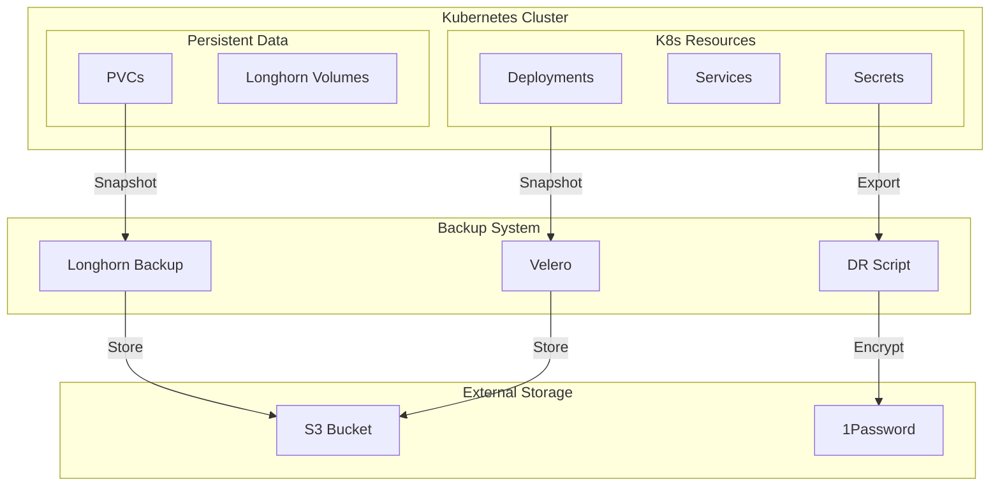

# Backup & Disaster Recovery

## Visión General

Sistema de backup completo para proteger workloads de Kubernetes y datos persistentes.
Velero para recursos K8s, Longhorn para volúmenes, y scripts automatizados para credenciales críticas.

!!! success "Impacto"
    **Backup diario** automático • **RPO < 1 hora** • **RTO < 30 minutos** para restauración completa

---

## Arquitectura



---

## Stack Tecnológico

=== "Kubernetes Backup"

    | Componente | Tecnología | Función |
    |:-----------|:-----------|:--------|
    | **Controller** | Velero | K8s resource backup |
    | **Provider** | AWS S3 | Object storage |
    | **Snapshotter** | CSI Plugin | Volume snapshots |

=== "Volume Backup"

    | Componente | Tecnología | Función |
    |:-----------|:-----------|:--------|
    | **Storage** | Longhorn | Distributed storage |
    | **Snapshots** | Longhorn | Instant snapshots |
    | **Offsite** | S3 Backend | Remote backup |

=== "Secret Backup"

    | Componente | Tecnología | Función |
    |:-----------|:-----------|:--------|
    | **Script** | export-dr-backup.sh | Credential export |
    | **Encryption** | Sealed Secrets | At-rest encryption |
    | **Vault** | 1Password | Secure storage |

---

## Velero Configuration

```yaml
apiVersion: velero.io/v1
kind: Schedule
metadata:
  name: daily-cluster-backup
spec:
  schedule: "0 3 * * *"  # 3 AM daily
  template:
    includedNamespaces:
      - "*"
    excludedNamespaces:
      - kube-system
      - velero
    includeClusterResources: true
    storageLocation: default
    ttl: 720h  # 30 days retention
```

---

## Features Destacadas

### Backup Automatizado

!!! tip "Set and Forget"
    Backups diarios a las 3 AM con retención de 30 días. Sin intervención manual requerida.

| Tipo | Frecuencia | Retención | Destino |
|:-----|:-----------|:----------|:--------|
| **Full Cluster** | Diario 3 AM | 30 días | S3 |
| **Longhorn Volumes** | Cada 6h | 7 días | S3 |
| **WAL Archive (DB)** | Cada 5 min | 30 días | S3 |
| **DR Secrets** | Manual | Indefinida | 1Password |

### Longhorn Snapshots

```yaml
apiVersion: longhorn.io/v1beta2
kind: RecurringJob
metadata:
  name: backup-volumes
spec:
  cron: "0 */6 * * *"
  task: backup
  retain: 28
  concurrency: 2
```

### DR Script para Secrets

```bash
#!/bin/bash
# export-dr-backup.sh

# Exportar credenciales críticas
kubectl get secret sealed-secrets-key -n kube-system -o yaml > sealed-secrets-key.yaml
kubectl get secret argocd-admin -n argocd -o yaml > argocd-admin.yaml
kubectl get secret authentik-admin -n auth -o yaml > authentik-admin.yaml

# Crear archivo encriptado
tar cz *.yaml | gpg --symmetric --cipher-algo AES256 > dr-backup-$(date +%Y%m%d).tar.gz.gpg

# Upload a 1Password
op document create dr-backup-$(date +%Y%m%d).tar.gz.gpg --vault "HomeLab DR"
```

---

## Procedimiento de Restauración

### Restaurar Namespace Completo

```bash
# Listar backups disponibles
velero backup get

# Restaurar namespace específico
velero restore create --from-backup daily-cluster-backup-20240201 \
  --include-namespaces portfolio \
  --restore-volumes=true
```

### Restaurar Volumen Longhorn

```bash
# Desde snapshot local
longhorn-cli volume restore --volume pvc-abc123 --snapshot snap-20240201

# Desde S3 backup
longhorn-cli volume restore --volume pvc-abc123 --backup s3://backups/pvc-abc123
```

---

## Métricas de Backup

| Métrica | Objetivo | Actual |
|:--------|:---------|:-------|
| **RPO** (Recovery Point Objective) | < 1 hora | 6 horas (volumes), 5 min (DB) |
| **RTO** (Recovery Time Objective) | < 30 min | ~15 min (tested) |
| **Backup Success Rate** | 99.9% | 100% (last 30 days) |
| **Restore Tests** | Monthly | ✅ Feb 2024 |

---

## Repositorio

[:fontawesome-brands-github: HOMELAB-INFRA](https://github.com/palbina/HOMELAB-INFRA){ .md-button }

!!! quote "Backup Philosophy"
    *"A backup that hasn't been tested is not a backup"* - Restauraciones mensuales verifican la integridad de los datos.
