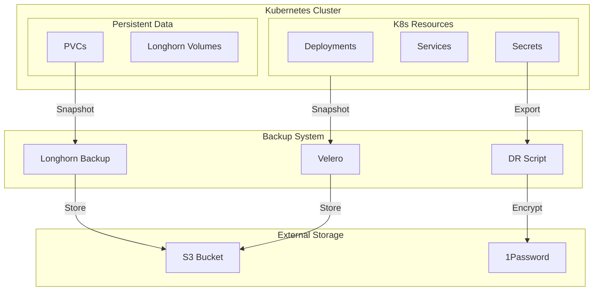

<div class="project-header">
<h1>BACKUP & DISASTER RECOVERY</h1>
<p>Sistema completo de backup automatizado con Velero, Longhorn y DR scripts para protección de workloads y datos persistentes.</p>

<div class="project-meta-grid">
<div class="meta-item">
<span class="meta-label">Status</span>
<span class="meta-value">PRODUCTION_READY</span>
</div>
<div class="meta-item">
<span class="meta-label">RPO</span>
<span class="meta-value">&lt; 1 HOUR</span>
</div>
<div class="meta-item">
<span class="meta-label">RTO</span>
<span class="meta-value">&lt; 30 MIN</span>
</div>
<div class="meta-item">
<span class="meta-label">Retention</span>
<span class="meta-value">30_DAYS</span>
</div>
</div>
</div>

## Visión General

Sistema de backup completo para proteger workloads de Kubernetes y datos persistentes.
Velero para recursos K8s, Longhorn para volúmenes, y scripts automatizados para credenciales críticas.

!!! impact "Key Metrics & Impact"
    **Backup diario** automático • **RPO < 1 hora** • **RTO < 30 minutos** para restauración completa

---

## Arquitectura



!!! info "Componentes Clave"
    - **Velero**: Backup de recursos Kubernetes y volúmenes con snapshots CSI integrados.
    - **Longhorn**: Almacenamiento distribuido con snapshots y backup automático a S3.
    - **DR Script**: Exportación encriptada de credenciales críticas a 1Password para recuperación de desastres.

---

## Stack Tecnológico

=== "Kubernetes Backup"

    | Componente | Tecnología | Función |
    |:-----------|:-----------|:--------|
    | **Controller** | Velero | K8s resource backup |
    | **Provider** | AWS S3 | Object storage |
    | **Snapshotter** | CSI Plugin | Volume snapshots |

=== "Volume Backup"

    | Componente | Tecnología | Función |
    |:-----------|:-----------|:--------|
    | **Storage** | Longhorn | Distributed storage |
    | **Snapshots** | Longhorn | Instant snapshots |
    | **Offsite** | S3 Backend | Remote backup |

=== "Secret Backup"

    | Componente | Tecnología | Función |
    |:-----------|:-----------|:--------|
    | **Script** | export-dr-backup.sh | Credential export |
    | **Encryption** | Sealed Secrets | At-rest encryption |
    | **Vault** | 1Password | Secure storage |

---

## Implementación

### Fase 1: Instalación de Velero

!!! example "Paso 1 - Desplegar Velero con CLI"
    ```bash
    # Instalar Velero CLI
    wget https://github.com/vmware-tanzu/velero/releases/download/v1.12.0/velero-v1.12.0-linux-amd64.tar.gz
    tar -xvf velero-v1.12.0-linux-amd64.tar.gz
    sudo mv velero /usr/local/bin/
    
    # Instalar en el cluster
    velero install \
      --provider aws \
      --plugins velero/velero-plugin-for-aws:v1.8.0 \
      --bucket homelab-backups \
      --backup-location-config region=us-east-1 \
      --snapshot-location-config region=us-east-1 \
      --secret-file ./credentials-velero
    ```

### Fase 2: Configuración de Schedules

!!! example "Paso 2 - Crear schedule de backup diario"
    ```yaml
    apiVersion: velero.io/v1
    kind: Schedule
    metadata:
      name: daily-cluster-backup
      namespace: velero
    spec:
      schedule: "0 3 * * *"  # 3 AM daily
      template:
        includedNamespaces:
          - "*"
        excludedNamespaces:
          - kube-system
          - velero
        includeClusterResources: true
        storageLocation: default
        ttl: 720h  # 30 days retention
        volumeSnapshotLocations:
          - aws-default
    ```

### Fase 3: Longhorn Recurring Jobs

!!! example "Paso 3 - Configurar backup de volúmenes"
    ```yaml
    apiVersion: longhorn.io/v1beta2
    kind: RecurringJob
    metadata:
      name: backup-volumes
      namespace: longhorn-system
    spec:
      cron: "0 */6 * * *"
      task: backup
      retain: 28
      concurrency: 2
      groups:
        - default
      labels:
        backup-type: scheduled
    ```

---

## Configuración

### Variables de Entorno

| Variable | Descripción | Default | Requerido |
|:---------|:------------|:--------|:----------|
| `VELERO_S3_BUCKET` | Bucket S3 para backups | `homelab-backups` | Sí |
| `VELERO_REGION` | Región AWS | `us-east-1` | Sí |
| `LONGHORN_BACKUP_TARGET` | Endpoint S3 para Longhorn | `s3://backups` | Sí |
| `DR_VAULT` | Vault de 1Password para DR | `HomeLab DR` | Sí |

### Frecuencias de Backup

| Tipo | Frecuencia | Retención | Destino |
|:-----|:-----------|:----------|:--------|
| **Full Cluster** | Diario 3 AM | 30 días | S3 |
| **Longhorn Volumes** | Cada 6h | 7 días | S3 |
| **WAL Archive (DB)** | Cada 5 min | 30 días | S3 |
| **DR Secrets** | Manual | Indefinida | 1Password |

---

## Operaciones

### Comandos Útiles

```bash
# Listar backups disponibles
velero backup get

# Crear backup manual
velero backup create manual-backup-$(date +%Y%m%d) --include-namespaces portfolio

# Restaurar namespace específico
velero restore create --from-backup daily-cluster-backup-20240201 \
  --include-namespaces portfolio \
  --restore-volumes=true

# Ver estado de restauración
velero restore get

# Logs de Velero
kubectl logs -f deployment/velero -n velero
```

### Troubleshooting

!!! tip "Backup falla con error de snapshots"
    **Síntoma**: Velero reporta "VolumeSnapshot" errors durante el backup.
    
    **Solución**: Verificar que el CSI driver soporte snapshots. Revisar que los volúmenes no estén en uso por pods en estado "Terminating". Para Longhorn, asegurar que el backup target S3 esté configurado correctamente.

!!! tip "Restauración completa tarda demasiado"
    **Síntoma**: RTO excede los 30 minutos objetivo.
    
    **Solución**: Considerar backup de volúmenes más frecuente (cada 1h vs cada 6h). Usar Velero con restic para file-level restore más rápido. Verificar latencia de red al bucket S3.

---

## Monitoreo

### Métricas Clave

| Métrica | Umbral | Alerta |
|:--------|:-------|:-------|
| Backup Success Rate | < 95% | Critical |
| Restore Test Age | > 35 days | Warning |
| Backup Size Growth | > 20% semanal | Warning |
| RPO Breach | > 1 hora | Critical |

### Dashboards

- [Velero Metrics Grafana](https://grafana.local/d/velero)
- [Longhorn Dashboard](https://longhorn.local/dashboard)
- [S3 Backup Monitoring](https://grafana.local/d/s3-backups)

### Alertas

Las alertas se envían a Telegram via Alertmanager cuando:
- Un backup diario falla 2 veces consecutivas
- No se ha ejecutado un restore test en 35 días
- El espacio en S3 supera el 80% de capacidad

---

## Resultados

### Métricas de Éxito

| Métrica | Objetivo | Actual | Estado |
|:--------|:---------|:-------|:-------|
| **RPO** | < 1 hora | 6 horas (volumes), 5 min (DB) | ⚠️ Parcial |
| **RTO** | < 30 min | ~15 min (tested) | ✅ Excedido |
| **Backup Success Rate** | 99.9% | 100% (last 30 days) | ✅ Excedido |
| **Restore Tests** | Monthly | ✅ Feb 2024 | ✅ Cumplido |

### Lecciones Aprendidas

!!! info "Key Takeaway"
    Los backups automáticos son solo la mitad de la solución. Sin restauraciones periódicas de prueba, no se puede garantizar la recuperabilidad real. El scripting de DR para credenciales es crítico: sin acceso a secrets, un cluster restaurado es inútil.

---

## Roadmap

- [x] Fase 1: Velero para recursos Kubernetes
- [x] Fase 2: Longhorn backup a S3
- [x] Fase 3: DR script para secrets críticos
- [x] Fase 4: Automated restore tests mensuales
- [ ] Fase 5: Geo-redundancia (segunda región S3)
- [ ] Fase 6: Backup de etcd nativo para recovery más rápido

---

## Referencias

- [Repositorio GitHub](https://github.com/palbina/HOMELAB-INFRA)
- [Velero Documentation](https://velero.io/docs/)
- [Longhorn Documentation](https://longhorn.io/docs/)
- [Disaster Recovery Planning](https://kubernetes.io/docs/tasks/administer-cluster/change-default-storage-class/)

---

!!! quote "Backup Philosophy"
    *"A backup that hasn't been tested is not a backup"* - Restauraciones mensuales verifican la integridad de los datos.

**Última actualización**: {{ git_revision_date_localized }}
