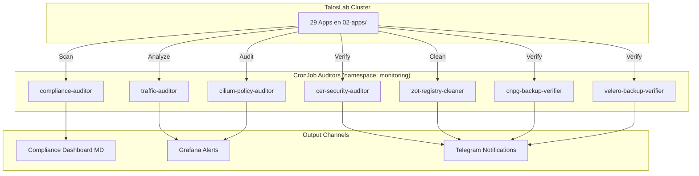

<div class="project-header">
<h1>COMPLIANCE DASHBOARD</h1>
<p>Auditoría automatizada de compliance con 7 CronJobs verificando 29 aplicaciones contra el Molty Standard V2.</p>

<div class="project-meta-grid">
<div class="meta-item">
<span class="meta-label">Status</span>
<span class="meta-value">AUDIT_ACTIVE</span>
</div>
<div class="meta-item">
<span class="meta-label">Coverage</span>
<span class="meta-value">29_APPS_100%</span>
</div>
<div class="meta-item">
<span class="meta-label">CronJobs</span>
<span class="meta-value">7_AUDITORS</span>
</div>
<div class="meta-item">
<span class="meta-label">Standard</span>
<span class="meta-value">MOLTY_V2</span>
</div>
</div>
</div>

## Visión General

Sistema automatizado de verificación de compliance que audita las 29 aplicaciones del cluster TalosLab contra el Molty Standard V2. Siete CronJobs especializados ejecutan verificaciones periódicas de seguridad, tráfico, certificados, registros, backups y NetworkPolicies.

!!! impact "Key Metrics & Impact"
**29 aplicaciones** 100% compliant • **7 CronJobs** de auditoría • **0 excepciones** al estándar Molty V2 • **~580 checks diarios** automatizados

---

## Arquitectura



!!! info "Pipeline de Auditoría"
    Cada CronJob se ejecuta en su schedule independiente y reporta resultados al Compliance Dashboard (Markdown generado automáticamente), Grafana (alertas) y Telegram (notificaciones críticas).

---

## Stack Tecnológico

### CronJobs de Auditoría

| Auditor | Schedule | Checks |
|:---|:---|:---|
| **compliance-auditor** | Diario | 20 checks por app (SecurityContext, probes, PSS, NP, limits) |
| **traffic-auditor** | Cada 6h | Análisis de tráfico externo, IPs sospechosas |
| **cert-security-auditor** | Semanal | Verificación de certificados TLS, expiración |
| **zot-registry-cleaner** | Semanal | Limpieza de imágenes sin tag, dangling manifests |
| **cilium-policy-auditor** | Diario | Verificación de NetworkPolicies v2.1, detección de `- {}` |
| **cnpg-backup-verifier** | Diario | Integridad de backups PostgreSQL, RPO check |
| **velero-backup-verifier** | Diario | Integridad de backups K8s, restore test simulado |

### Checks por Aplicación (Web)

| Categoría | Checks | Peso |
|:---|:---:|:---:|
| **Seguridad** | SecurityContext, PSS, SA, capabilities | 35% |
| **Zero Trust** | NetworkPolicy v2.1, Istio Ambient label | 25% |
| **Resiliencia** | PDB, resource limits, probes | 20% |
| **Funcionalidad** | IngressRoute, CrowdSec, Authentik | 15% |
| **Observabilidad** | ServiceMonitor | 5% |

---

## Implementación

### Fase 1: Compliance Dashboard Automatizado

!!! example "Dashboard generado automáticamente"
    El dashboard se regenera en cada ejecución del `compliance-auditor` y se commitea al repo:

    ```markdown
    # 📊 Dashboard de Compliance - Molty Standard V2
    
    > **Última actualización:** 2026-06-19
    > **Estado Global:** **100%** (29/29 Apps Compliant)
    
| Aplicación | Checks | Compliance % | Estado |
|:---|:---:|:---:|:---:|
| astro-portfolio | 20/20 | 100% | 🟢 COMPLIANT |
| canary-demo | 20/20 | 100% | 🟢 COMPLIANT |
    ... (29 apps total)
    ```

### Fase 2: Webhook de Alertas

!!! example "Notificación Telegram por incumplimiento"
    ```yaml
    # AlertManager rule
- alert: ComplianceDegraded
      expr: compliance_score < 80
      for: 5m
      annotations:
        summary: "App {{ $labels.app }} bajó a {{ $value }}% compliance"
      labels:
        severity: critical
        channel: telegram
    ```

### Fase 3: Pre-commit Hook

!!! example "Validación pre-merge"
    ```bash
    # .git/hooks/pre-commit (simplificado)
    #!/bin/bash
    CHANGED_APPS=$(git diff --cached --name-only | grep 'k8s/02-apps/' | cut -d/ -f3 | sort -u)
    for app in $CHANGED_APPS; do
      ./scripts/validate-deployment-compliance.sh "k8s/02-apps/$app" || exit 1
    done
    ```

---

## Resultados de Compliance

### Aplicaciones Auditadas (29/29 - 100%)

| Aplicación | Checks | Estado |
|:---|:---:|:---:|
| astro-portfolio | 20/20 | 🟢 |
| canary-demo | 20/20 | 🟢 |
| code-server | 20/20 | 🟢 |
| esphome | 20/20 | 🟢 |
| fastapi-backend | 20/20 | 🟢 |
| fastapi-frontend | 16/16 | 🟢 |
| forgejo | 20/20 | 🟢 |
| frigate | 20/20 | 🟢 |
| geonode | 20/20 | 🟢 |
| gitlab | 20/20 | 🟢 |
| home-assistant | 20/20 | 🟢 |
| industrial-monitor-landing | 20/20 | 🟢 |
| industrial-plant-monitor | 20/20 | 🟢 |
| kubernetes-dashboard | 20/20 | 🟢 |
| mkdocs-portfolio | 20/20 | 🟢 |
| molty-odoo | 20/20 | 🟢 |
| mosquitto | 18/18 | 🟢 |
| odoo | 20/20 | 🟢 |
| openclaw | 20/20 | 🟢 |
| osrm-backend | 20/20 | 🟢 |
| portainer | 20/20 | 🟢 |
| portfolio | 20/20 | 🟢 |
| senaletica-vial | 20/20 | 🟢 |
| thingsboard | 20/20 | 🟢 |
| vaultwarden | 20/20 | 🟢 |
| velero-ui | 20/20 | 🟢 |
| web-terminal | 20/20 | 🟢 |
| wordpress | 20/20 | 🟢 |
| zot-registry | 20/20 | 🟢 |

### Estadísticas

| Métrica | Valor |
|:---|:---:|
| **Total Apps** | 29 |
| **Cumplimiento 100%** | 29 🟢 |
| **Cumplimiento Parcial (>80%)** | 0 🟡 |
| **No Cumplen (<80%)** | 0 🔴 |
| **Checks Totales** | ~580/día |
| **CronJobs Activos** | 7/7 |

---

## Operaciones

### Comandos Útiles

```bash
# Ejecutar compliance check manual
kubectl create job --from=cronjob/compliance-auditor manual-check -n monitoring

# Ver logs de auditoría
kubectl logs -f job/manual-check -n monitoring

# Verificar estado de todos los CronJobs
kubectl get cronjobs -n monitoring

# Forzar regeneración del dashboard
kubectl create job --from=cronjob/compliance-auditor regen-dashboard -n monitoring
```

### Troubleshooting

!!! tip "Compliance score degradado en una app"
**Síntoma**: Una app que antes estaba 100% ahora reporta <80%.

**Solución**: Revisar los cambios recientes en `k8s/02-apps/<app>/`. El auditor verifica SecurityContext, NetworkPolicies, probes y resource limits. Si se modificó el deployment.yaml, verificar que no se hayan eliminado campos requeridos.

---

## Métricas de Éxito

| Métrica | Objetivo | Actual | Estado |
|:---|:---|:---|:---|
| **Compliance Global** | 100% | 100% (29/29) | ✅ Cumplido |
| **CronJobs Funcionando** | 7/7 | 7/7 | ✅ Cumplido |
| **Tiempo de Auditoría** | < 10 min | ~3 min | ✅ Excedido |
| **False Positives** | < 1% | 0% | ✅ Excedido |

---

## Roadmap

- [x] Fase 1: compliance-auditor con checks básicos
- [x] Fase 2: Dashboard Markdown auto-generado
- [x] Fase 3: 7 CronJobs especializados
- [x] Fase 4: Pre-commit hook validation
- [ ] Fase 5: Integración con Grafana Alerting nativo
- [ ] Fase 6: Score histórico con trend visualization

---

## Referencias

- [TalosLab Compliance Dashboard](https://github.com/palbina/HOMELAB-INFRA/blob/main/docs/compliance-dashboard.md)
- [Molty Standard V2](https://github.com/palbina/HOMELAB-INFRA/blob/main/k8s/templates/README.md)
- [Deployment Methodology](./deployment-methodology.md)

---

!!! quote "Compliance as Code"
*"La seguridad sin verificación es solo una esperanza. 7 auditores automatizados garantizan que cada app, cada día, cumple el estándar."*

**Última actualización**: 2026-07-05
