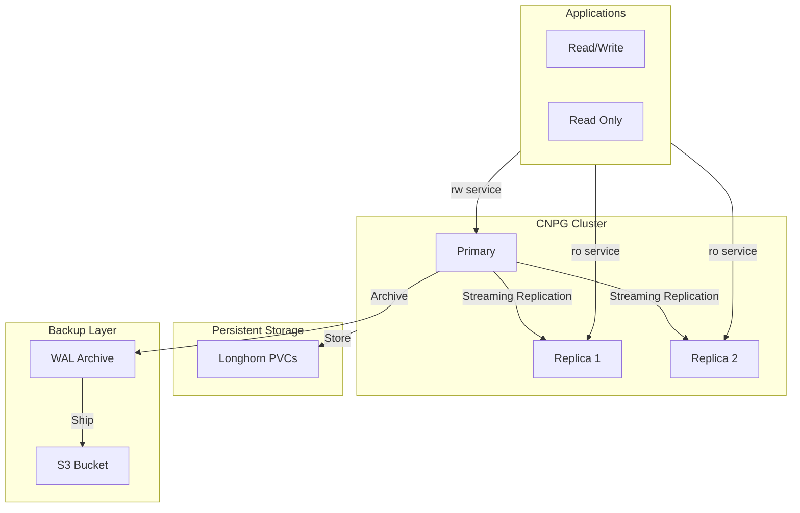

<div class="project-header">
<h1>Database HA con CloudNativePG</h1>
<p>Clusters PostgreSQL de alta disponibilidad con failover automático y backups inmutables.</p>

<div class="project-meta-grid">
<div class="meta-item">
<span class="meta-label">Status</span>
<span class="meta-value">CLUSTER_STABLE</span>
</div>
<div class="meta-item">
<span class="meta-label">Engine</span>
<span class="meta-value">POSTGRES_V16</span>
</div>
<div class="meta-item">
<span class="meta-label">Replication</span>
<span class="meta-value">SYNC_STREAMING</span>
</div>
<div class="meta-item">
<span class="meta-label">Backups</span>
<span class="meta-value">S3_CONTINUOUS</span>
</div>
</div>
</div>

## Visión General

Clusters PostgreSQL de alta disponibilidad gestionados como código con CloudNativePG.
Failover automático, WAL archiving a S3, y backups continuos sin tiempo de inactividad.

!!! success "Impacto"
    **3 instancias** PostgreSQL HA • **Backups continuos** a S3 • **Failover automático** en segundos

---

## Arquitectura



---

## Stack Tecnológico

=== "Database"

    | Componente | Tecnología | Función |
    |:-----------|:-----------|:--------|
    | **Operator** | CloudNativePG | Lifecycle management |
    | **Engine** | PostgreSQL 16 | Database engine |
    | **Pooler** | PgBouncer | Connection pooling |

=== "High Availability"

    | Componente | Tecnología | Función |
    |:-----------|:-----------|:--------|
    | **Replication** | Streaming | Sync replica lag < 1s |
    | **Failover** | CNPG Operator | Promoción automática |
    | **Services** | K8s Services | rw/ro endpoints |

=== "Backup & Recovery"

    | Componente | Tecnología | Función |
    |:-----------|:-----------|:--------|
    | **WAL Archive** | S3 | Continuous archiving |
    | **Base Backup** | Barman | Scheduled full backups |
    | **PITR** | WAL + Base | Point-in-time recovery |

---

## Cluster Configuration

```yaml
apiVersion: postgresql.cnpg.io/v1
kind: Cluster
metadata:
  name: postgres-cluster
spec:
  instances: 3
  
  postgresql:
    parameters:
      max_connections: "200"
      shared_buffers: "256MB"
      effective_cache_size: "512MB"
  
  storage:
    storageClass: longhorn
    size: 20Gi
  
  backup:
    barmanObjectStore:
      destinationPath: s3://homelab-backups/cnpg/
      s3Credentials:
        accessKeyId:
          name: s3-creds
          key: ACCESS_KEY_ID
        secretAccessKey:
          name: s3-creds
          key: SECRET_ACCESS_KEY
      wal:
        compression: gzip
    retentionPolicy: "30d"
```

---

## Features Destacadas

### Failover Automático

!!! tip "Self-Healing"
    Si el Primary falla, CNPG promueve automáticamente un replica en < 30 segundos. Las aplicaciones reconectan automáticamente vía el Service `rw`.

### Servicios de Acceso

```yaml
# Read/Write - Solo Primary
postgres-cluster-rw.database.svc

# Read Only - Load balanced entre Replicas  
postgres-cluster-ro.database.svc

# Single instance (para migrations)
postgres-cluster-1.database.svc
```

### Backup Continuo a S3

- ✅ WAL archiving cada 5 minutos
- ✅ Base backup diario
- ✅ Retención 30 días
- ✅ Encriptación at-rest

### Point-in-Time Recovery

```bash
# Restaurar a un momento específico
kubectl cnpg restore postgres-cluster \
  --backup postgres-cluster-2024-02-01 \
  --target-time "2024-02-01 14:30:00"
```

---

## Bases de Datos en Producción

| Database | Aplicación | Tamaño | Replicas |
|:---------|:-----------|:-------|:---------|
| **odoo-db** | Odoo ERP | 2.5 GB | 2 |
| **authentik-db** | Authentik SSO | 150 MB | 1 |
| **wordpress-db** | WordPress Sites | 500 MB | 1 |
| **forgejo-db** | Forgejo Git | 300 MB | 1 |

---

## Métricas y Monitoring

```promql
# Lag de replicación
cnpg_pg_replication_lag_seconds

# Conexiones activas
cnpg_pg_stat_activity_count

# Transacciones por segundo
rate(cnpg_pg_stat_database_xact_commit[5m])
```

---

## Repositorio

[:fontawesome-brands-github: HOMELAB-INFRA](https://github.com/palbina/HOMELAB-INFRA){ .md-button }

!!! quote "Data Reliability"
    *"Your data is safe even when nodes fail"* - HA nativo, backups continuos, y recovery point < 5 minutos.
