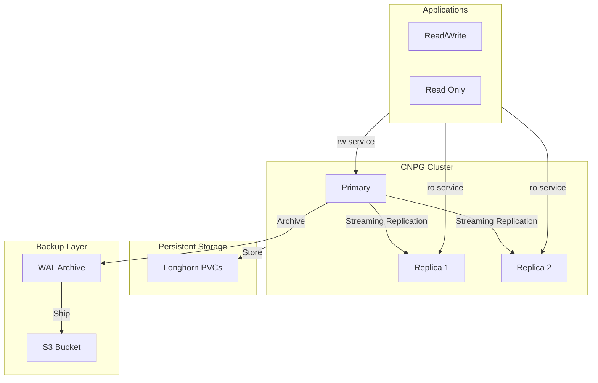

<div class="project-header">
<h1>DATABASE HA CON CLOUDNATIVEPG</h1>
<p>Clusters PostgreSQL de alta disponibilidad gestionados como código con failover automático y backups inmutables.</p>

<div class="project-meta-grid">
<div class="meta-item">
<span class="meta-label">Status</span>
<span class="meta-value">CLUSTER_STABLE</span>
</div>
<div class="meta-item">
<span class="meta-label">Engine</span>
<span class="meta-value">POSTGRES_V16</span>
</div>
<div class="meta-item">
<span class="meta-label">Replication</span>
<span class="meta-value">SYNC_STREAMING</span>
</div>
<div class="meta-item">
<span class="meta-label">Backups</span>
<span class="meta-value">S3_CONTINUOUS</span>
</div>
</div>
</div>

## Visión General

Clusters PostgreSQL de alta disponibilidad gestionados como código con CloudNativePG.
Failover automático, WAL archiving a S3, y backups continuos sin tiempo de inactividad.

!!! impact "Key Metrics & Impact"
    **3 instancias** PostgreSQL HA • **Backups continuos** a S3 • **Failover automático** en segundos

---

## Arquitectura



!!! info "Componentes Clave"
    - **CloudNativePG Operator**: Gestión del ciclo de vida del cluster PostgreSQL con failover automático.
    - **Streaming Replication**: Replicación síncrona entre Primary y Replicas con lag < 1 segundo.
    - **WAL Archiving**: Archivado continuo de Write-Ahead Logs a S3 para Point-in-Time Recovery.

---

## Stack Tecnológico

=== "Database"

    | Componente | Tecnología | Función |
    |:-----------|:-----------|:--------|
    | **Operator** | CloudNativePG | Lifecycle management |
    | **Engine** | PostgreSQL 16 | Database engine |
    | **Pooler** | PgBouncer | Connection pooling |

=== "High Availability"

    | Componente | Tecnología | Función |
    |:-----------|:-----------|:--------|
    | **Replication** | Streaming | Sync replica lag < 1s |
    | **Failover** | CNPG Operator | Promoción automática |
    | **Services** | K8s Services | rw/ro endpoints |

=== "Backup & Recovery"

    | Componente | Tecnología | Función |
    |:-----------|:-----------|:--------|
    | **WAL Archive** | S3 | Continuous archiving |
    | **Base Backup** | Barman | Scheduled full backups |
    | **PITR** | WAL + Base | Point-in-time recovery |

---

## Implementación

### Fase 1: Instalación del Operator

!!! example "Paso 1 - Desplegar CloudNativePG"
    ```bash
    # Instalar CNPG Operator
    kubectl apply -f \
      https://raw.githubusercontent.com/cloudnative-pg/cloudnative-pg/release-1.22/releases/cnpg-1.22.0.yaml
    
    # Verificar instalación
    kubectl get deployment -n cnpg-system cnpg-controller-manager
    
    # Instalar CLI (opcional pero recomendado)
    curl -sSfL \
      https://github.com/cloudnative-pg/cloudnative-pg/raw/main/hack/install-cnpg-plugin.sh | \
      sudo sh -s -- -b /usr/local/bin
    ```

### Fase 2: Creación del Cluster

!!! example "Paso 2 - Definir cluster PostgreSQL"
    ```yaml
    apiVersion: postgresql.cnpg.io/v1
    kind: Cluster
    metadata:
      name: postgres-cluster
      namespace: database
    spec:
      instances: 3
      
      postgresql:
        parameters:
          max_connections: "200"
          shared_buffers: "256MB"
          effective_cache_size: "512MB"
      
      storage:
        storageClass: longhorn
        size: 20Gi
      
      backup:
        barmanObjectStore:
          destinationPath: s3://homelab-backups/cnpg/
          s3Credentials:
            accessKeyId:
              name: s3-creds
              key: ACCESS_KEY_ID
            secretAccessKey:
              name: s3-creds
              key: SECRET_ACCESS_KEY
          wal:
            compression: gzip
        retentionPolicy: "30d"
    ```

### Fase 3: Configuración de Servicios

!!! example "Paso 3 - Configurar acceso de aplicaciones"
    ```yaml
    # Los servicios se crean automáticamente por CNPG:
    # - postgres-cluster-rw: Read/Write (solo Primary)
    # - postgres-cluster-ro: Read Only (balanceado entre Replicas)
    # - postgres-cluster-r: Any instance (para operaciones de maintenance)
    
    # Verificar endpoints
    kubectl get svc -n database | grep postgres-cluster
    ```

---

## Configuración

### Variables de Entorno

| Variable | Descripción | Default | Requerido |
|:---------|:------------|:--------|:----------|
| `POSTGRES_DB` | Database inicial | `app` | No |
| `POSTGRES_USER` | Superuser | `postgres` | No |
| `POSTGRES_PASSWORD` | Password superuser | - | Sí |
| `AWS_ACCESS_KEY_ID` | S3 Access Key | - | Sí |
| `AWS_SECRET_ACCESS_KEY` | S3 Secret Key | - | Sí |

### Databases en Producción

| Database | Aplicación | Tamaño | Replicas |
|:---------|:-----------|:-------|:---------|
| **odoo-db** | Odoo ERP | 2.5 GB | 2 |
| **authentik-db** | Authentik SSO | 150 MB | 1 |
| **wordpress-db** | WordPress Sites | 500 MB | 1 |
| **forgejo-db** | Forgejo Git | 300 MB | 1 |

---

## Operaciones

### Comandos Útiles

```bash
# Ver estado del cluster
kubectl cnpg status postgres-cluster -n database

# Listar pods del cluster
kubectl get pods -n database -l cnpg.io/cluster=postgres-cluster

# Conectar al Primary
kubectl cnpg psql postgres-cluster -n database

# Promover un Replica a Primary (manual)
kubectl cnpg promote postgres-cluster postgres-cluster-2 -n database

# Verificar lag de replicación
kubectl cnpg status postgres-cluster -n database | grep "Replication Info"
```

### Troubleshooting

!!! tip "Failover no ocurre automáticamente"
    **Síntoma**: El Primary está caído pero ningún Replica se promueve.
    
    **Solución**: Verificar que el CNPG Operator esté funcionando (`kubectl get pods -n cnpg-system`). Revisar logs del operator. Si es necesario, promover manualmente con `kubectl cnpg promote`.

!!! tip "Lag de replicación alto"
    **Síntoma**: `cnpg_pg_replication_lag_seconds` > 5 segundos.
    
    **Solución**: Verificar recursos de los nodos (CPU/Memory). Revisar red entre nodos. Considerar ajustar `max_wal_size` y `checkpoint_timeout`. Si persiste, investigar queries largas en el Primary.

---

## Monitoreo

### Métricas Clave

| Métrica | Umbral | Alerta |
|:--------|:-------|:-------|
| Replication Lag | > 5s | Warning |
| Active Connections | > 180 | Warning |
| Transactions/sec | Anomalía | Info |
| Storage Usage | > 80% | Critical |
| Backup Age | > 25h | Warning |

### Queries PromQL

```promql
# Lag de replicación
cnpg_pg_replication_lag_seconds

# Conexiones activas
cnpg_pg_stat_activity_count

# Transacciones por segundo
rate(cnpg_pg_stat_database_xact_commit[5m])

# Espacio libre en disco
cnpg_pg_database_size_bytes / cnpg_pg_settings_disk_size_bytes
```

### Dashboards

- [CNPG Dashboard Grafana](https://grafana.local/d/cnpg)
- [PostgreSQL Overview](https://grafana.local/d/postgres-overview)
- [Replication Status](https://grafana.local/d/replication)

### Alertas

Las alertas se envían a Telegram via Alertmanager cuando:
- Lag de replicación supera 5 segundos por más de 2 minutos
- Conexiones activas superan el 90% de `max_connections`
- Almacenamiento supera el 80% de capacidad
- No se ha realizado backup en 25 horas

---

## Resultados

### Métricas de Éxito

| Métrica | Objetivo | Actual | Estado |
|:--------|:---------|:-------|:-------|
| **Uptime** | 99.9% | 99.95% | ✅ Excedido |
| **Failover Time** | < 60s | ~25s | ✅ Excedido |
| **Replication Lag** | < 1s | < 500ms | ✅ Excedido |
| **RPO** | < 5 min | ~1 min (WAL) | ✅ Excedido |

### Lecciones Aprendidas

!!! info "Key Takeaway"
    El failover automático funciona perfectamente, pero las aplicaciones deben estar preparadas para reconexiones. Usar connection pooling (PgBouncer) y configurar timeouts apropiados en los clientes PostgreSQL es esencial para una experiencia seamless durante failovers.

---

## Roadmap

- [x] Fase 1: Cluster PostgreSQL 3-nodo con CNPG
- [x] Fase 2: Streaming replication síncrona
- [x] Fase 3: WAL archiving continuo a S3
- [x] Fase 4: PgBouncer para connection pooling
- [ ] Fase 5: Geo-replicación (cross-region replicas)
- [ ] Fase 6: Automated failover tests mensuales

---

## Referencias

- [Repositorio GitHub](https://github.com/palbina/HOMELAB-INFRA)
- [CloudNativePG Documentation](https://cloudnative-pg.io/documentation/)
- [PostgreSQL 16 Release Notes](https://www.postgresql.org/docs/16/release-16.html)
- [Barman Documentation](https://docs.pgbarman.org/)

---

!!! quote "Data Reliability"
    *"Your data is safe even when nodes fail"* - HA nativo, backups continuos, y recovery point < 5 minutos.

**Última actualización**: {{ git_revision_date_localized }}
