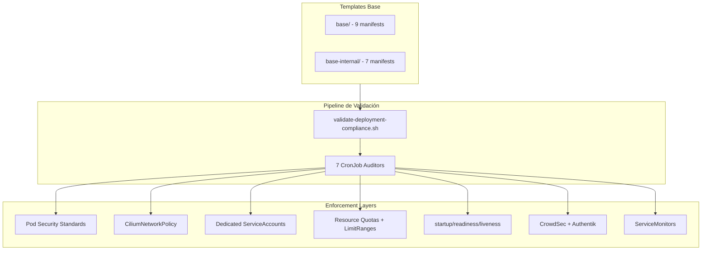

<div class="project-header">
<h1>MOLTY STANDARD V2</h1>
<p>Metodología de despliegue estandarizada con 9 manifiestos obligatorios, validación automática de compliance y Zero Trust networking.</p>

<div class="project-meta-grid">
<div class="meta-item">
<span class="meta-label">Status</span>
<span class="meta-value">ENFORCED</span>
</div>
<div class="meta-item">
<span class="meta-label">Coverage</span>
<span class="meta-value">29_APPS_100%</span>
</div>
<div class="meta-item">
<span class="meta-label">Auditors</span>
<span class="meta-value">7_CRONJOBS</span>
</div>
<div class="meta-item">
<span class="meta-label">Security</span>
<span class="meta-value">ZERO_TRUST_V2.1</span>
</div>
</div>
</div>

## Visión General

El **Molty Standard V2** es el estándar de despliegue obligatorio para todas las aplicaciones del cluster TalosLab. Basado en el hardening completo de la aplicación Molty Odoo, define 9 manifiestos requeridos para aplicaciones web y 7 para servicios internos, abarcando seguridad, resiliencia, funcionalidad y observabilidad.

!!! impact "Key Metrics & Impact"
**29 aplicaciones** 100% compliant • **7 CronJobs** de auditoría automatizada • **Zero Trust v2.1** con default-deny verdadero • **<30s** para validar compliance de una app nueva

---

## Arquitectura



!!! info "Flujo de Creación de Apps"
    `cp base/* → reemplazar placeholders → validate-deployment-compliance.sh → git push → ArgoCD sync`

---

## Stack Tecnológico

### Manifiestos Web (base/)

| Archivo | Categoría | Función |
|:---|:---:|:---|
| `namespace.yaml` | Seguridad | PSS enforce:baseline + Istio Ambient label |
| `service-account.yaml` | Seguridad | SA dedicado sin automount token |
| `network-policy.yaml` | Seguridad | CiliumNP Zero Trust v2.1 con default-deny `[]` |
| `pdb.yaml` | Resiliencia | PodDisruptionBudget (documentado para 1-réplica) |
| `resource-quota.yaml` | Resiliencia | Límites hard del namespace |
| `limit-range.yaml` | Resiliencia | **[V2]** Defaults CPU/mem para initContainers |
| `deployment.yaml` | Funcionalidad | Full securityContext + probes + resource limits |
| `ingress-route.yaml` | Funcionalidad | Traefik + CrowdSec bouncer + Authentik forwardAuth |
| `servicemonitor.yaml` | Observabilidad | Prometheus ServiceMonitor (recomendado) |

### Servicios Internos (base-internal/)

| Diferencia vs Web | Detalle |
|:---|:---|
| Sin `ingress-route.yaml` | No expone UI web |
| `deployment.yaml` | TCP probes, `strategy: Recreate` |
| Marcador `INTERNAL_SERVICE` | Documenta exclusión de Istio Ambient |

### CronJobs de Auditoría

| Auditor | Namespace | Función |
|:---|:---|:---|
| `compliance-auditor` | monitoring | Compliance check global |
| `traffic-auditor` | monitoring | Análisis de tráfico externo |
| `cert-security-auditor` | monitoring | Verificación de certificados TLS |
| `zot-registry-cleaner` | monitoring | Limpieza de imágenes obsoletas |
| `cilium-policy-auditor` | monitoring | Verificación de NetworkPolicies |
| `cnpg-backup-verifier` | monitoring | Integridad de backups PostgreSQL |
| `velero-backup-verifier` | monitoring | Integridad de backups K8s |

---

## Implementación

### Fase 1: Bootstrapping de Nueva App

!!! example "Crear app desde template"
    ```bash
    # Opción A: Script automático
    ./scripts/create-app-from-template.sh mi-app 8080 mi-app.arkenops.cc imagen:tag
    
    # Opción B: Manual
    cp base/* ../02-apps/mi-nueva-app/
    # Reemplazar placeholders: APP_NAME, APP_NAMESPACE, APP_PORT
    ```

### Fase 2: Validación de Compliance

!!! example "Validar antes del merge"
    ```bash
    ./scripts/validate-deployment-compliance.sh k8s/02-apps/<app-name>
    
    # Checks realizados:
    # ✅ Todos los archivos obligatorios presentes
    # ✅ SecurityContext con allowPrivilegeEscalation: false
    # ✅ Drop ALL capabilities, runAsNonRoot: true
    # ✅ startupProbe + readinessProbe + livenessProbe
    # ✅ CiliumNetworkPolicy default-deny con [] (no - {})
    # ✅ Resource limits + LimitRange defaults
    # ✅ Istio Ambient label en namespace
    # ⚠️ ServiceMonitor presente (advisory)
    ```

### Fase 3: Principios de Seguridad (v2.1)

!!! example "9 principios obligatorios"
    1. **Zero Trust Networking**: Default-deny REAL (`[]`, no `- {}`)
    2. **Least Privilege**: ServiceAccounts sin automount token
    3. **Non-root Execution**: `runAsNonRoot: true`
    4. **No Privilege Escalation**: `allowPrivilegeEscalation: false`
    5. **Capability Dropping**: `capabilities.drop: ["ALL"]`
    6. **Resource Limits**: CPU/memory limits + LimitRange defaults
    7. **Health Monitoring**: Probes para detección rápida de fallos
    8. **Pod Security**: Namespace con Pod Security Standards
    9. **Istio Exclusion Policy**: Apps no-HTTP documentan exclusión de Ambient

---

## Configuración

### Variables de Entorno

| Variable | Descripción | Default |
|:---------|:------------|:--------|
| `APP_NAME` | Nombre de la aplicación | Requerido |
| `APP_NAMESPACE` | Namespace K8s | Requerido |
| `APP_PORT` | Puerto del contenedor | 8080 |
| `INGRESS_HOST` | Hostname para IngressRoute | Requerido |
| `IMAGE_TAG` | Tag de la imagen | latest |

### Apps por Categoría de Compliance

| Categoría | Apps | Checks |
|:---|:---:|:---:|
| **Web Apps** | astro-portfolio, canary-demo, code-server, fastapi-backend, fastapi-frontend, forgejo, geonode, gitlab, home-assistant, industrial-monitor-landing, industrial-plant-monitor, kubernetes-dashboard, mkdocs-portfolio, molty-odoo, odoo, openclaw, portainer, portfolio, senaletica-vial, thingsboard, vaultwarden, velero-ui, web-terminal, wordpress | 20/20 |
| **Internal Services** | mosquitto, osrm-backend | 18/18 |
| **Registry** | zot-registry | 20/20 |

---

## Operaciones

### Comandos Útiles

```bash
# Validar compliance de todas las apps
for app in k8s/02-apps/*/; do
  echo "=== $(basename $app) ==="
  ./scripts/validate-deployment-compliance.sh "$app"
done

# Ver estado de CronJobs de auditoría
kubectl get cronjobs -n monitoring | grep auditor

# Forzar ejecución de compliance-auditor
kubectl create job --from=cronjob/compliance-auditor manual-audit-$(date +%s) -n monitoring
```

### Troubleshooting

!!! tip "Validación falla en NetworkPolicy"
**Síntoma**: El script reporta "default-deny no usa patrón v2.1 []"

**Solución**: Verificar que `network-policy.yaml` use `[]` vacío en lugar de `- {}`. El bug `- {}` crea una lista con un objeto vacío que permite todo el tráfico.

---

## Resultados

### Métricas de Éxito

| Métrica | Objetivo | Actual | Estado |
|:--------|:---------|:-------|:-------|
| **Apps Compliant** | 100% | 29/29 (100%) | ✅ Cumplido |
| **Tiempo de Validación** | < 5 min | ~30s | ✅ Excedido |
| **CronJobs Activos** | 7/7 | 7/7 (100%) | ✅ Cumplido |
| **Apps Migradas a V2** | Todas | 25/25 → 29/29 | ✅ Completado |

### Lecciones Aprendidas

!!! info "Key Takeaway"
    El Molty Standard V2 transformó el despliegue de "cada app es única" a un pipeline industrializado. La validación automatizada elimina errores humanos (SecurityContext olvidado, probes faltantes). El fix v2.1 del bug `- {}` fue crítico: una NetworkPolicy mal configurada puede dar falsa sensación de seguridad.

---

## Referencias

- [TalosLab Docs - Molty Standard V2](https://github.com/palbina/HOMELAB-INFRA/blob/main/k8s/templates/README.md)
- [Cilium NetworkPolicy Docs](https://docs.cilium.io/en/stable/security/policy/)
- [Kubernetes Pod Security Standards](https://kubernetes.io/docs/concepts/security/pod-security-standards/)

---

!!! quote "Industrialización del Despliegue"
*"Estandarizar no es limitar, es garantizar que cada app cumple el mismo estándar de calidad"* — 29 apps, 1 estándar, 0 excepciones.

**Última actualización**: 2026-07-05
