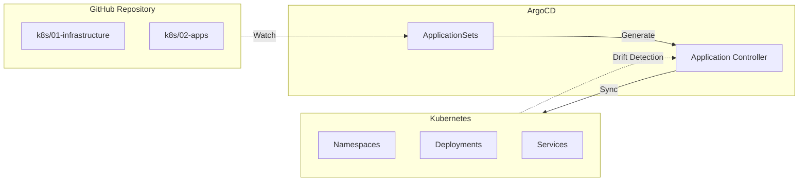

# GitOps con ArgoCD

## Visión General

Implementación completa de GitOps para gestión declarativa del cluster Kubernetes.
Git como fuente única de verdad para infraestructura y aplicaciones.

---

## Arquitectura



---

## Componentes

### ApplicationSets

Generación automática de Applications basada en la estructura de directorios:

```yaml
# Un directorio = Una aplicación
k8s/02-apps/
├── portfolio/        → ArgoCD App: portfolio
├── canary-demo/      → ArgoCD App: canary-demo
├── odoo/             → ArgoCD App: odoo
└── wordpress/        → ArgoCD App: wordpress
```

### Sync Waves

Orden de deployment garantizado mediante anotaciones:

| Wave | Componentes |
|:----:|:------------|
| 0 | CRDs, Cilium CNI |
| 1-2 | Istio Base + Control Plane |
| 3 | Sealed Secrets |
| 4 | Longhorn Storage |
| 5 | Traefik, Cloudflared |
| 10 | Databases, Monitoring |
| 20+ | User Applications |

---

## Features

### Self-Healing

```yaml
syncPolicy:
  automated:
    prune: true      # Elimina recursos huérfanos
    selfHeal: true   # Corrige drift automáticamente
```

### Sealed Secrets

Secrets encriptados que pueden vivir en Git:

```bash
# Crear y sellar un secret
kubectl create secret generic my-secret \
  --from-literal=password=supersecret \
  --dry-run=client -o yaml | kubeseal > sealed-secret.yaml
```

### Progressive Delivery

Integración con Argo Rollouts para Canary deployments:

- Traffic splitting con Istio
- Análisis automático de métricas Prometheus
- Rollback automático si métricas fallan

---

## Flujo de Trabajo

1. **Developer** → Push cambios a `main`
2. **GitHub Actions** → Build image, push a GHCR
3. **CI** → Actualiza manifest con nuevo tag
4. **ArgoCD** → Detecta cambio, aplica sync
5. **Rollouts** → Canary deployment progresivo

---

## Repositorio

[:fontawesome-brands-github: HOMELAB-INFRA](https://github.com/palbina/HOMELAB-INFRA){ .md-button }
