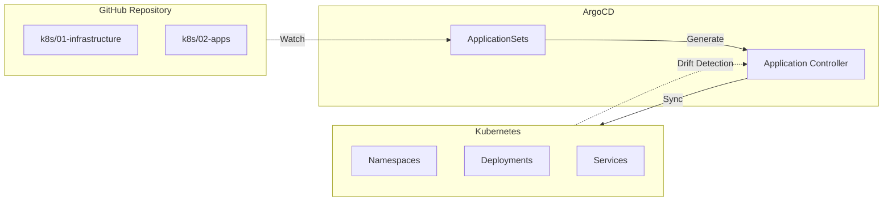
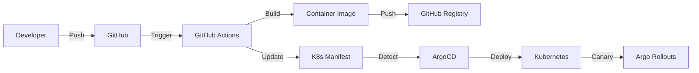

<div class="project-header">
<h1>GitOps con ArgoCD</h1>
<p>Gestión declarativa del ciclo de vida de aplicaciones y sincronización automática de estado.</p>

<div class="project-meta-grid">
<div class="meta-item">
<span class="meta-label">Status</span>
<span class="meta-value">OPERATIONAL</span>
</div>
<div class="meta-item">
<span class="meta-label">Delivery Type</span>
<span class="meta-value">PROGRESSIVE_CANARY</span>
</div>
<div class="meta-item">
<span class="meta-label">Engine</span>
<span class="meta-value">ARGO_CD_V2.10</span>
</div>
<div class="meta-item">
<span class="meta-label">Reproduction</span>
<span class="meta-value">100%_DECLARATIVE</span>
</div>
</div>
</div>

## Visión General

Implementación completa de GitOps para gestión declarativa del cluster Kubernetes.
Git como fuente única de verdad para infraestructura y aplicaciones.

!!! impact "Key Metrics & Impact"
    **30+ aplicaciones** gestionadas declarativamente • **Zero drift** con self-healing automático • **100% reproducible** desde Git

---

## Arquitectura



!!! info "Flujo Unidireccional"
    Todos los cambios fluyen desde Git hacia el cluster. Cualquier modificación manual es detectada y revertida automáticamente.

---

## Stack Tecnológico

=== "Core GitOps"

    | Componente | Tecnología | Función |
    |:-----------|:-----------|:--------|
    | **CD Engine** | ArgoCD v2.10 | Continuous delivery declarativo |
    | **App Generator** | ApplicationSets | Multi-app desde directorios |
    | **Secrets** | Sealed Secrets | Encriptación en Git |

=== "Progressive Delivery"

    | Componente | Tecnología | Función |
    |:-----------|:-----------|:--------|
    | **Rollouts** | Argo Rollouts | Canary/Blue-Green |
    | **Mesh** | Istio | Traffic splitting |
    | **Analysis** | Prometheus | Métricas para rollback |

---

## Componentes Clave

### ApplicationSets

Generación automática de Applications basada en estructura de directorios:

```yaml
# Un directorio = Una aplicación
k8s/02-apps/
├── portfolio/        → ArgoCD App: portfolio
├── canary-demo/      → ArgoCD App: canary-demo
├── odoo/             → ArgoCD App: odoo
└── wordpress/        → ArgoCD App: wordpress
```

### Sync Waves

Orden de deployment garantizado mediante anotaciones:

| Wave | Componentes | Descripción |
|:----:|:------------|:------------|
| 0 | CRDs, Cilium CNI | Fundamentos de red |
| 1-2 | Istio Base + CP | Service mesh |
| 3 | Sealed Secrets | Gestión de secrets |
| 4 | Longhorn | Storage distribuido |
| 5 | Traefik, Cloudflared | Ingress y túneles |
| 10 | DBs, Monitoring | Datos y observabilidad |
| 20+ | User Applications | Apps de usuario |

---

## Features Destacadas

### Self-Healing Automático

```yaml
syncPolicy:
  automated:
    prune: true      # Elimina recursos huérfanos
    selfHeal: true   # Corrige drift automáticamente
```

!!! tip "Zero Drift Guarantee"
    Cualquier cambio manual en el cluster es detectado en segundos y revertido al estado declarado en Git.

### Sealed Secrets para Git

Secrets encriptados que pueden vivir seguros en repositorios públicos:

```bash
# Crear y sellar un secret
kubectl create secret generic my-secret \
  --from-literal=password=supersecret \
  --dry-run=client -o yaml | kubeseal > sealed-secret.yaml
```

### Progressive Delivery con Canary

Integración completa con Argo Rollouts:

- ✅ Traffic splitting gradual con Istio
- ✅ Análisis automático de métricas Prometheus
- ✅ Rollback automático si métricas fallan
- ✅ Promoción manual o automática

---

## Flujo de Trabajo CI/CD



---

## Repositorio

[:fontawesome-brands-github: HOMELAB-INFRA](https://github.com/palbina/HOMELAB-INFRA){ .md-button }

!!! quote "Principio GitOps"
    *"Si no está en Git, no existe"* - Todo el estado del cluster es 100% reproducible desde el repositorio.
