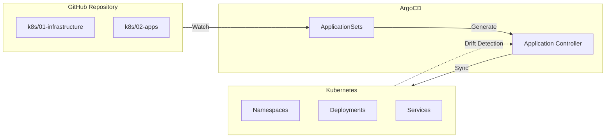

<div class="project-header">
<h1>GITOPS CON ARGOCD</h1>
<p>Gestión declarativa del ciclo de vida de aplicaciones y sincronización automática de estado desde Git.</p>

<div class="project-meta-grid">
<div class="meta-item">
<span class="meta-label">Status</span>
<span class="meta-value">OPERATIONAL</span>
</div>
<div class="meta-item">
<span class="meta-label">Delivery Type</span>
<span class="meta-value">PROGRESSIVE_CANARY</span>
</div>
<div class="meta-item">
<span class="meta-label">Engine</span>
<span class="meta-value">ARGO_CD_V2.10</span>
</div>
<div class="meta-item">
<span class="meta-label">Reproduction</span>
<span class="meta-value">100%_DECLARATIVE</span>
</div>
</div>
</div>

## Visión General

Implementación completa de GitOps para gestión declarativa del cluster Kubernetes.
Git como fuente única de verdad para infraestructura y aplicaciones.

!!! impact "Key Metrics & Impact"
    **30+ aplicaciones** gestionadas declarativamente • **Zero drift** con self-healing automático • **100% reproducible** desde Git

---

## Arquitectura



!!! info "Flujo Unidireccional"
    Todos los cambios fluyen desde Git hacia el cluster. Cualquier modificación manual es detectada y revertida automáticamente.

---

## Stack Tecnológico

=== "Core GitOps"

    | Componente | Tecnología | Función |
    |:-----------|:-----------|:--------|
    | **CD Engine** | ArgoCD v2.10 | Continuous delivery declarativo |
    | **App Generator** | ApplicationSets | Multi-app desde directorios |
    | **Secrets** | Sealed Secrets | Encriptación en Git |

=== "Progressive Delivery"

    | Componente | Tecnología | Función |
    |:-----------|:-----------|:--------|
    | **Rollouts** | Argo Rollouts | Canary/Blue-Green |
    | **Mesh** | Istio | Traffic splitting |
    | **Analysis** | Prometheus | Métricas para rollback |

---

## Implementación

### Fase 1: Instalación de ArgoCD

!!! example "Paso 1 - Desplegar ArgoCD en el cluster"
    ```bash
    # Crear namespace
    kubectl create namespace argocd
    
    # Instalar ArgoCD
    kubectl apply -n argocd -f \
      https://raw.githubusercontent.com/argoproj/argo-cd/stable/manifests/install.yaml
    
    # Exponer UI localmente
    kubectl port-forward svc/argocd-server -n argocd 8080:443
    ```

### Fase 2: Configuración de ApplicationSets

!!! example "Paso 2 - Generación automática de Applications"
    ```yaml
    apiVersion: argoproj.io/v1alpha1
    kind: ApplicationSet
    metadata:
      name: apps
      namespace: argocd
    spec:
      generators:
        - git:
            repoURL: https://github.com/palbina/HOMELAB-INFRA
            revision: main
            directories:
              - path: k8s/02-apps/*
      template:
        metadata:
          name: '{{path.basename}}'
        spec:
          project: default
          source:
            repoURL: https://github.com/palbina/HOMELAB-INFRA
            targetRevision: main
            path: '{{path}}'
          destination:
            server: https://kubernetes.default.svc
            namespace: '{{path.basename}}'
          syncPolicy:
            automated:
              prune: true
              selfHeal: true
    ```

### Fase 3: Sync Waves

!!! example "Paso 3 - Orden de deployment con anotaciones"
    ```yaml
    # Wave 0: CRDs, Cilium CNI
    # Wave 1-2: Istio Base + CP
    # Wave 3: Sealed Secrets
    # Wave 4: Longhorn
    # Wave 5: Traefik, Cloudflared
    # Wave 10: DBs, Monitoring
    # Wave 20+: User Applications
    
    metadata:
      annotations:
        argocd.argoproj.io/sync-wave: "5"
    ```

---

## Configuración

### Variables de Entorno

| Variable | Descripción | Default | Requerido |
|:---------|:------------|:--------|:----------|
| `ARGOCD_SERVER` | URL del servidor ArgoCD | `argocd.local` | Sí |
| `ARGOCD_AUTH_TOKEN` | Token de autenticación | - | Sí |
| `REPO_URL` | URL del repositorio Git | - | Sí |
| `SYNC_INTERVAL` | Intervalo de sincronización | `3m` | No |

### Sync Waves por Categoría

| Wave | Componentes | Descripción |
|:----:|:------------|:------------|
| **0** | CRDs, Cilium CNI | Fundamentos de red |
| **1-2** | Istio Base + CP | Service mesh |
| **3** | Sealed Secrets | Gestión de secrets |
| **4** | Longhorn | Storage distribuido |
| **5** | Traefik, Cloudflared | Ingress y túneles |
| **10** | DBs, Monitoring | Datos y observabilidad |
| **20+** | User Applications | Apps de usuario |

---

## Operaciones

### Comandos Útiles

```bash
# Login a ArgoCD CLI
argocd login argocd.local --username admin

# Listar aplicaciones
argocd app list

# Sincronizar aplicación manualmente
argocd app sync portfolio

# Ver estado de sincronización
argocd app get portfolio

# Forzar refresh
argocd app get portfolio --hard-refresh

# Logs del application controller
kubectl logs -f deployment/argocd-application-controller -n argocd
```

### Troubleshooting

!!! tip "Drift no se corrige automáticamente"
    **Síntoma**: Cambios manuales en el cluster no se revierten.
    
    **Solución**: Verificar que `selfHeal: true` esté configurado en el syncPolicy. Revisar que el Application Controller esté funcionando. Revisar logs del controller por errores RBAC.

!!! tip "ApplicationSet no genera Applications"
    **Síntoma**: Directorios en Git no crean Applications automáticamente.
    
    **Solución**: Verificar que el path en el generator sea correcto. Revisar que el repositorio esté correctamente conectado en ArgoCD. Verificar permisos del token de Git.

---

## Monitoreo

### Métricas Clave

| Métrica | Umbral | Alerta |
|:--------|:-------|:-------|
| Sync Failures | > 3 en 1h | Critical |
| Drift Detected | > 0 | Warning |
| App Sync Duration | > 5 min | Warning |
| Repository Connection | Down | Critical |

### Dashboards

- [ArgoCD Dashboard](https://argocd.local)
- [Grafana GitOps Metrics](https://grafana.local/d/argocd)
- [Application Status Overview](https://grafana.local/d/app-status)

### Alertas

Las alertas se envían a Telegram via Alertmanager cuando:
- Una sincronización falla 3 veces consecutivas
- Se detecta drift en aplicaciones críticas
- El repositorio Git no es accesible
- Una aplicación está en estado "Unknown" por más de 10 minutos

---

## Resultados

### Métricas de Éxito

| Métrica | Objetivo | Actual | Estado |
|:--------|:---------|:-------|:-------|
| **Deployment Frequency** | Daily | Multiple/day | ✅ Excedido |
| **Lead Time** | < 1h | ~15 min | ✅ Excedido |
| **Change Failure Rate** | < 10% | ~2% | ✅ Excedido |
| **MTTR** | < 1h | ~5 min | ✅ Excedido |

### Lecciones Aprendidas

!!! info "Key Takeaway"
    La clave del éxito GitOps está en la disciplina: nunca modificar el cluster manualmente, siempre hacer cambios en Git. ApplicationSets reduce drásticamente el boilerplate y garantiza consistencia en el despliegue de múltiples aplicaciones.

---

## Roadmap

- [x] Fase 1: ArgoCD core installation
- [x] Fase 2: ApplicationSets para multi-app
- [x] Fase 3: Sealed Secrets para secrets en Git
- [x] Fase 4: Sync waves para orden de deployment
- [ ] Fase 5: ArgoCD Image Updater para CD automatizado
- [ ] Fase 6: Multi-cluster GitOps (staging/prod)

---

## Referencias

- [Repositorio GitHub](https://github.com/palbina/HOMELAB-INFRA)
- [ArgoCD Documentation](https://argo-cd.readthedocs.io/)
- [Argo Rollouts Documentation](https://argoproj.github.io/argo-rollouts/)
- [GitOps Principles](https://opengitops.dev/)

---

!!! quote "Principio GitOps"
    *"Si no está en Git, no existe"* - Todo el estado del cluster es 100% reproducible desde el repositorio.

**Última actualización**: {{ git_revision_date_localized }}
