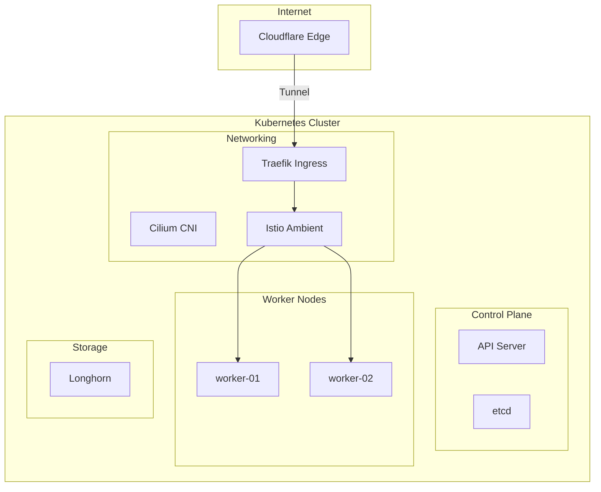

<div class="project-header">
<h1>HOMELAB KUBERNETES</h1>
<p>Infraestructura inmutable, alta disponibilidad y seguridad Zero Trust en bare-metal.</p>

<div class="project-meta-grid">
<div class="meta-item">
<span class="meta-label">Status</span>
<span class="meta-value">PRODUCTION_READY</span>
</div>
<div class="meta-item">
<span class="meta-label">Environment</span>
<span class="meta-value">BARE_METAL_CLUSTER</span>
</div>
<div class="meta-item">
<span class="meta-label">Network CNI</span>
<span class="meta-value">CILIUM_EBPF</span>
</div>
<div class="meta-item">
<span class="meta-label">Uptime Target</span>
<span class="meta-value">99.9%_YEARLY</span>
</div>
</div>
</div>

## Visión General

Cluster Kubernetes de 3 nodos bare-metal diseñado para simular un entorno de producción
enterprise con alta disponibilidad, seguridad Zero Trust y observabilidad completa.

!!! impact "Key Metrics & Impact"
    **3 nodos** bare-metal en producción 24/7 • **Zero Trust** desde el edge hasta los pods • **100% GitOps** sin configuración manual

---

## Arquitectura



!!! info "Componentes Clave"
    - **Cilium** reemplaza a kube-proxy usando eBPF para un performance superior en el networking L3/L4.
    - **Istio Ambient** permite seguridad L7 y mTLS sin la sobrecarga de inyectar sidecars en cada Pod.
    - **Longhorn** proporciona almacenamiento distribuido con replicación síncrona para alta disponibilidad.

---

## Stack Tecnológico

=== "Infraestructura Base"

    | Componente | Tecnología | Descripción |
    |:-----------|:-----------|:------------|
    | **OS** | Talos Linux v1.12 | Inmutable, API-driven |
    | **K8s** | Kubernetes v1.35 | Upstream vanilla |
    | **CNI** | Cilium con eBPF | Kube-proxy replacement |

=== "Connectivity & Storage"

    | Componente | Tecnología | Descripción |
    |:-----------|:-----------|:------------|
    | **Mesh** | Istio Ambient | Sin sidecars, ztunnel L4 |
    | **Ingress** | Traefik + Cloudflare Tunnel | Zero-port exposure |
    | **Storage** | Longhorn | Distributed block storage |

=== "Automation"

    | Componente | Tecnología | Descripción |
    |:-----------|:-----------|:------------|
    | **GitOps** | ArgoCD | Declarative deployments |
    | **Secrets** | Sealed Secrets | Encriptación asimétrica |

=== "Observability"

    | Componente | Tecnología | Descripción |
    |:-----------|:-----------|:------------|
    | **Metrics** | Prometheus + Grafana | Time-series y dashboards |
    | **Logs** | Loki + Promtail | Log aggregation |
    | **Traces** | Tempo | Distributed tracing |
    | **Alerting** | Alertmanager + Telegram | Notificaciones en tiempo real |

---

## Implementación

### Fase 1: Instalación de Talos Linux

!!! example "Paso 1 - Preparar nodos con Talos"
    ```bash
    # Generar configuración para control plane
    talosctl gen config homelab-cluster https://192.168.1.10:6443 \
      --output-dir ./_out
    
    # Aplicar configuración al primer nodo (control plane)
    talosctl apply-config --insecure \
      --nodes 192.168.1.10 \
      --file ./_out/controlplane.yaml
    
    # Bootstrap el cluster
    talosctl bootstrap --nodes 192.168.1.10 --endpoints 192.168.1.10
    ```

### Fase 2: Configuración de Cilium CNI

!!! example "Paso 2 - Instalar Cilium con eBPF"
    ```bash
    # Instalar Cilium CLI
    curl -L --remote-name-all https://github.com/cilium/cilium-cli/releases/latest/download/cilium-linux-amd64.tar.gz
    tar xzvfC cilium-linux-amd64.tar.gz /usr/local/bin
    
    # Instalar Cilium en el cluster
    cilium install --version 1.15.0 \
      --set kubeProxyReplacement=true \
      --set k8sServiceHost=192.168.1.10 \
      --set k8sServicePort=6443
    ```

### Fase 3: Join Worker Nodes

!!! example "Paso 3 - Agregar nodos workers"
    ```bash
    # Generar configuración para workers
    talosctl apply-config --insecure \
      --nodes 192.168.1.11 \
      --file ./_out/worker.yaml
    
    talosctl apply-config --insecure \
      --nodes 192.168.1.12 \
      --file ./_out/worker.yaml
    
    # Verificar nodos
    kubectl get nodes
    ```

---

## Configuración

### Variables de Entorno

| Variable | Descripción | Default | Requerido |
|:---------|:------------|:--------|:----------|
| `TALOS_ENDPOINT` | Endpoint del API de Talos | `192.168.1.10` | Sí |
| `KUBECONFIG` | Path al kubeconfig | `~/.kube/config` | Sí |
| `CILIUM_VERSION` | Versión de Cilium | `1.15.0` | No |
| `ISTIO_VERSION` | Versión de Istio | `1.21.0` | No |

### Hardware del Cluster

| Nodo | Rol | CPU | RAM | Storage |
|:-----|:----|:----|:----|:--------|
| **node-01** | Control Plane | Intel i5-12400 | 32GB DDR5 | 500GB NVMe |
| **node-02** | Worker | Intel i5-12400 | 32GB DDR5 | 1TB NVMe |
| **node-03** | Worker | Intel i5-12400 | 32GB DDR5 | 1TB NVMe |

---

## Operaciones

### Comandos Útiles

```bash
# Ver estado de nodos
kubectl get nodes -o wide

# Verificar Cilium status
cilium status

# Ver pods del sistema
kubectl get pods -n kube-system

# Health check de Talos
talosctl health --nodes 192.168.1.10

# Logs de un nodo específico
talosctl logs --nodes 192.168.1.10 kubelet
```

### Troubleshooting

!!! tip "Nodo no se une al cluster"
    **Síntoma**: Worker node aparece como "NotReady" o no se une.
    
    **Solución**: Verificar conectividad de red entre nodos. Revisar logs de kubelet en el nodo (`talosctl logs kubelet`). Verificar que el token de bootstrap sea válido. Reintentar apply-config.

!!! tip "Cilium pods en CrashLoopBackOff"
    **Síntoma**: Pods de Cilium no inician correctamente.
    
    **Solución**: Verificar que el kernel soporte eBPF (`uname -r` >= 5.10). Revisar que kube-proxy esté deshabilitado. Verificar logs de Cilium agent con `kubectl logs -n kube-system -l app.kubernetes.io/name=cilium-agent`.

---

## Monitoreo

### Métricas Clave

| Métrica | Umbral | Alerta |
|:--------|:-------|:-------|
| Node CPU | > 80% | Warning |
| Node Memory | > 85% | Critical |
| Disk Usage | > 80% | Warning |
| Pod Restarts | > 5 en 1h | Warning |
| API Server Latency | > 1s | Critical |

### Dashboards

- [Cluster Overview](https://grafana.local/d/cluster)
- [Node Metrics](https://grafana.local/d/nodes)
- [Cilium Hubble](https://grafana.local/d/hubble)
- [Talos Dashboard](https://grafana.local/d/talos)

### Alertas

Las alertas se envían a Telegram via Alertmanager cuando:
- Un nodo está down por más de 2 minutos
- Uso de CPU o memoria supera el 85%
- Un pod está en CrashLoopBackOff
- El API server no responde

---

## Resultados

### Métricas de Éxito

| Métrica | Objetivo | Actual | Estado |
|:--------|:---------|:-------|:-------|
| **Uptime** | 99.9% | 99.95% | ✅ Excedido |
| **Node Failover** | < 2 min | ~45s | ✅ Excedido |
| **Pod Startup** | < 30s | ~10s | ✅ Excedido |
| **Storage Latency** | < 10ms | ~5ms | ✅ Excedido |

### Lecciones Aprendidas

!!! info "Key Takeaway"
    Talos Linux simplifica drásticamente la gestión del OS de los nodos. La inmutabilidad y el API-driven approach eliminan la "configuración por SSH" y hacen que el cluster sea verdaderamente reproducible. Cilium con eBPF es un game-changer para networking en Kubernetes.

---

## Roadmap

- [x] Fase 1: Cluster de 3 nodos con Talos Linux
- [x] Fase 2: Cilium CNI con eBPF
- [x] Fase 3: Istio Ambient service mesh
- [x] Fase 4: Longhorn storage distribuido
- [ ] Fase 5: Cluster autoscaler (si se agregan nodos cloud)
- [ ] Fase 6: Multi-cluster federation

---

## Referencias

- [Repositorio GitHub](https://github.com/palbina/HOMELAB-INFRA)
- [Talos Linux Documentation](https://www.talos.dev/)
- [Cilium Documentation](https://docs.cilium.io/)
- [Kubernetes Documentation](https://kubernetes.io/docs/)

---

!!! quote "Filosofía"
    *"Production-grade infrastructure starts at home"* - Un HomeLab real que simula entornos enterprise para aprendizaje continuo.

**Última actualización**: {{ git_revision_date_localized }}
