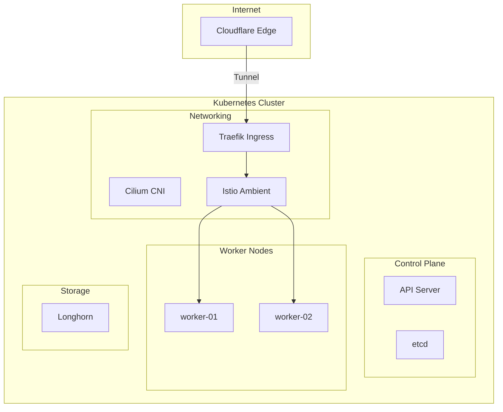

# HomeLab Kubernetes

## Visión General

Cluster Kubernetes de 3 nodos bare-metal diseñado para simular un entorno de producción
enterprise con alta disponibilidad, seguridad Zero Trust y observabilidad completa.

---

## Arquitectura

---

## Stack Tecnológico

| Componente | Tecnología | Descripción |
|:-----------|:-----------|:------------|
| **OS** | Talos Linux v1.12 | Inmutable, API-driven |
| **K8s** | Kubernetes v1.35 | Upstream vanilla |
| **CNI** | Cilium con eBPF | Kube-proxy replacement |
| **Mesh** | Istio Ambient | Sin sidecars, ztunnel L4 |
| **Ingress** | Traefik + Cloudflare Tunnel | Zero-port exposure |
| **Storage** | Longhorn | Distributed block storage |
| **GitOps** | ArgoCD | Declarative deployments |

---

## Features Destacadas

### Zero Trust Security

- **Cilium Network Policies**: Default deny con whitelists explícitas
- **Istio mTLS**: Encriptación automática service-to-service
- **CrowdSec WAF**: IP reputation blocking
- **Authentik SSO**: Identity provider centralizado

### Observabilidad Completa

- **Prometheus**: Métricas con alerting a Telegram
- **Loki**: Agregación centralizada de logs
- **Tempo**: Distributed tracing
- **Grafana**: Dashboards con correlación logs-metrics-traces

### GitOps Puro

- **ArgoCD ApplicationSets**: Detección automática de apps
- **Sealed Secrets**: Secrets encriptados en Git
- **Sync Waves**: Orden de deployment garantizado

---

## Recursos

| Recurso | Cantidad |
|:--------|:---------|
| Nodos | 3 (1 CP + 2 Workers) |
| vCPUs Total | 16 |
| RAM Total | 48 GB |
| Storage | 2 TB NVMe (Longhorn replicated) |

---

## Repositorio

El código fuente de la infraestructura está disponible en GitHub:

[:fontawesome-brands-github: HOMELAB-INFRA](https://github.com/palbina/HOMELAB-INFRA){ .md-button }
