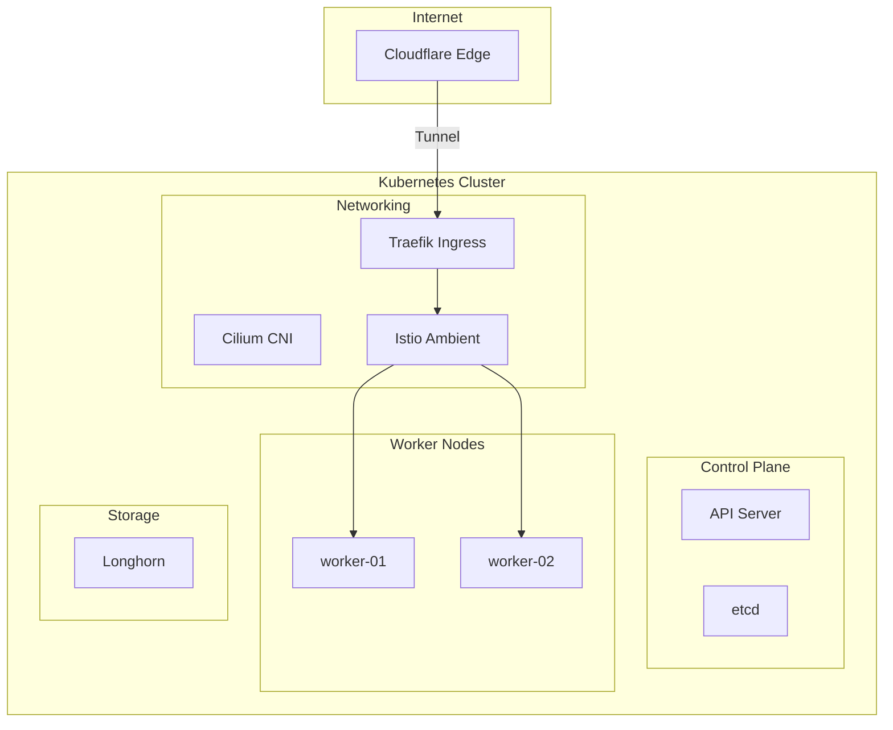

# HomeLab Kubernetes

## Visión General

Cluster Kubernetes de 3 nodos bare-metal diseñado para simular un entorno de producción
enterprise con alta disponibilidad, seguridad Zero Trust y observabilidad completa.

---

## Arquitectura

!!! info "Componentes Clave"
    - **Cilium** reemplaza a kube-proxy usando eBPF para un performance superior en el networking L3/L4.
    - **Istio Ambient** permite seguridad L7 y mTLS sin la sobrecarga de inyectar sidecars en cada Pod.
    - **Longhorn** proporciona almacenamiento distribuido con replicación síncrona para alta disponibilidad.

---

## Stack Tecnológico

=== "Infraestructura Base"

    | Componente | Tecnología | Descripción |
    |:-----------|:-----------|:------------|
    | **OS** | Talos Linux v1.12 | Inmutable, API-driven |
    | **K8s** | Kubernetes v1.35 | Upstream vanilla |
    | **CNI** | Cilium con eBPF | Kube-proxy replacement |

=== "Connectivity & Storage"

    | Componente | Tecnología | Descripción |
    |:-----------|:-----------|:------------|
    | **Mesh** | Istio Ambient | Sin sidecars, ztunnel L4 |
    | **Ingress** | Traefik + Cloudflare Tunnel | Zero-port exposure |
    | **Storage** | Longhorn | Distributed block storage |

=== "Automation"

    | Componente | Tecnología | Descripción |
    |:-----------|:-----------|:------------|
    | **GitOps** | ArgoCD | Declarative deployments |
    | **Secrets** | Sealed Secrets | Encriptación asimétrica |

---

## Features Destacadas

!!! tip "Zero Trust Security"
    La seguridad se implementa en capas (Defense in Depth), desde el borde con Cloudflare hasta las políticas a nivel de red con Cilium.

- **Cilium Network Policies**: Default deny con whitelists explícitas
- **Istio mTLS**: Encriptación automática service-to-service
- **CrowdSec WAF**: IP reputation blocking
- **Authentik SSO**: Identity provider centralizado

---

## Repositorio

El código fuente de la infraestructura está disponible en GitHub:

[:fontawesome-brands-github: HOMELAB-INFRA](https://github.com/palbina/HOMELAB-INFRA){ .md-button }

!!! success "Open Source"
    Toda la configuración de este cluster es pública para fomentar el aprendizaje y la transparencia en la comunidad DevOps.
