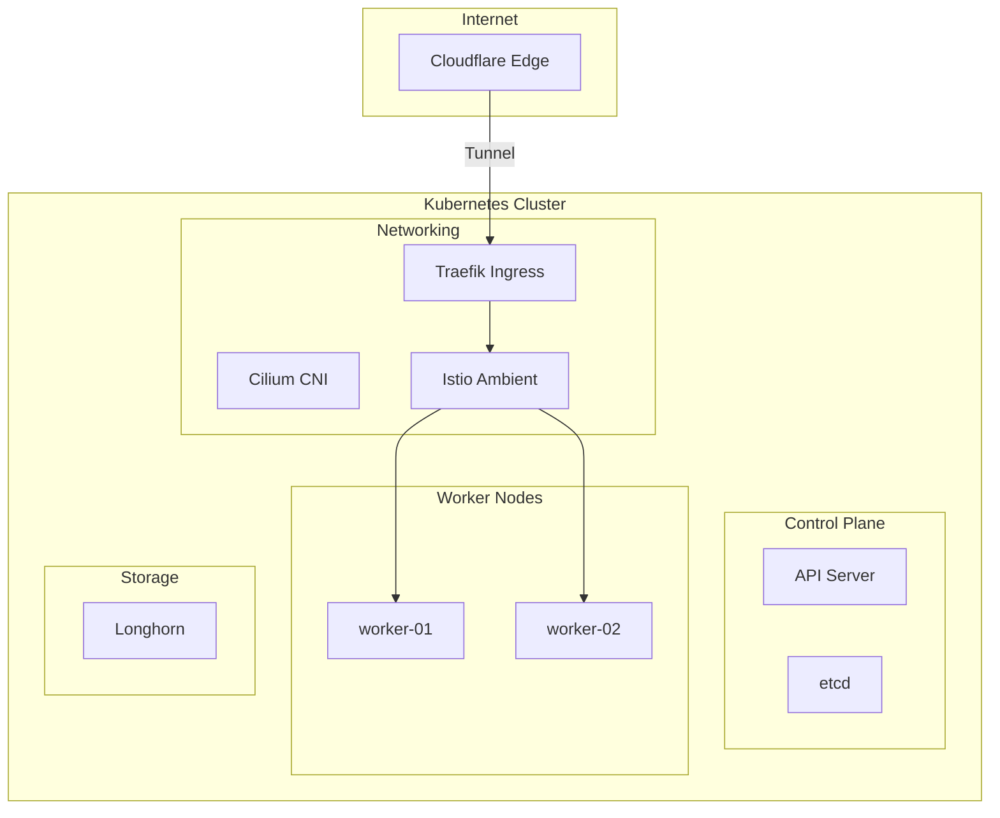

<div class="project-header">
<h1>HomeLab Kubernetes</h1>
<p>Infraestructura inmutable, alta disponibilidad y seguridad Zero Trust.</p>

<div class="project-meta-grid">
<div class="meta-item">
<span class="meta-label">Status</span>
<span class="meta-value">PRODUCTION_READY</span>
</div>
<div class="meta-item">
<span class="meta-label">Environment</span>
<span class="meta-value">BARE_METAL_CLUSTER</span>
</div>
<div class="meta-item">
<span class="meta-label">Network CNI</span>
<span class="meta-value">CILIUM_EBPF</span>
</div>
<div class="meta-item">
<span class="meta-label">Uptime Target</span>
<span class="meta-value">99.9%_YEARLY</span>
</div>
</div>
</div>

## Visión General

Cluster Kubernetes de 3 nodos bare-metal diseñado para simular un entorno de producción
enterprise con alta disponibilidad, seguridad Zero Trust y observabilidad completa.

!!! impact "Key Metrics & Impact"
    **3 nodos** bare-metal en producción 24/7 • **Zero Trust** desde el edge hasta los pods • **100% GitOps** sin configuración manual

---

## Arquitectura



!!! info "Componentes Clave"
    - **Cilium** reemplaza a kube-proxy usando eBPF para un performance superior en el networking L3/L4.
    - **Istio Ambient** permite seguridad L7 y mTLS sin la sobrecarga de inyectar sidecars en cada Pod.
    - **Longhorn** proporciona almacenamiento distribuido con replicación síncrona para alta disponibilidad.

---

## Stack Tecnológico

=== "Infraestructura Base"

    | Componente | Tecnología | Descripción |
    |:-----------|:-----------|:------------|
    | **OS** | Talos Linux v1.12 | Inmutable, API-driven |
    | **K8s** | Kubernetes v1.35 | Upstream vanilla |
    | **CNI** | Cilium con eBPF | Kube-proxy replacement |

=== "Connectivity & Storage"

    | Componente | Tecnología | Descripción |
    |:-----------|:-----------|:------------|
    | **Mesh** | Istio Ambient | Sin sidecars, ztunnel L4 |
    | **Ingress** | Traefik + Cloudflare Tunnel | Zero-port exposure |
    | **Storage** | Longhorn | Distributed block storage |

=== "Automation"

    | Componente | Tecnología | Descripción |
    |:-----------|:-----------|:------------|
    | **GitOps** | ArgoCD | Declarative deployments |
    | **Secrets** | Sealed Secrets | Encriptación asimétrica |

=== "Observability"

    | Componente | Tecnología | Descripción |
    |:-----------|:-----------|:------------|
    | **Metrics** | Prometheus + Grafana | Time-series y dashboards |
    | **Logs** | Loki + Promtail | Log aggregation |
    | **Traces** | Tempo | Distributed tracing |
    | **Alerting** | Alertmanager + Telegram | Notificaciones en tiempo real |

---

## Features Destacadas

### Zero Trust Security

!!! tip "Defense in Depth"
    La seguridad se implementa en capas, desde el borde con Cloudflare hasta las políticas a nivel de red con Cilium.

| Capa | Tecnología | Función |
|:-----|:-----------|:--------|
| **Edge** | Cloudflare WAF | DDoS protection, bot filtering |
| **Ingress** | CrowdSec | IPS colaborativo, IP reputation |
| **Network** | Cilium Policies | Default deny, whitelist explícita |
| **Service** | Istio mTLS | Encriptación automática pod-to-pod |
| **Identity** | Authentik SSO | OIDC/SAML centralizado |

### High Availability

- ✅ **3 nodos** con quorum para etcd
- ✅ **Longhorn** con replicación 2x para storage
- ✅ **Anti-affinity** para spreads de pods críticos
- ✅ **PodDisruptionBudgets** para rolling updates seguros

### Progressive Delivery

Canary deployments con análisis automático de métricas:

```yaml
strategy:
  canary:
    steps:
      - setWeight: 10
      - analysis:
          templates:
            - templateName: success-rate
      - setWeight: 50
      - pause: {}
      - setWeight: 100
```

---

## Hardware

| Nodo | Rol | CPU | RAM | Storage |
|:-----|:----|:----|:----|:--------|
| **node-01** | Control Plane | Intel i5-12400 | 32GB DDR5 | 500GB NVMe |
| **node-02** | Worker | Intel i5-12400 | 32GB DDR5 | 1TB NVMe |
| **node-03** | Worker | Intel i5-12400 | 32GB DDR5 | 1TB NVMe |

---

## Repositorio

El código fuente de la infraestructura está disponible en GitHub:

[:fontawesome-brands-github: HOMELAB-INFRA](https://github.com/palbina/HOMELAB-INFRA){ .md-button }

!!! quote "Filosofía"
    *"Production-grade infrastructure starts at home"* - Un HomeLab real que simula entornos enterprise para aprendizaje continuo.
