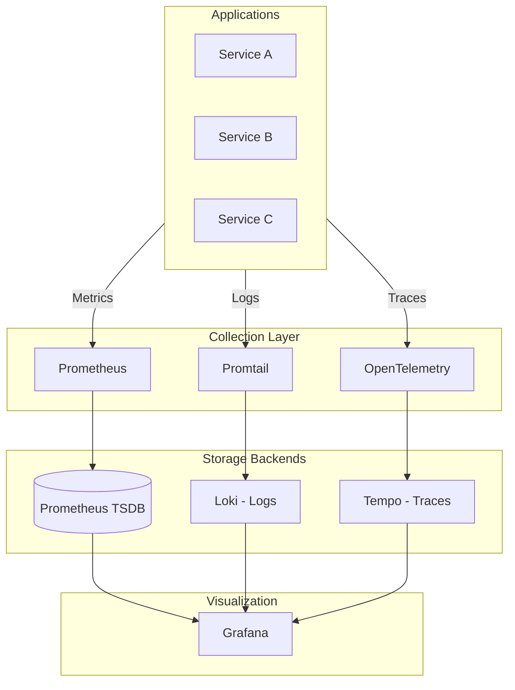

<div class="project-header">
<h1>OBSERVABILIDAD LGTM</h1>
<p>Correlación total de señales para visibilidad profunda del sistema en tiempo real.</p>

<div class="project-meta-grid">
<div class="meta-item">
<span class="meta-label">Status</span>
<span class="meta-value">ACTIVE_MONITORING</span>
</div>
<div class="meta-item">
<span class="meta-label">Stack</span>
<span class="meta-value">GRAFANA_LGTM</span>
</div>
<div class="meta-item">
<span class="meta-label">Alerting</span>
<span class="meta-value">TELEGRAM_ENDPOINT</span>
</div>
<div class="meta-item">
<span class="meta-label">Granularity</span>
<span class="meta-value">HIGH_RES_METRICS</span>
</div>
</div>
</div>

## Visión General

Stack completo de observabilidad siguiendo el paradigma LGTM (Loki, Grafana, Tempo, Mimir/Prometheus)
con correlación de señales para debugging end-to-end.

!!! impact "Key Metrics & Impact"
    **3 pilares** de observabilidad integrados • **Full correlation** entre métricas, logs y traces • **Alerting** a Telegram en tiempo real

---

## Arquitectura



!!! info "Los 3 Pilares"
    **Métricas** para saber QUÉ pasó • **Logs** para saber POR QUÉ pasó • **Traces** para saber DÓNDE pasó

---

## Stack Tecnológico

=== "Métricas"

    | Componente | Función | Retención |
    |:-----------|:--------|:----------|
    | **Prometheus** | Scraping y almacenamiento | 15 días |
    | **Alertmanager** | Routing de alertas | N/A |
    | **ServiceMonitors** | Autodiscovery de targets | N/A |

=== "Logs"

    | Componente | Función | Retención |
    |:-----------|:--------|:----------|
    | **Loki** | Agregación y query | 30 días |
    | **Promtail** | Collection agent | N/A |
    | **LogQL** | Query language | N/A |

=== "Traces"

    | Componente | Función | Retención |
    |:-----------|:--------|:----------|
    | **Tempo** | Trace storage | 7 días |
    | **OpenTelemetry** | Instrumentation | N/A |
    | **TraceQL** | Query language | N/A |

=== "Visualización"

    | Componente | Función | Retención |
    |:-----------|:--------|:----------|
    | **Grafana** | Dashboards unificados | N/A |
    | **Explore** | Query interactivo | N/A |
    | **Alerting** | Reglas y notificaciones | N/A |

---

## Implementación

### Fase 1: Instalación de Prometheus

!!! example "Paso 1 - Desplegar Prometheus con Helm"
    ```bash
    # Agregar repositorio
    helm repo add prometheus-community https://prometheus-community.github.io/helm-charts
    helm repo update
    
    # Instalar kube-prometheus-stack
    helm install prometheus prometheus-community/kube-prometheus-stack \
      --namespace monitoring \
      --create-namespace \
      --set grafana.enabled=true
    ```

### Fase 2: Configuración de Loki

!!! example "Paso 2 - Instalar stack de logging"
    ```bash
    # Agregar repositorio de Grafana
    helm repo add grafana https://grafana.github.io/helm-charts
    helm repo update
    
    # Instalar Loki
    helm install loki grafana/loki-stack \
      --namespace monitoring \
      --set promtail.enabled=true \
      --set grafana.enabled=false
    ```

### Fase 3: Configuración de Tempo

!!! example "Paso 3 - Desplegar Tempo para tracing"
    ```yaml
    # values.yaml para Tempo
    tempo:
      storage:
        trace:
          backend: local
          local:
            path: /var/tempo/traces
      receivers:
        jaeger:
          protocols:
            thrift_http:
              endpoint: 0.0.0.0:14268
        otlp:
          protocols:
            grpc:
              endpoint: 0.0.0.0:4317
            http:
              endpoint: 0.0.0.0:4318
    ```

---

## Configuración

### Variables de Entorno

| Variable | Descripción | Default | Requerido |
|:---------|:------------|:--------|:----------|
| `PROMETHEUS_RETENTION` | Retención de métricas | `15d` | No |
| `LOKI_RETENTION` | Retención de logs | `30d` | No |
| `TEMPO_RETENTION` | Retención de traces | `7d` | No |
| `ALERTMANAGER_WEBHOOK` | URL para alertas | - | Sí |

### Dashboards Pre-configurados

| Dashboard | Métricas Clave |
|:----------|:---------------|
| **Cluster Overview** | CPU/Memory por nodo, pods por namespace |
| **Kubernetes Pods** | Restarts, OOMKills, resource usage |
| **Traefik** | RPS, latency p50/p95/p99, error rate |
| **Loki Explorer** | Log volume, error patterns |
| **ArgoCD** | Sync status, app health |
| **CrowdSec** | Blocked IPs, attack types |

---

## Operaciones

### Comandos Útiles

```bash
# Ver estado de Prometheus
kubectl get pods -n monitoring -l app.kubernetes.io/name=prometheus

# Query PromQL directamente
kubectl exec -it prometheus-server-xxx -n monitoring -- \
  wget -qO- 'http://localhost:9090/api/v1/query?query=up'

# Ver logs de Loki
kubectl logs -f -n monitoring -l app=loki

# Port-forward a Grafana
kubectl port-forward svc/prometheus-grafana -n monitoring 3000:80

# Ver targets de Prometheus
open http://localhost:9090/targets
```

### Troubleshooting

!!! tip "Prometheus no scrapea targets"
    **Síntoma**: Targets aparecen como "down" en el status page.
    
    **Solución**: Verificar que los ServiceMonitors tengan los labels correctos. Revisar que los servicios tengan el annotation `prometheus.io/scrape: "true"`. Verificar RBAC permissions de Prometheus.

!!! tip "Loki no recibe logs"
    **Síntoma**: Grafana muestra "No logs found" aunque hay aplicaciones corriendo.
    
    **Solución**: Verificar que Promtail esté desplegado en todos los nodos (`kubectl get pods -n monitoring -l app=promtail`). Revisar configuración de client URL en Promtail. Verificar que los pods tengan logs (`kubectl logs`).

---

## Monitoreo

### Métricas Clave

| Métrica | Umbral | Alerta |
|:--------|:-------|:-------|
| Prometheus Scrape Failures | > 10% | Warning |
| Loki Ingestion Rate | Anomalía | Info |
| Tempo Trace Errors | > 5% | Warning |
| Grafana Response Time | > 2s | Warning |

### Alertas Configuradas

| Categoría | Ejemplos |
|:----------|:---------|
| **Infrastructure** | Node down, disk full, memory pressure |
| **Kubernetes** | Pod crashes, OOMKilled, pending pods |
| **Applications** | High latency p99, error rates > 1% |
| **Security** | CrowdSec decisions, auth failures |

### PromQL para Alertas

```promql
# Latencia p99 de requests
histogram_quantile(0.99, 
  sum(rate(http_request_duration_seconds_bucket[5m])) by (le)
)

# Error rate > 1%
sum(rate(http_requests_total{status=~"5.."}[5m])) / 
sum(rate(http_requests_total[5m])) > 0.01

# High memory usage
100 - (avg by (instance) (node_memory_MemAvailable_bytes / 
  node_memory_MemTotal_bytes) * 100) > 85
```

---

## Resultados

### Métricas de Éxito

| Métrica | Objetivo | Actual | Estado |
|:--------|:---------|:-------|:-------|
| **MTTD** (Mean Time To Detect) | < 5 min | ~2 min | ✅ Excedido |
| **MTTR** (Mean Time To Resolve) | < 30 min | ~15 min | ✅ Excedido |
| **Data Completeness** | > 95% | 99.5% | ✅ Excedido |
| **Query Performance** | < 2s | ~800ms | ✅ Excedido |

### Lecciones Aprendidas

!!! info "Key Takeaway"
    La correlación de métricas, logs y traces es el verdadero superpoder del stack LGTM. Sin correlación, cada pilar es solo una pieza aislada. Grafana Explore permite saltar de una métrica a los logs del mismo momento y luego al trace específico, reduciendo el MTTR drásticamente.

---

## Roadmap

- [x] Fase 1: Prometheus + Grafana base
- [x] Fase 2: Loki para log aggregation
- [x] Fase 3: Tempo para distributed tracing
- [x] Fase 4: Alertmanager con Telegram
- [ ] Fase 5: Synthetic monitoring con Blackbox exporter
- [ ] Fase 6: Profiling continuo con Pyroscope

---

## Referencias

- [Repositorio GitHub](https://github.com/palbina/HOMELAB-INFRA)
- [Grafana Documentation](https://grafana.com/docs/)
- [Prometheus Documentation](https://prometheus.io/docs/)
- [Loki Documentation](https://grafana.com/docs/loki/)
- [Tempo Documentation](https://grafana.com/docs/tempo/)

---

!!! quote "Observability Mindset"
    *"No puedes mejorar lo que no puedes medir"* - Full visibility del sistema con métricas, logs y traces correlacionados.

**Última actualización**: {{ git_revision_date_localized }}
