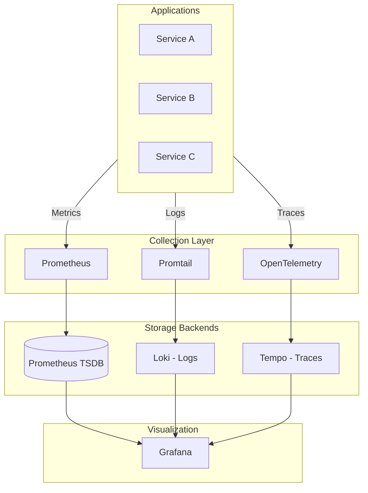
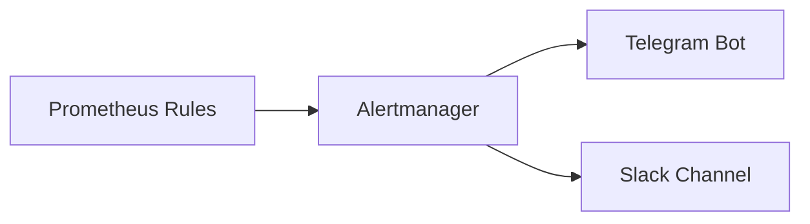

<div class="project-header">
<h1>Observabilidad LGTM</h1>
<p>Correlación total de señales para visibilidad profunda del sistema en tiempo real.</p>

<div class="project-meta-grid">
<div class="meta-item">
<span class="meta-label">Status</span>
<span class="meta-value">ACTIVE_MONITORING</span>
</div>
<div class="meta-item">
<span class="meta-label">Stack</span>
<span class="meta-value">GRAFANA_LGTM</span>
</div>
<div class="meta-item">
<span class="meta-label">Alerting</span>
<span class="meta-value">TELEGRAM_ENDPOINT</span>
</div>
<div class="meta-item">
<span class="meta-label">Granularity</span>
<span class="meta-value">HIGH_RES_METRICS</span>
</div>
</div>
</div>

## Visión General

Stack completo de observabilidad siguiendo el paradigma LGTM (Loki, Grafana, Tempo, Mimir/Prometheus)
con correlación de señales para debugging end-to-end.

!!! success "Impacto"
    **3 pilares** de observabilidad integrados • **Full correlation** entre métricas, logs y traces • **Alerting** a Telegram en tiempo real

---

## Arquitectura



!!! info "Los 3 Pilares"
    **Métricas** para saber QUÉ pasó • **Logs** para saber POR QUÉ pasó • **Traces** para saber DÓNDE pasó

---

## Stack Tecnológico

=== "Métricas"

    | Componente | Función | Retención |
    |:-----------|:--------|:----------|
    | **Prometheus** | Scraping y almacenamiento | 15 días |
    | **Alertmanager** | Routing de alertas | N/A |
    | **ServiceMonitors** | Autodiscovery de targets | N/A |

=== "Logs"

    | Componente | Función | Retención |
    |:-----------|:--------|:----------|
    | **Loki** | Agregación y query | 30 días |
    | **Promtail** | Collection agent | N/A |
    | **LogQL** | Query language | N/A |

=== "Traces"

    | Componente | Función | Retención |
    |:-----------|:--------|:----------|
    | **Tempo** | Trace storage | 7 días |
    | **OpenTelemetry** | Instrumentation | N/A |
    | **TraceQL** | Query language | N/A |

=== "Visualización"

    | Componente | Función | Retención |
    |:-----------|:--------|:----------|
    | **Grafana** | Dashboards unificados | N/A |
    | **Explore** | Query interactivo | N/A |
    | **Alerting** | Reglas y notificaciones | N/A |

---

## Features Destacadas

### Correlación de Señales

Grafana permite saltar entre métricas, logs y traces usando el mismo TraceID:

```
📈 Metric Spike → 📜 Logs at that time → 🔍 Trace of failed request
```

!!! tip "Debugging End-to-End"
    Desde una alerta de latencia alta, puedes navegar directamente a los logs del momento y luego al trace específico de la request lenta.

### Pipeline de Alerting



**Alertas configuradas:**

| Categoría | Ejemplos |
|:----------|:---------|
| **Infrastructure** | Node down, disk full, memory pressure |
| **Kubernetes** | Pod crashes, OOMKilled, pending pods |
| **Applications** | High latency p99, error rates > 1% |
| **Security** | CrowdSec decisions, auth failures |

### Dashboards Pre-configurados

| Dashboard | Métricas Clave |
|:----------|:---------------|
| **Cluster Overview** | CPU/Memory por nodo, pods por namespace |
| **Kubernetes Pods** | Restarts, OOMKills, resource usage |
| **Traefik** | RPS, latency p50/p95/p99, error rate |
| **Loki Explorer** | Log volume, error patterns |
| **ArgoCD** | Sync status, app health |
| **CrowdSec** | Blocked IPs, attack types |

---

## LogQL Cookbook

### Queries Útiles

```logql
# Errores en los últimos 15 minutos
{namespace="portfolio"} |= "error" | json

# Top 5 pods por volumen de logs
topk(5, sum by (pod) (rate({namespace=~".+"}[5m])))
```

### PromQL para Alertas

```promql
# Latencia p99 de requests
histogram_quantile(0.99, 
  sum(rate(http_request_duration_seconds_bucket[5m])) by (le)
)

# Error rate > 1%
sum(rate(http_requests_total{status=~"5.."}[5m])) / 
sum(rate(http_requests_total[5m])) > 0.01
```

---

## Repositorio

[:fontawesome-brands-github: HOMELAB-INFRA](https://github.com/palbina/HOMELAB-INFRA){ .md-button }

!!! quote "Observability Mindset"
    *"No puedes mejorar lo que no puedes medir"* - Full visibility del sistema con métricas, logs y traces correlacionados.
