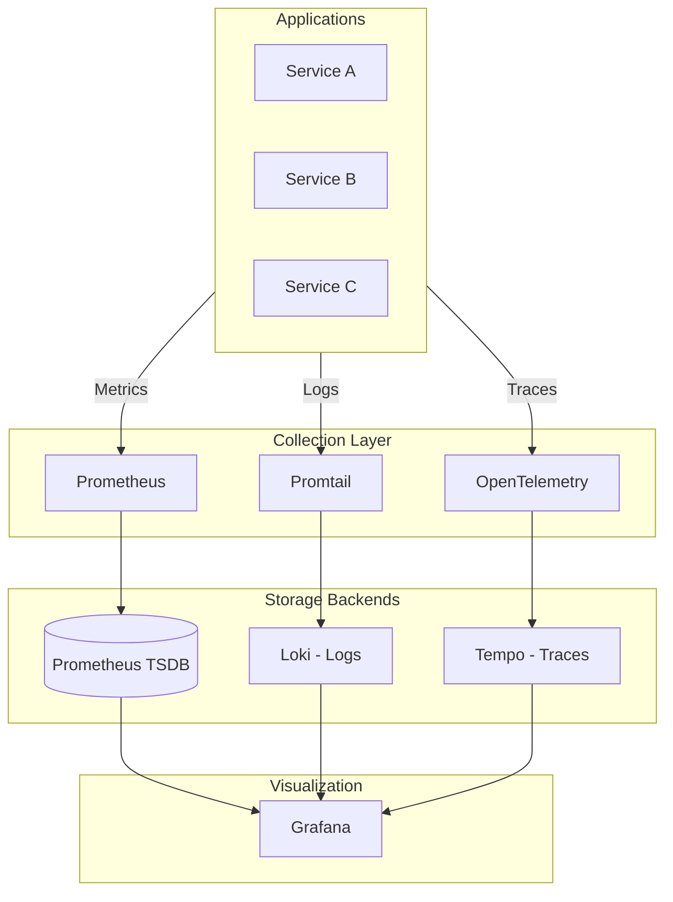
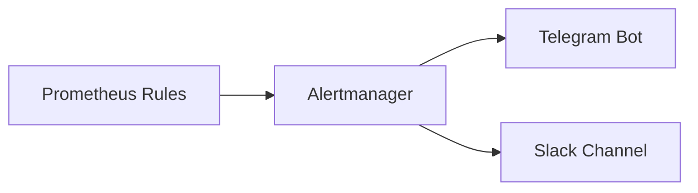

# Observabilidad LGTM

## Visión General

Stack completo de observabilidad siguiendo el paradigma LGTM (Loki, Grafana, Tempo, Mimir/Prometheus)
con correlación de señales para debugging end-to-end.

---

## Arquitectura



---

## Componentes

| Componente | Función | Retención |
|:-----------|:--------|:----------|
| **Prometheus** | Métricas time-series | 15 días |
| **Loki** | Agregación de logs | 30 días |
| **Tempo** | Distributed tracing | 7 días |
| **Grafana** | Dashboards y alerting | N/A |
| **Alertmanager** | Routing de alertas | N/A |

---

## Features

### Correlación de Señales

Grafana permite saltar entre métricas, logs y traces usando el mismo TraceID:

```
Metric Spike → Logs at that time → Trace of failed request
```

### Alerting Pipeline



Alertas configuradas para:

- **Infrastructure**: Node down, disk full, memory pressure
- **Kubernetes**: Pod crashes, OOMKilled, pending pods
- **Applications**: High latency, error rates
- **Security**: CrowdSec decisions, auth failures

### Dashboards Pre-configurados

| Dashboard | Descripción |
|:----------|:------------|
| Cluster Overview | Recursos de nodos y namespaces |
| Kubernetes Pods | Estado y recursos de pods |
| Traefik | Request rates, latencies |
| Loki Logs | Explorer y queries |
| ArgoCD | Sync status de aplicaciones |

---

## LogQL Cookbook

```logql
# Errores en los últimos 15 minutos
{namespace="portfolio"} |= "error" | json

# Top 5 pods por volumen de logs
topk(5, sum by (pod) (rate({namespace=~".+"}[5m])))

# Latencia p99 de requests
histogram_quantile(0.99, 
  sum(rate(http_request_duration_seconds_bucket[5m])) by (le)
)
```

---

## Repositorio

[:fontawesome-brands-github: HOMELAB-INFRA](https://github.com/palbina/HOMELAB-INFRA){ .md-button }
