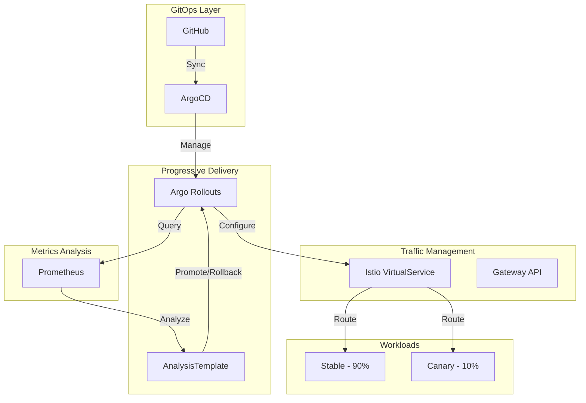

<div class="project-header">
<h1>PROGRESSIVE DELIVERY</h1>
<p>Implementación de Canary Deployments con análisis automático de métricas para deployments seguros y rollback inteligente.</p>

<div class="project-meta-grid">
<div class="meta-item">
<span class="meta-label">Status</span>
<span class="meta-value">PRODUCTION_READY</span>
</div>
<div class="meta-item">
<span class="meta-label">Strategy</span>
<span class="meta-value">CANARY_DEPLOYMENT</span>
</div>
<div class="meta-item">
<span class="meta-label">Stack</span>
<span class="meta-value">ISTIO_SERVICE_MESH</span>
</div>
<div class="meta-item">
<span class="meta-label">Analysis</span>
<span class="meta-value">AUTOMATED_SLO</span>
</div>
</div>
</div>

## Visión General

Implementación de Canary Deployments con análisis automático de métricas para deployments seguros y rollback inteligente.
Traffic splitting progresivo con Istio y promoción automática basada en SLOs.

!!! impact "Key Metrics & Impact"
    **Zero-downtime** deployments • **Análisis automático** de success rate • **Rollback instantáneo** si métricas fallan

---

## Arquitectura



!!! info "Componentes Clave"
    - **Argo Rollouts**: Controller que gestiona el ciclo de vida de canary deployments con análisis automático.
    - **Istio VirtualService**: Control de tráfico L7 con weight-based routing entre versiones stable y canary.
    - **Prometheus + AnalysisTemplate**: Queries automáticas de métricas para validar SLOs antes de promover.

---

## Stack Tecnológico

=== "Rollout Engine"

    | Componente | Tecnología | Función |
    |:-----------|:-----------|:--------|
    | **Controller** | Argo Rollouts | Gestión de Canary/Blue-Green |
    | **Analysis** | AnalysisTemplate | Queries Prometheus para SLOs |
    | **Metrics** | AnalysisRun | Ejecución de análisis |

=== "Traffic Management"

    | Componente | Tecnología | Función |
    |:-----------|:-----------|:--------|
    | **Mesh** | Istio Ambient | Traffic splitting L7 |
    | **Gateway** | Gateway API | Standard routing |
    | **VirtualService** | Istio CRD | Weight-based routing |

=== "Observability"

    | Componente | Tecnología | Función |
    |:-----------|:-----------|:--------|
    | **Metrics** | Prometheus | Success rate, latency |
    | **Dashboards** | Grafana | Rollout visualization |
    | **Alerts** | Alertmanager | Failure notifications |

---

## Implementación

### Fase 1: Configuración de Rollout

!!! example "Paso 1 - Definir estrategia Canary"
    ```yaml
    # rollout.yaml
    apiVersion: argoproj.io/v1alpha1
    kind: Rollout
    spec:
      strategy:
        canary:
          steps:
            - setWeight: 10
            - pause: { duration: 2m }
            - analysis:
                templates:
                  - templateName: success-rate
            - setWeight: 30
            - pause: { duration: 2m }
            - setWeight: 50
            - pause: { duration: 5m }
            - setWeight: 100
    ```

### Fase 2: Analysis Template

!!! example "Paso 2 - Crear template de análisis"
    ```yaml
    apiVersion: argoproj.io/v1alpha1
    kind: AnalysisTemplate
    metadata:
      name: success-rate
    spec:
      args:
        - name: service-name
      metrics:
        - name: success-rate
          interval: 30s
          successCondition: result[0] >= 0.95
          provider:
            prometheus:
              query: |
                sum(rate(
                  istio_requests_total{
                    destination_service=~"<service-name>.*",
                    response_code!~"5.*"
                  }[2m]
                )) / sum(rate(
                  istio_requests_total{
                    destination_service=~"<service-name>.*"
                  }[2m]
                ))
    ```

### Fase 3: Traffic Splitting

!!! example "Paso 3 - Configurar Istio VirtualService"
    ```yaml
    apiVersion: networking.istio.io/v1beta1
    kind: VirtualService
    spec:
      http:
        - route:
            - destination:
                host: canary-demo
                subset: stable
              weight: 90
            - destination:
                host: canary-demo
                subset: canary
              weight: 10
    ```

---

## Configuración

### Variables de Análisis

| Variable | Descripción | Default | Requerido |
|:---------|:------------|:--------|:----------|
| `success-threshold` | Porcentaje mínimo de éxito | `0.95` | Sí |
| `analysis-interval` | Intervalo de query | `30s` | No |
| `rollback-on-failure` | Auto-rollback si falla | `true` | No |

### SLOs Definidos

| Métrica | Umbral | Ventana | Acción |
|:--------|:-------|:--------|:-------|
| **Success Rate** | ≥ 95% | 2 min | Promote |
| **Latency P95** | < 500ms | 5 min | Promote |
| **Error Rate** | < 1% | 1 min | Rollback |

---

## Operaciones

### Comandos Útiles

```bash
# Ver estado del rollout
kubectl argo rollouts get rollout canary-demo -n demo

# Promover manualmente
kubectl argo rollouts promote canary-demo -n demo

# Abortar/Rollback
kubectl argo rollouts abort canary-demo -n demo

# Ver análisis en tiempo real
kubectl argo rollouts get analysisrun success-rate-xxxxx -n demo
```

### Troubleshooting

!!! tip "Análisis falla pero métricas son buenas"
    **Síntoma**: AnalysisRun marca failure pero Prometheus muestra success rate > 95%
    
    **Solución**: Verificar que la query de Prometheus esté correctamente configurada con el label `destination_service`. Revisar que el service name en el argumento coincida exactamente.

!!! tip "Traffic no se divide correctamente"
    **Síntoma**: Todo el tráfico va a stable a pesar de setWeight
    
    **Solución**: Verificar que los subsets (stable/canary) estén correctamente definidos en el DestinationRule de Istio. Asegurar que los pods tengan los labels correctos.

---

## Monitoreo

### Métricas Clave

| Métrica | Umbral | Alerta |
|:--------|:-------|:-------|
| Canary Success Rate | < 95% | Critical |
| Canary Latency P95 | > 500ms | Warning |
| Rollback Count | > 0 | Info |
| Analysis Duration | > 10 min | Warning |

### Dashboards

- [Argo Rollouts Dashboard](https://argocd.local/rollouts)
- [Grafana Canary Metrics](https://grafana.local/d/canary)

### Alertas

Las alertas se envían a Telegram via Alertmanager cuando:
- Un canary deployment es abortado automáticamente
- Las métricas de análisis están degradadas
- Un rollout ha estado en progreso por más de 30 minutos

---

## Resultados

### Métricas de Éxito

| Métrica | Antes | Después | Mejora |
|:--------|:------|:--------|:-------|
| **Deployment Failures** | Manual detection | Auto-rollback | -90% |
| **MTTR** | ~15 min | ~30 sec | -97% |
| **User Impact** | 100% users | 10% users | -90% |

### Lecciones Aprendidas

!!! info "Key Takeaway"
    El análisis automático basado en SLOs elimina la subjetividad en los deployments. Los rollback automáticos son más rápidos y confiables que cualquier proceso manual, reduciendo drásticamente el impacto de deployments fallidos.

---

## Roadmap

- [x] Fase 1: Implementación básica de Canary con Istio
- [x] Fase 2: AnalysisTemplate con Prometheus queries
- [x] Fase 3: Rollback automático basado en SLOs
- [ ] Fase 4: Blue-Green deployments para DB migrations
- [ ] Fase 5: A/B testing con header-based routing

---

## Referencias

- [Repositorio GitHub](https://github.com/palbina/HOMELAB-INFRA)
- [Argo Rollouts Documentation](https://argoproj.github.io/argo-rollouts/)
- [Istio Traffic Management](https://istio.io/latest/docs/concepts/traffic-management/)
- [Homelab Kubernetes](./homelab.md)

---

!!! quote "Progressive Delivery Philosophy"
    *"Deploy with confidence, rollback without fear"* - Cada deployment es validado automáticamente antes de afectar a todos los usuarios.

**Última actualización**: {{ git_revision_date_localized }}
