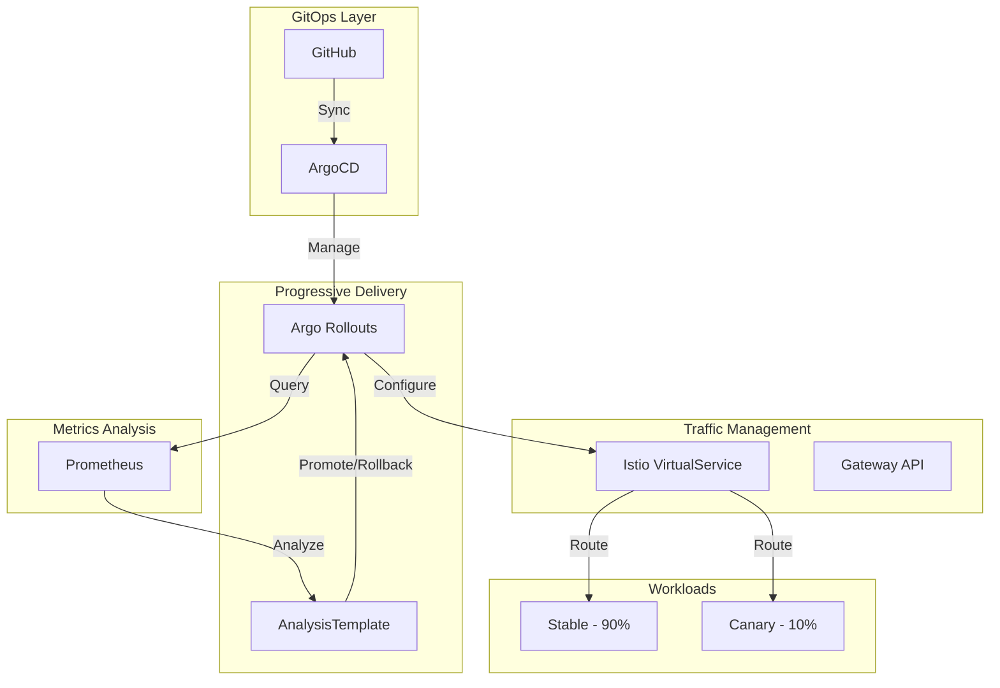

# Progressive Delivery

## Visión General

Implementación de Canary Deployments con análisis automático de métricas para deployments seguros y rollback inteligente.
Traffic splitting progresivo con Istio y promoción automática basada en SLOs.

!!! success "Impacto"
    **Zero-downtime** deployments • **Análisis automático** de success rate • **Rollback instantáneo** si métricas fallan

---

## Arquitectura



---

## Stack Tecnológico

=== "Rollout Engine"

    | Componente | Tecnología | Función |
    |:-----------|:-----------|:--------|
    | **Controller** | Argo Rollouts | Gestión de Canary/Blue-Green |
    | **Analysis** | AnalysisTemplate | Queries Prometheus para SLOs |
    | **Metrics** | AnalysisRun | Ejecución de análisis |

=== "Traffic Management"

    | Componente | Tecnología | Función |
    |:-----------|:-----------|:--------|
    | **Mesh** | Istio Ambient | Traffic splitting L7 |
    | **Gateway** | Gateway API | Standard routing |
    | **VirtualService** | Istio CRD | Weight-based routing |

=== "Observability"

    | Componente | Tecnología | Función |
    |:-----------|:-----------|:--------|
    | **Metrics** | Prometheus | Success rate, latency |
    | **Dashboards** | Grafana | Rollout visualization |
    | **Alerts** | Alertmanager | Failure notifications |

---

## Estrategia de Canary

### Rollout Steps

```yaml
strategy:
  canary:
    steps:
      - setWeight: 10
      - pause: { duration: 2m }
      - analysis:
          templates:
            - templateName: success-rate
      - setWeight: 30
      - pause: { duration: 2m }
      - setWeight: 50
      - pause: { duration: 5m }
      - setWeight: 100
```

### Analysis Template

```yaml
apiVersion: argoproj.io/v1alpha1
kind: AnalysisTemplate
metadata:
  name: success-rate
spec:
  args:
    - name: service-name
  metrics:
    - name: success-rate
      interval: 30s
      successCondition: result[0] >= 0.95
      provider:
        prometheus:
          query: |
            sum(rate(
              istio_requests_total{
                destination_service=~"<service-name>.*",
                response_code!~"5.*"
              }[2m]
            )) / sum(rate(
              istio_requests_total{
                destination_service=~"<service-name>.*"
              }[2m]
            ))
```

---

## Features Destacadas

### Análisis Automático

!!! tip "SLO-Based Promotion"
    El canary solo se promueve si mantiene **>95% success rate** durante el período de análisis. Cualquier degradación dispara rollback automático.

### Traffic Splitting con Istio

```yaml
apiVersion: networking.istio.io/v1beta1
kind: VirtualService
spec:
  http:
    - route:
        - destination:
            host: canary-demo
            subset: stable
          weight: 90
        - destination:
            host: canary-demo
            subset: canary
          weight: 10
```

### Rollback Instantáneo

- ✅ Detección de failure en segundos
- ✅ Rollback automático a versión stable
- ✅ Notificación a Telegram
- ✅ Sin intervención manual requerida

---

## Demo: Canary Deployment

| Fase | Tráfico | Duración | Acción |
|:-----|:--------|:---------|:-------|
| Initial | 10% canary | 2 min | Warmup |
| Analysis | 10% canary | - | Query Prometheus |
| Increase | 30% canary | 2 min | Si success ≥ 95% |
| Ramp | 50% canary | 5 min | Observación |
| Promote | 100% canary | - | Full rollout |

---

## Repositorio

[:fontawesome-brands-github: HOMELAB-INFRA](https://github.com/palbina/HOMELAB-INFRA){ .md-button }

!!! quote "Progressive Delivery"
    *"Deploy with confidence, rollback without fear"* - Cada deployment es validado automáticamente antes de afectar a todos los usuarios.
