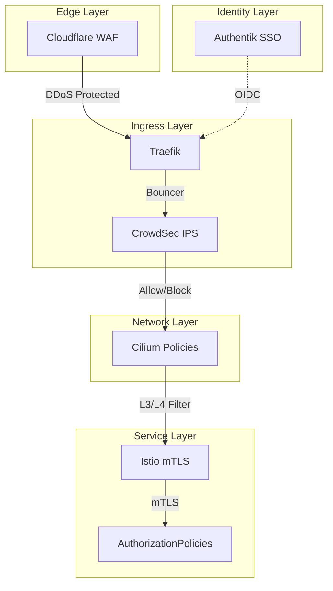

<div class="project-header">
<h1>Zero Trust Security</h1>
<p>Arquitectura de defensa en profundidad multicapa con verificación continua de identidad.</p>

<div class="project-meta-grid">
<div class="meta-item">
<span class="meta-label">Status</span>
<span class="meta-value">SHIELD_ACTIVE</span>
</div>
<div class="meta-item">
<span class="meta-label">Security Level</span>
<span class="meta-value">ZERO_TRUST_L5</span>
</div>
<div class="meta-item">
<span class="meta-label">Network</span>
<span class="meta-value">CILIUM_POLICIES</span>
</div>
<div class="meta-item">
<span class="meta-label">Identity</span>
<span class="meta-value">AUTHENTIK_OIDC</span>
</div>
</div>
</div>

## Visión General

Arquitectura de seguridad multicapa implementando el principio Zero Trust: nunca confiar, siempre verificar.
Defensa en profundidad desde el edge hasta el pod, con encriptación automática y bloqueo proactivo de amenazas.

!!! success "Impacto"
    **4 capas** de seguridad activas • **mTLS automático** service-to-service • **IP blocking** colaborativo en tiempo real

---

## Arquitectura



!!! info "Defense in Depth"
    Cada capa puede bloquear tráfico malicioso de forma independiente. Si una capa falla, las demás continúan protegiendo.

---

## Stack Tecnológico

=== "Edge Security"

    | Componente | Tecnología | Función |
    |:-----------|:-----------|:--------|
    | **WAF** | Cloudflare WAF | Protección DDoS, bot mitigation |
    | **SSL** | Cloudflare SSL | Terminación TLS, certificados auto |
    | **Tunnel** | Cloudflare Tunnel | Zero-port exposure |

=== "Ingress Security"

    | Componente | Tecnología | Función |
    |:-----------|:-----------|:--------|
    | **IPS** | CrowdSec | Detección colaborativa de amenazas |
    | **Bouncer** | Traefik Plugin | Bloqueo automático de IPs |
    | **Middlewares** | Rate Limiting | Protección contra abuse |

=== "Network Security"

    | Componente | Tecnología | Función |
    |:-----------|:-----------|:--------|
    | **Policies** | CiliumNetworkPolicy | Default deny, whitelist explícita |
    | **L7 Filter** | Cilium L7 | Filtrado HTTP/gRPC |
    | **Hubble** | Cilium Hubble | Observabilidad de red |

=== "Service Security"

    | Componente | Tecnología | Función |
    |:-----------|:-----------|:--------|
    | **mTLS** | Istio Ambient | Encriptación automática pod-to-pod |
    | **AuthZ** | AuthorizationPolicy | Control de acceso L7 |
    | **Identity** | Authentik | SSO con OIDC/SAML |

---

## Features Destacadas

### CrowdSec - IPS Colaborativo

```yaml
# Escenarios de detección activos
scenarios:
  - crowdsecurity/http-bad-user-agent
  - crowdsecurity/http-probing
  - crowdsecurity/ssh-bf
  - crowdsecurity/http-crawl-non_statics
```

!!! tip "Comunidad Global"
    CrowdSec comparte inteligencia de amenazas con +200K instalaciones. Si una IP ataca a otro usuario, tu cluster la bloquea automáticamente.

### Cilium NetworkPolicies

```yaml
apiVersion: cilium.io/v2
kind: CiliumNetworkPolicy
metadata:
  name: default-deny-all
spec:
  endpointSelector: {}
  ingress:
    - fromEndpoints:
        - matchLabels:
            io.kubernetes.pod.namespace: istio-system
```

### Istio mTLS Automático

- ✅ **STRICT mode** en todos los namespaces
- ✅ Certificados rotados automáticamente cada 24h
- ✅ Zero configuración por aplicación
- ✅ Visible en Kiali service graph

---

## Métricas de Seguridad

| Métrica | Valor |
|:--------|:------|
| IPs bloqueadas (últimas 24h) | ~150 |
| Escenarios CrowdSec activos | 12 |
| Namespaces con mTLS STRICT | 100% |
| NetworkPolicies aplicadas | 45+ |

---

## Repositorio

[:fontawesome-brands-github: HOMELAB-INFRA](https://github.com/palbina/HOMELAB-INFRA){ .md-button }

!!! quote "Zero Trust Philosophy"
    *"Never trust, always verify"* - Cada request es autenticada y autorizada, sin importar origen.
