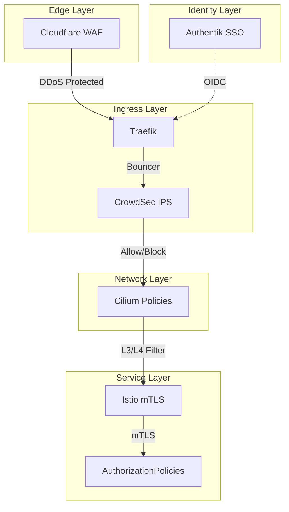

<div class="project-header">
<h1>ZERO TRUST SECURITY</h1>
<p>Arquitectura de defensa en profundidad multicapa con verificación continua de identidad.</p>

<div class="project-meta-grid">
<div class="meta-item">
<span class="meta-label">Status</span>
<span class="meta-value">SHIELD_ACTIVE</span>
</div>
<div class="meta-item">
<span class="meta-label">Security Level</span>
<span class="meta-value">ZERO_TRUST_L5</span>
</div>
<div class="meta-item">
<span class="meta-label">Network</span>
<span class="meta-value">CILIUM_POLICIES</span>
</div>
<div class="meta-item">
<span class="meta-label">Identity</span>
<span class="meta-value">AUTHENTIK_OIDC</span>
</div>
</div>
</div>

## Visión General

Arquitectura de seguridad multicapa implementando el principio Zero Trust: nunca confiar, siempre verificar.
Defensa en profundidad desde el edge hasta el pod, con encriptación automática y bloqueo proactivo de amenazas.

!!! impact "Key Metrics & Impact"
    **4 capas** de seguridad activas • **mTLS automático** service-to-service • **IP blocking** colaborativo en tiempo real

---

## Arquitectura



!!! info "Defense in Depth"
    Cada capa puede bloquear tráfico malicioso de forma independiente. Si una capa falla, las demás continúan protegiendo.

---

## Stack Tecnológico

=== "Edge Security"

    | Componente | Tecnología | Función |
    |:-----------|:-----------|:--------|
    | **WAF** | Cloudflare WAF | Protección DDoS, bot mitigation |
    | **SSL** | Cloudflare SSL | Terminación TLS, certificados auto |
    | **Tunnel** | Cloudflare Tunnel | Zero-port exposure |

=== "Ingress Security"

    | Componente | Tecnología | Función |
    |:-----------|:-----------|:--------|
    | **IPS** | CrowdSec | Detección colaborativa de amenazas |
    | **Bouncer** | Traefik Plugin | Bloqueo automático de IPs |
    | **Middlewares** | Rate Limiting | Protección contra abuse |

=== "Network Security"

    | Componente | Tecnología | Función |
    |:-----------|:-----------|:--------|
    | **Policies** | CiliumNetworkPolicy | Default deny, whitelist explícita |
    | **L7 Filter** | Cilium L7 | Filtrado HTTP/gRPC |
    | **Hubble** | Cilium Hubble | Observabilidad de red |

=== "Service Security"

    | Componente | Tecnología | Función |
    |:-----------|:-----------|:--------|
    | **mTLS** | Istio Ambient | Encriptación automática pod-to-pod |
    | **AuthZ** | AuthorizationPolicy | Control de acceso L7 |
    | **Identity** | Authentik | SSO con OIDC/SAML |

---

## Implementación

### Fase 1: Cloudflare Edge Protection

!!! example "Paso 1 - Configurar Cloudflare WAF"
    ```bash
    # Configurar zone en Cloudflare
    # WAF Rules:
    # - Rate limiting: 100 req/min por IP
    # - Bot Fight Mode: Enabled
    # - DDoS Protection: Automatic
    
    # Cloudflare Tunnel para zero-port exposure
    cloudflared tunnel create homelab
    cloudflared tunnel route dns homelab homelab.example.com
    ```

### Fase 2: CrowdSec IPS

!!! example "Paso 2 - Desplegar CrowdSec con Helm"
    ```bash
    # Instalar CrowdSec
    helm install crowdsec crowdsec/crowdsec \
      --namespace security \
      --create-namespace \
      --set agent.acquisition[0].namespace=ingress \
      --set agent.acquisition[0].podName=traefik-*
    
    # Instalar bouncer para Traefik
    helm install crowdsec-traefik-bouncer \
      crowdsec/crowdsec-traefik-bouncer \
      --namespace security \
      --set crowdsec.lapiKey=<API_KEY>
    ```

### Fase 3: Cilium NetworkPolicies

!!! example "Paso 3 - Aplicar default deny policy"
    ```yaml
    apiVersion: cilium.io/v2
    kind: CiliumNetworkPolicy
    metadata:
      name: default-deny-all
      namespace: default
    spec:
      endpointSelector: {}
      ingress:
        - fromEndpoints:
            - matchLabels:
                io.kubernetes.pod.namespace: istio-system
      egress:
        - toEndpoints:
            - matchLabels:
                k8s:io.kubernetes.pod.namespace: kube-system
    ```

---

## Configuración

### Variables de Entorno

| Variable | Descripción | Default | Requerido |
|:---------|:------------|:--------|:----------|
| `CLOUDFLARE_API_TOKEN` | Token para WAF | - | Sí |
| `CROWDSEC_API_KEY` | Key para bouncers | - | Sí |
| `AUTHENTIK_URL` | URL del IdP | `auth.homelab.local` | Sí |
| `ISTIO_MTLS_MODE` | Modo mTLS | `STRICT` | No |

### Escenarios CrowdSec Activos

```yaml
# Escenarios de detección activos
scenarios:
  - crowdsecurity/http-bad-user-agent
  - crowdsecurity/http-probing
  - crowdsecurity/ssh-bf
  - crowdsecurity/http-crawl-non_statics
```

---

## Operaciones

### Comandos Útiles

```bash
# Ver decisiones de CrowdSec
cscli decisions list

# Ban manual de IP
cscli decisions add --ip 192.168.1.100 --duration 4h

# Ver alerts recientes
cscli alerts list

# Verificar Cilium policies
cilium policy get

# Ver mTLS status en Istio
istioctl authn tls-check

# Ver logs de Authentik
kubectl logs -f -n auth -l app=authentik
```

### Troubleshooting

!!! tip "CrowdSec no detecta ataques"
    **Síntoma**: IPs maliciosas no son bloqueadas.
    
    **Solución**: Verificar que los logs estén llegando a CrowdSec (`cscli metrics`). Revisar que los parsers estén correctamente configurados. Verificar que el bouncer esté funcionando (`cscli bouncers list`).

!!! tip "Cilium policies bloquean tráfico legítimo"
    **Síntoma**: Pods no pueden comunicarse entre sí.
    
    **Solución**: Verificar CiliumNetworkPolicies con `cilium policy get`. Usar Hubble UI para visualizar tráfico bloqueado. Aplicar labels correctos en los selectors de las policies.

---

## Monitoreo

### Métricas de Seguridad

| Métrica | Valor | Tendencia |
|:--------|:------|:----------|
| IPs bloqueadas (últimas 24h) | ~150 | 📈 |
| Escenarios CrowdSec activos | 12 | - |
| Namespaces con mTLS STRICT | 100% | ✅ |
| NetworkPolicies aplicadas | 45+ | 📈 |

### Alertas Configuradas

| Alerta | Condición | Acción |
|:-------|:----------|:-------|
| **High Attack Rate** | > 50 IPs bloqueadas en 1h | Notificación Telegram |
| **mTLS Degradation** | < 100% STRICT | Página al on-call |
| **CrowdSec Down** | Agent no reporta | Página crítica |
| **Auth Failures** | > 10/min en Authentik | Notificación |

### Dashboards

- [CrowdSec Metrics](https://grafana.local/d/crowdsec)
- [Cilium Hubble](https://grafana.local/d/hubble)
- [Istio Security](https://grafana.local/d/istio-security)
- [Authentik Overview](https://grafana.local/d/authentik)

---

## Resultados

### Métricas de Éxito

| Métrica | Objetivo | Actual | Estado |
|:--------|:---------|:-------|:-------|
| **Blocked Threats/Day** | > 50 | ~150 | ✅ Excedido |
| **False Positive Rate** | < 1% | ~0.2% | ✅ Excedido |
| **mTLS Coverage** | 100% | 100% | ✅ Cumplido |
| **Auth Success Rate** | > 95% | 99.8% | ✅ Excedido |

### Lecciones Aprendidas

!!! info "Key Takeaway"
    La seguridad multicapa (Defense in Depth) no es opcional en producción. Cloudflare bloquea el 90% de amenazas en el edge. CrowdSec añade inteligencia colectiva. Cilium e Istio aseguran que incluso si alguien entra, no puede moverse lateralmente. Cada capa es independiente y crítica.

---

## Roadmap

- [x] Fase 1: Cloudflare WAF + Tunnel
- [x] Fase 2: CrowdSec IPS colaborativo
- [x] Fase 3: Cilium NetworkPolicies default-deny
- [x] Fase 4: Istio mTLS STRICT mode
- [x] Fase 5: Authentik SSO/OIDC
- [ ] Fase 6: Falco runtime security
- [ ] Fase 7: Vault para secrets management

---

## Referencias

- [Repositorio GitHub](https://github.com/palbina/HOMELAB-INFRA)
- [Cloudflare Documentation](https://developers.cloudflare.com/)
- [CrowdSec Documentation](https://docs.crowdsec.net/)
- [Cilium Security Policies](https://docs.cilium.io/en/stable/security/policy/)
- [Istio Security](https://istio.io/latest/docs/concepts/security/)

---

!!! quote "Zero Trust Philosophy"
    *"Never trust, always verify"* - Cada request es autenticada y autorizada, sin importar origen.

**Última actualización**: {{ git_revision_date_localized }}
