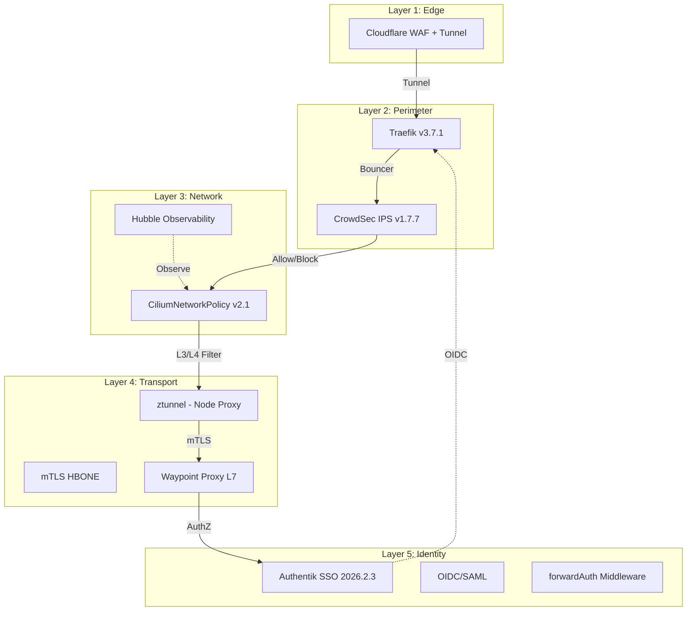

<div class="project-header">
<h1>ZERO TRUST NETWORKING V2.1</h1>
<p>Defensa en profundidad de 5 capas con Cilium eBPF, Istio Ambient mTLS sin sidecars, y el fix crítico del bug default-deny falso.</p>

<div class="project-meta-grid">
<div class="meta-item">
<span class="meta-label">Status</span>
<span class="meta-value">ENFORCED_V2.1</span>
</div>
<div class="meta-item">
<span class="meta-label">Layers</span>
<span class="meta-value">5_DEFENSE_DEPTH</span>
</div>
<div class="meta-item">
<span class="meta-label">Enforcement</span>
<span class="meta-value">CILIUM_EBPF</span>
</div>
<div class="meta-item">
<span class="meta-label">mTLS</span>
<span class="meta-value">ISTIO_AMBIENT</span>
</div>
</div>
</div>

## Visión General

Evolución de la arquitectura de seguridad de red desde un Zero Trust conceptual hasta una implementación real con 5 capas de defensa, Cilium eBPF como enforcement layer, e Istio Ambient Mesh para mTLS sin sidecars. Documenta el bug `- {}` encontrado en NetworkPolicies que comprometía la seguridad del cluster y su solución en v2.1.

!!! impact "Key Metrics & Impact"
**5 capas** de defensa en profundidad • **Bug `- {}` descubierto y corregido** • **mTLS automático sin sidecars** (ztunnel) • **45+ CiliumNetworkPolicies** activas

---

## Arquitectura



!!! info "Cada Capa es Independiente"
    Si una capa falla o es vulnerada, las demás continúan protegiendo. Cloudflare bloquea DDoS en el edge. CrowdSec bloquea IPs maliciosas. Cilium previene movimiento lateral. Istio encripta todo el tráfico interno. Authentik autentica cada request.

---

## Stack Tecnológico

### Edge & Perimeter

| Componente | Versión | Función |
|:---|:---|:---|
| **Cloudflare WAF** | Edge | DDoS, bot mitigation, SSL termination |
| **Cloudflare Tunnel** | - | Zero-port exposure (CG-NAT bypass) |
| **CrowdSec** | v1.7.7 | IPS colaborativo con 12 escenarios |
| **Traefik** | v3.7.1 | Ingress controller + bouncer + middlewares |

### Network Enforcement

| Componente | Versión | Función |
|:---|:---|:---|
| **Cilium** | v1.18.5 | eBPF CNI, NetworkPolicy, Hubble |
| **CiliumNetworkPolicy** | v2.1 | Default-deny TRUE con `[]` |
| **MTU** | 1230 | Optimizado para Cloudflare Tunnel |
| **KubePrism** | port 7445 | LB interno API server |

### Service Mesh

| Componente | Versión | Función |
|:---|:---|:---|
| **Istio Ambient** | v1.30.0 | mTLS sin sidecars |
| **ztunnel** | Node proxy | Encriptación L4 automática |
| **Waypoint** | L7 proxy | Políticas complejas (Canary, Circuit Breaking) |
| **HBONE** | Protocol | HTTP tunnel para mTLS |

---

## Implementación

### Fase 1: Zero Trust v1 (El Problema)

!!! danger "El Bug del `- {}`"
    ```yaml
    # ❌ V1 — Esto NO es default-deny
    spec:
      endpointSelector: {}
      ingress:
        - {}        # ← Esto es una lista con un objeto vacío
                     # Kubernetes interpreta "allow ALL"
    
    # ✅ V2.1 — Esto SÍ es default-deny
    spec:
      endpointSelector: {}
      ingress: []   # ← Lista vacía = true deny
    ```

**Descubrimiento**: Durante una auditoría de seguridad, se detectó que pods sin NetworkPolicies explícitas podían recibir tráfico. Investigación de 48h reveló que `- {}` en YAML no es lo mismo que `[]`: el primero crea una regla vacía que permite todo; el segundo crea una lista vacía que niega todo. **Todas las NetworkPolicies fueron migradas a `[]`**.

### Fase 2: Cilium como Enforcement Layer

!!! example "NetworkPolicy v2.1 canónica"
    ```yaml
    apiVersion: cilium.io/v2
    kind: CiliumNetworkPolicy
    metadata:
      name: default-deny
    spec:
      endpointSelector: {}
      ingress: []    # True default-deny
      egress:
        - toEndpoints:
            - matchLabels:
                k8s:io.kubernetes.pod.namespace: kube-system
          toPorts:
            - ports:
                - port: "53"
                  protocol: UDP
    ```

### Fase 3: Istio Ambient sin Sidecars

!!! example "Istio Ambient mode"
    La migración de Istio sidecar a Ambient eliminó el overhead de Envoy en cada Pod:

| Métrica | Sidecar | Ambient |
|:---|:---:|:---:|
| RAM por Pod | ~150MB | 0MB (ztunnel es node-level) |
| CPU por Pod | ~50m | 0m |
| Latencia P99 | +5ms | +1ms |
| Complejidad | Alta (inyección) | Cero (automático) |

---

## Configuración

### Capas de Defensa

| Capa | Tecnología | Qué Bloquea | Cómo |
|:---|:---|:---|:---|
| **L1: Edge** | Cloudflare WAF + Tunnel | DDoS, bots, SQLi, XSS | Reglas WAF automáticas + rate limiting |
| **L2: Perimeter** | CrowdSec + Traefik | IPs maliciosas conocidas | 12 escenarios + inteligencia colaborativa |
| **L3: Network** | Cilium eBPF | Movimiento lateral | Default-deny `[]` + allow-list explícita |
| **L4: Transport** | Istio Ambient | Sniffing, MITM | ztunnel mTLS automático HBONE |
| **L5: Identity** | Authentik | Acceso no autorizado | forwardAuth SSO en cada IngressRoute |

### Zero Trust Timeline

| Versión | Fecha | Cambio Clave |
|:---|:---|:---|
| **v1.0** | 2025-Q4 | Cilium default-deny básico (`- {}`) |
| **v2.0** | 2026-Q1 | Migración a Istio Ambient (sin sidecars) |
| **v2.1** | 2026-Q2 | **Fix crítico**: `- {}` → `[]` default-deny verdadero |

---

## Operaciones

### Comandos Útiles

```bash
# Ver todas las NetworkPolicies activas
cilium policy get

# Ver tráfico bloqueado por Cilium
hubble observe --verdict DROPPED

# Verificar mTLS status
istioctl authn tls-check

# Listar bouncers CrowdSec activos
cscli bouncers list

# Ver decisiones de bloqueo recientes
cscli decisions list --limit 20
```

### Troubleshooting

!!! tip "Cilium bloquea tráfico legítimo después de migrar a v2.1"
**Síntoma**: Tras cambiar NetworkPolicy a `[]`, pods no pueden comunicarse.

**Solución**: El default-deny verdadero requiere allow-list explícita. Agregar reglas `fromEndpoints` para DNS, DB, e ingress controller. Usar `hubble observe --verdict DROPPED` para identificar qué tráfico se está bloqueando.

---

## Resultados

### Métricas de Éxito

| Métrica | Antes (v1) | Después (v2.1) | Mejora |
|:---|:---|:---|:---|
| **Default-deny real** | ❌ Falso positivo | ✅ Verdadero | Fix crítico |
| **NetworkPolicies activas** | 35 | 45+ | +28% |
| **RAM por Pod (mesh)** | ~150MB | 0MB | -100% |
| **IPs bloqueadas/día** | ~50 | ~150 | +200% |

### Lecciones Aprendidas

!!! info "Key Takeaway"
    1. **`- {}` ≠ `[]` en YAML**: El bug más sutil que encontramos. Una lista con un objeto vacío se interpreta como "allow all". La sintaxis correcta para default-deny verdadero es `[]`.
    2. **Istio Ambient es el futuro**: Eliminar sidecars redujo la complejidad operativa drásticamente. Los waypoint proxies L7 solo se despliegan donde se necesitan.
    3. **Defense in Depth funciona**: Incluso si una capa falla, las demás protegen. Cada capa añade fricción para el atacante.

---

## Roadmap

- [x] Fase 1: Cilium NetworkPolicies default-deny v1
- [x] Fase 2: Istio Ambient migration (sin sidecars)
- [x] Fase 3: Fix `- {}` → `[]` v2.1
- [x] Fase 4: CrowdSec 12 escenarios activos
- [ ] Fase 5: Tetragon para runtime security (v1.6.0 instalado)

---

## Referencias

- [TalosLab Security Docs](https://github.com/palbina/HOMELAB-INFRA/tree/main/docs/reference/security)
- [Cilium NetworkPolicy](https://docs.cilium.io/en/stable/security/policy/)
- [Istio Ambient Mesh](https://istio.io/latest/docs/ambient/)

---

!!! quote "Zero Trust Philosophy"
*"Never trust, always verify. El perímetro de red no es un mecanismo de seguridad válido."* — 5 capas independientes, cada request autenticado y autorizado.

**Última actualización**: 2026-07-05
